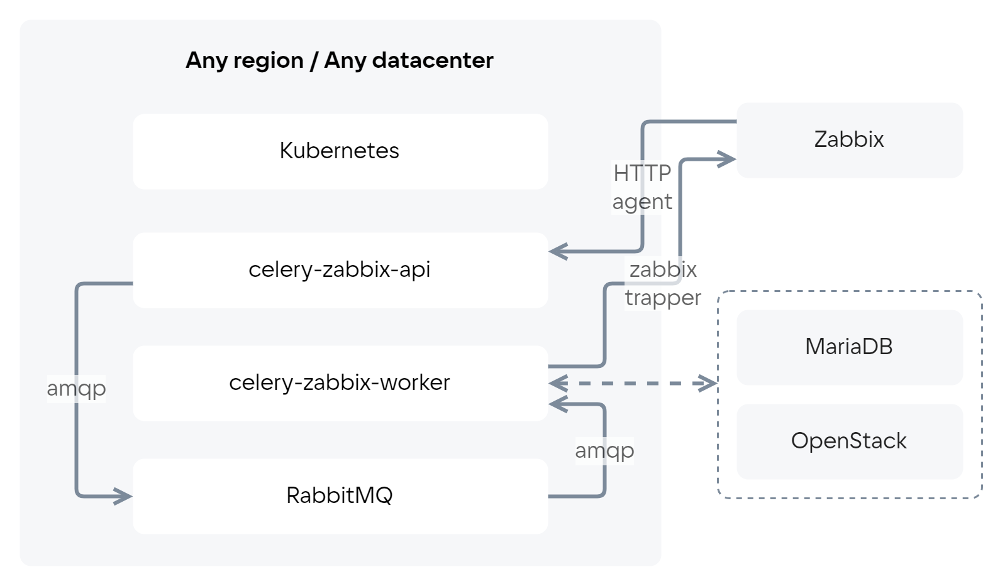

# {heading(Мониторинг)[id=services_monitoring]}

За мониторинг {var(sys2)} отвечают компоненты, построенные на базе решений Zabbix:

* Zabbix-server.
* Zabbix-agent.
* Celery-zabbix.
* Zabbix-openstack.

Структурная схема celery-zabbix показана на {linkto(#pic_celery_zabbix_str_scheme)[text=рисунке %number]}.

{caption(Рисунок {counter(pic)[id=numb_pic_celery_zabbix_str_scheme]} — Структурная схема celery-zabbix)[align=center;position=under;id=pic_celery_zabbix_str_scheme;number={const(numb_pic_celery_zabbix_str_scheme)}]}
{params[width=70%]}
{/caption}

Сервис мониторинга функционирует на отдельном хосте роли Logging-Monitoring. На этом же хосте разворачивается отдельный экземпляр БД MariaDB. Для доступа к данным используется Портал мониторинга (Zabbix).

## {heading(Перечень объектов мониторинга)[id=list_of_monitoring_objects]}

Реализованы хосты и шаблоны (templates) по основным объектам:

* Мониторинг ОС:

   * Доступность узлов.
   * Статус сервисов.
   * Нагрузка.
   * Синхронизации времени.
   * Состояние RAID.

* HAProxy (Public и Private).
* Iptables.
* KVM.
* Ceph.
* OpenStack Octavia.
* OpenStack Openvswitch.
* OpenStack Barbican.
* OpenStack Ceilometer.
* OpenStack Cinder.
* OpenStack Compute.
* OpenStack Glance.
* OpenStack Manila.
* OpenStack Neutron.
* OpenStack Nova.
* GoBGP.
* Billing.
* IDM (подсистема управления доступом).
* MariaDB и Galera.
* Memcached.
* RabbitMQ (в составе Kubernetes).
* RabbitMQ (в составе Docker).
* Tarantool.
* Etcd.
* Kubernetes.
* PostgreSQL и Stolon.
* Apache Kafka.
* Clickhouse.
* Sprut.
* Zabbix.

## {heading(Собираемые метрики)[id=metrics_collected]}

В Системе мониторинга собирается информация о:

* Процессорном времени.
* Памяти.
* Файловых системах.
* Обнаружении/доступности узла.
* Службах, запущенных на серверах.

Детальная информация об элементах данных (items) физических серверов находится на вкладке **Monitoring** → **Latest Data**.

## {heading(Состояние серверов)[id=server_status]}

Мониторинг состояния серверов осуществляется на вкладке **Monitoring** → **Hosts**.

Для просмотра графиков состояния серверов нажмите ссылку **Graphs** справа от названия сервера в столбце **Graphs**.

## {heading(Мониторинг проблем {var(sys2)})[id=problem_monitoring]}

Мониторинг текущих проблем {var(sys2)} осуществляется одним из способов:

1. На вкладке **Monitoring** → **Dashboard** в области **Current problems**.
1. На вкладке **Monitoring** → **Problems** в поле **Show** выберите **Recent Problems** и нажмите кнопку **Apply**.

Мониторинг истории проблем {var(sys2)}:

* На вкладке **Monitoring** → **Problems** в поле **Show** выберите **History** и нажмите кнопку **Apply**.

## {heading(Мониторинг состояния ОС)[id=os_status_monitoring]}

Мониторинг состояния ОС осуществляется на вкладке **Monitoring** → **Latest data**.

1. Выберите группу серверов:

   1. Нажмите кнопку **Select** справа от поля **Host groups**.
   1. Установите флажок для **Ceph OSD nodes**.
   1. Нажмите кнопку **Select**.

1. Выберите необходимые серверы:

   1. Нажмите кнопку **Select** справа от поля **Hosts**.
   1. Установите флажки для серверов.
   1. Нажмите кнопку **Select**.

1. В поле **Name** введите один из параметров:

   * **Disk**.
   * **Memory**.
   * **CPU**.

1. Нажмите кнопку **Apply**.
1. При необходимости повторите пункты 2 и 3.

## {heading(Мониторинг состояния узлов управления и сервисов на них)[id=monitoring_status_of_control_nodes]}

Мониторинг состояния узлов управления и сервисов на них осуществляется на вкладке **Monitoring** → **Latest data**.

1. Выберите группу серверов:

   1. Нажмите кнопку **Select** справа от поля **Host groups**.
   1. Установите флажок для **Openstack controllers**.
   1. Нажмите кнопку **Select**.

1. Выберите необходимые серверы:

   1. Нажмите кнопку **Select** справа от поля **Hosts**.
   1. Установите флажки для серверов.
   1. Нажмите кнопку **Select**.

1. В поле **Name** введите один из сервисов:

   * **Galera**.
   * **HAProxy**.
   * **HAProxy Private**.
   * **HAProxy Public**.
   * **MySQL**.

1. Нажмите кнопку **Apply**.
1. При необходимости повторите пункты 3 и 4.

## {heading(Мониторинг наличия свободных ресурсов на вычислительных узлах)[id=monitoring_availability_of_free_resources]}

Мониторинг наличия свободных ресурсов на вычислительных узлах осуществляется на вкладке **Monitoring** → **Latest data**.

1. Выберите группу серверов:

   1. Нажмите кнопку **Select** справа от поля **Host groups**.
   1. Установите флажок для **Hypervisors**.
   1. Нажмите кнопку **Select**.

1. Выберите необходимые серверы:

   1. Нажмите кнопку **Select** справа от поля **Hosts**.
   1. Установите флажки для серверов.
   1. Нажмите кнопку **Select**.

1. В поле **Name** введите один из ресурсов:

   * **CPU**.
   * **Space**.
   * **Memory**.

1. Нажмите кнопку **Apply**.
1. При необходимости повторите пункты 3 и 4.