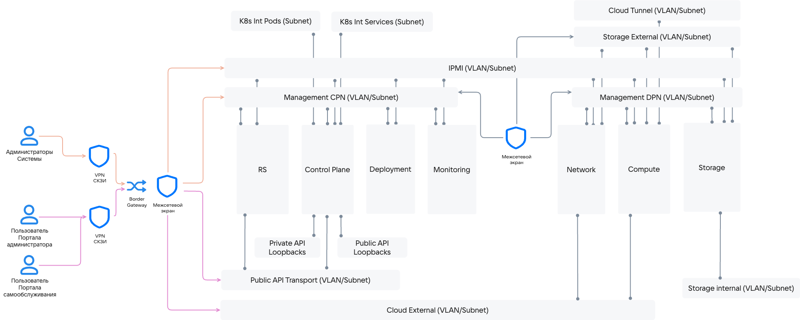

# {heading(Архитектура сети)[id=arch-network]}

<!--- //Исходные данные в статье https://confluence.vk.team/pages/viewpage.action?pageId=1081510455 -->

Для работы {var(sys2_go)} требуется набор маршрутизируемых и не маршрутизируемых сетей.

Разделение сервисов {var(sys2_go)} на отдельные сети обеспечивает:

* Изоляцию пользовательского трафика от системного и управляющего. Это позволяет добиться безопасности не только самого трафика, но и изоляции всех используемых компонентов от доступа и атак потенциальными злоумышленниками, оставляя возможность Администраторам {var(sys2_go)} изолированно управлять {var(sys5_go)}, модулями и компонентами.
* Защиту конфиденциальных данных от несанкционированного доступа. Защита достигается с помощью разделения сетей пользователей и Администраторов {var(sys2_go)}.

Для обеспечения изоляции трафика сети {var(sys2_go)} разделены по технологии VLAN. Набор необходимых сетей приведен в {linkto(#tab_arch_network)[text=таблице %number]}.

<warn>

Состав сетей может меняться в зависимости от конфигурации {var(sys2_go)}.

</warn>

{caption(Таблица {counter(table)[id=numb_tab_arch_network]} — Список сетей {var(sys2_go)})[align=right;position=above;id=tab_arch_network;number={const(numb_tab_arch_network)}]}
[cols="2,2,1,3,4", options="header"]
|===
|Название
|Описание
|Маска
|Доступ
|Комментарий

|Management
|Сеть для внутреннего взаимодействия компонентов {var(sys2_go)}
|/24
|Администраторам {var(sys2_go)}
|Основная сеть управления.
Используется для получения доступа Администраторами {var(sys2_go)} к внутренним адресам REST API, а также для межкомпонентного взаимодействия, в том числе взаимодействия компонентов с СУБД

|Private API Loopback
|Сеть для доступа компонентов к API
|/29
| 
|Пул loopback-адресов для межкомпонентного взаимодействия

|Public API Transport (Portal)
|Транспортная сеть для Public API Loopback
|/29
|Администраторам {var(sys2_go)}, Пользователям
|Используется для получения доступа пользователей Портала самообслуживания к REST API

|Public API Loopback
|Сеть для доступа пользователей к Порталу самообслуживания и API
|/29
|Администраторам {var(sys2_go)}, Пользователям
|Пул loopback-адресов для REST API для доступа пользователей к Порталу самообслуживания

|K8s Internal
|Внутренняя сеть Kubernetes
|/24
| 
|Резерв адресов для внутренних нужд служебного кластера Kubernetes в пределах серверов управления: подсети, которые никогда не будут конфликтовать с другими подсетями

|Cloud Tunnel
|Сеть для внутренних интерфейсов ВМ
|/24
| 
|Транспортная сеть для VXLAN туннелей для внутреннего взаимодействия ВМ

|Cloud External
|Сеть для внешних интерфейсов ВМ
|/16
|Администраторам {var(sys2_go)}, Пользователям
|Сеть для взаимодействия между {var(sys5_go)} и внешними сетями. Количество сетей зависит от требований заказчика

|Storage External
|Сеть для доступа к данным подсистемы физического хранилища
|/24
| 
|Сеть для доступа к подсистеме физического хранилища, подключаемого к {var(sys3_go)}

|Storage Internal
|Кластерная сеть Ceph
|/24
| 
|Транспортная сеть для подсистемы физического хранилища, подключаемого к {var(sys3_go)}

|IPMI
|Сеть с IPMI-интерфейсами
|/24
|Администраторам {var(sys2_go)}
|Сеть для обслуживания платформы Администраторами {var(sys2_go)}. Используется для подключения к физическому оборудованию инсталляции платформы по IPMI
|===
{/caption}

Общая схема распределения доступов сети приведена на {linkto(#pic_network_access)[text=рисунке %number]}.

{caption(Рисунок {counter(pic)[id=numb_pic_network_access]} — Общая схема распределения доступов к сети {var(sys2_go)})[align=center;position=under;id=pic_network_access;number={const(numb_pic_network_access)} ]}
{params[noBorder=true]}
{/caption}

Такое разделение сетей необходимо, чтобы разделить потоки данных для обеспечения информационной безопасности {var(sys2_go)}.

## {heading(Обеспечение безопасного подключения)[id=arch_network_secure connection]}

Подключение пользователей к {var(sys3_go)} осуществляется с помощью VPN-подключения с использованием сертифицированных СКЗИ.

Подключение Администраторов {var(sys2_go)} осуществляется с помощью отдельного от пользовательского VPN-подключения с использованием двухфакторной аутентификации.

## {heading(Межсетевое взаимодействие)[id=arch_network_networking]}

<err>

Запрещено подключение к {var(sys3_go)} из сети интернет без защищённого сертифицированными СКЗИ VPN-канала.

</err>

Для подключения к аттестованным компонентам {var(sys2_go)} из сети интернет создается маршрут через сертифицированные периметровые и сегментные межсетевые экраны с подключением через отдельную сеть **Cloud External** до точки генерации трафика.

## {heading(Сетевые доступы)[id=network_access]}

<warn>

Подробнее о подготовке сетевого окружения указано в документе **Руководство по установке {var(system_go)}** в разделе **Подготовка к установке** → **Подготовка окружения** → **Подготовка сетевого ландшафта**.

</warn>

Обеспечьте доступ из сети `Management` до следующих сервисов:

* DNS.
* AD/LDAP.
* NTP.
* SMTP.

Обеспечьте доступ из сети `Cloud External` в сеть `Public API Loopbacks` по следующим портам:

* `80`.
* `443`.

Чтобы использовать корпоративное BGP-оборудование, откройте порт 179/TCP от серверов `Controller` до BGP-коммутаторов и обратно через сеть `Management`.