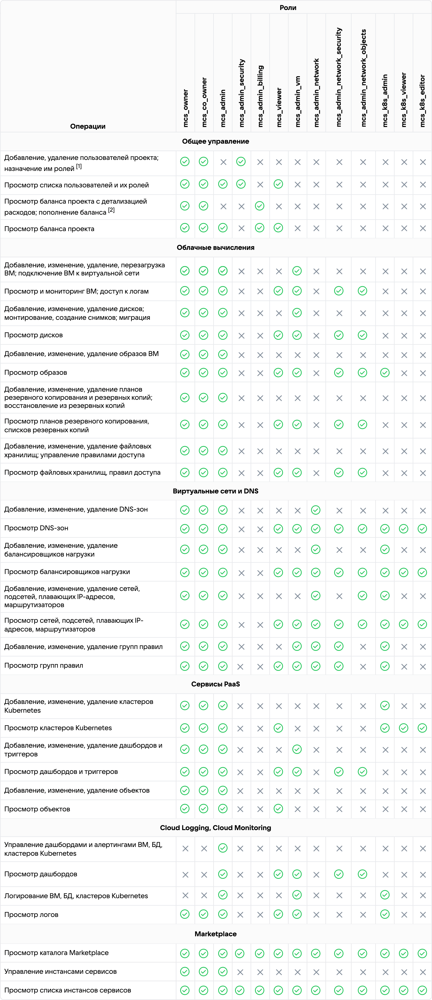
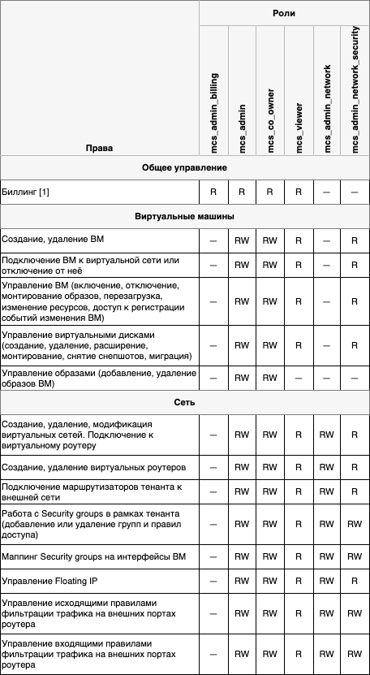
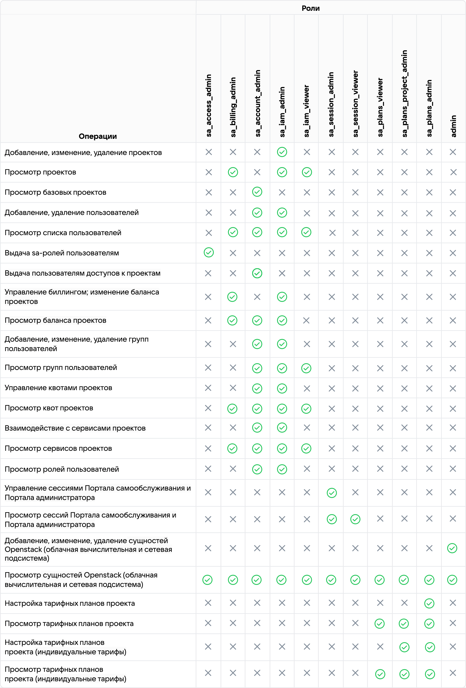
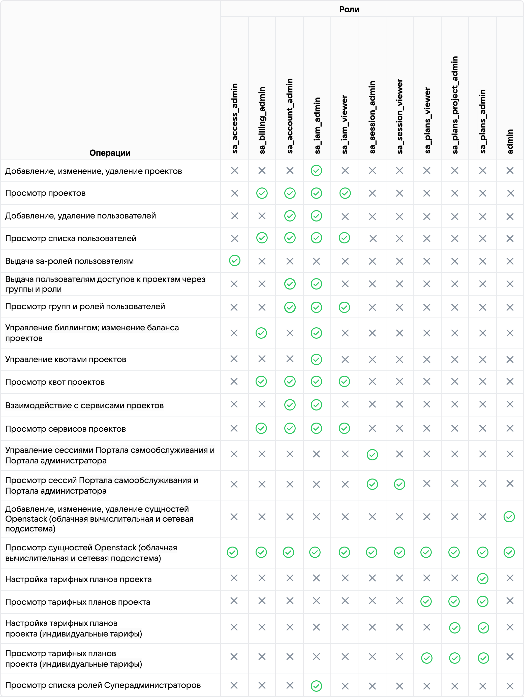

# {heading(Права и учетные записи пользователей)[id=arch-roles]}

Каждому пользователю соответствует персонифицированная учетная запись.

Учетные записи пользователей условно делятся на группы, приведенные в {linkto(#tab_users)[text=таблице %number]}.

{caption(Таблица {counter(table)[id=numb_tab_users]} — Пользователи {ifdef(box, pg)}{var(sys2)}{/ifdef}{ifndef(box, pg)}{var(sys2_go)}{/ifndef})[align=right;position=above;id=tab_users;number={const(numb_tab_users)}]}
[cols="1,2", options="header"]
|===
|Группа
|Описание

|{linkto(#role_model_mcs)[text=%text]}
|{ifdef(box, pg)}
Создаются в Keycloak в области безопасности (realm) `mcs_users` или импортируются в рамках интеграции с LDAP-провайдером.
{/ifdef}
{ifndef(box, pg)}
Импортируются в рамках интеграции с LDAP-провайдером.
{/ifndef}

К этим пользователям {ifdef(box, pg)}{var(sys2)}{/ifdef}{ifndef(box, pg)}{var(sys2_go)}{/ifndef} применяется ролевая модель управления доступом.

|{linkto(#role_model_sa)[text=%text]}
|{ifdef(box, pg)}
Создаются в Keycloak в области безопасности (realm) `mcs_admin` или импортируются в рамках интеграции с LDAP-провайдером.
{/ifdef}
{ifndef(box, pg)}
Импортируются в рамках интеграции с LDAP-провайдером.
{/ifndef}

К этим пользователям {ifdef(box, pg)}{var(sys2)}{/ifdef}{ifndef(box, pg)}{var(sys2_go)}{/ifndef} применяется ролевая модель управления доступом.

|Администратор ИБ {ifdef(box, pg)}{var(sys2)}{/ifdef}{ifndef(box, pg)}{var(sys2_go)}{/ifndef}
|Администратор Портала управления доступом Keycloak. Имя учетной записи по умолчанию — `admin`. {ifdef(box, pg)}Обладает доступом ко всем учетным записям {var(sys2)} (кроме `superadmin` и тех, что хранятся в службе каталогов LDAP-провайдера) и настройкам их доступа.

Учетные записи с данной ролью создаются в Keycloak в области безопасности (realm) `master` при включенной настройке неограниченного доступа к другим областям безопасности
{/ifdef}

|{linkto(#builtin_accounts)[text=%text]}
|Служебные (или сервисные) учетные записи используются сервисами OpenStack для обеспечения работы необходимых служб или сервисов
|===
{/caption}

## {heading(Пользователи Портала самообслуживания)[id=role_model_mcs]}

Для пользователей Портала самообслуживания поддерживается набор ролей, назначаемых в рамках отдельного проекта. Пользователю можно назначить одну или несколько ролей, приведенных в {linkto(#tab_mcs_users)[text=таблице %number]}.

{caption(Таблица {counter(table)[id=numb_tab_mcs_users]} — Роли пользователей Портала самообслуживания)[align=right;position=above;id=tab_mcs_users;number={const(numb_tab_mcs_users)}]}
[cols="2,2,3", options="header"]
|===
|ID роли
|Название роли
|Описание

|`mcs_viewer`
|Наблюдатель
|Позволяет просматривать большую часть информации о проекте, но без доступа на редактирование

{ifdef(box, pg)}

|`mcs_owner`
|Владелец проекта
|Служебная роль назначается автоматически только Владельцу проекта. Роль не может быть назначена другому пользователю. Роль создается в единственном экземпляре при первоначальной настройке {var(sys2)} в Keystone и представляет собой единственного владельца всех проектов {var(sys2)}. Имя задается при создании.

<warn>

Данная учетная запись редактированию не подлежит.

</warn>

{/ifdef}

|`mcs_co_owner`
|Совладелец проекта
|Предоставляет доступ ко всем ресурсам проекта. Может быть назначена вручную

|`mcs_admin_network`
|Администратор сети
|Предоставляет доступ ко всем объектам сетевой подсистемы

|`mcs_admin_billing`
|Администратор биллинга
|Предоставляет доступ только к пункту **Баланс** и функциям биллинга

{ifdef(box, pg)}

|`mcs_admin_security`
|Администратор пользователей
|Роль обычно не используется, так как добавление новых пользователей происходит с помощью добавления их в соответствующую группу LDAP-провайдера
{/ifdef}

|`mcs_admin`
|Администратор проекта
|Предоставляет доступ ко всем ресурсам проекта, кроме групп пользователей и баланса

{ifdef(box, pg)}

|`mcs_admin_vm`
|Администратор ВМ
|Предоставляет доступ к ВМ проекта

|`mcs_admin_network_objects`
|Администратор внутренних сетей
|Предоставляет доступ к сетевым ресурсам, связанным с Neutron, Sprut и Octavia

|`mcs_admin_network_security`
|Администратор сетевой безопасности
|Предоставляет доступ к сетевым ресурсам, связанным с безопасностью

{/ifdef}

{ifndef(box, pg)}

|`mcs_admin_network_security`
|Администратор сетевой безопасности
|Обеспечивает контроль сетевых настроек

{/ifndef}

{ifdef(box, pg)}

|`mcs_k8s_admin`
|Администратор Kubernetes
|Предоставляет доступ на чтение и запись к большинству объектов в пространстве имен, включая возможность создавать другие роли и связывания ролей. Предоставляет доступ к секретам, что позволяет запускать поды от имени любого сервисного аккаунта в пространстве имен

|`mcs_k8s_viewer`
|Аудитор Kubernetes
|Предоставляет доступ на чтение к большинству объектов в пространстве имен

|`mcs_k8s_editor`
|Оператор Kubernetes
|Предоставляет доступ на чтение и запись к большинству объектов в пространстве имен. Предоставляет доступ к секретам, что позволяет запускать поды от имени любого сервисного аккаунта в пространстве имен

{/ifdef}

|===
{/caption}

Каждой роли соответствует набор прав, приведенных в {linkto(#tab_roles)[text=таблице %number]}.

{ifdef(box, pg)}
[1] Указанный функционал отключен в Портале самообслуживания {var(sys2)}. Взаимодействие с пользователями и ролями осуществляется исключительно через Портал администратора.

[2] В реализации {var(sys2)} все операции на запись осуществляются исключительно через Портал администратора. Пример: изменение баланса или цен.
{/ifdef}

{ifndef(box, pg)}
[1] В реализации {var(sys2)} биллинг доступен для чтения только некоторым ролям. Все операции на запись  осуществляются исключительно через Портал администратора. Пример: изменение баланса или цен.
{/ifndef}

{ifdef(box, pg)}
{caption(Таблица {counter(table)[id=numb_tab_roles]} — Права пользователей Портала самообслуживания)[align=right;position=above;id=tab_roles;number={const(numb_tab_roles)}]}
{params[printWidth=140mm;printHeight=210mm;noBorder=true]}
{/caption}
{/ifdef}

{ifndef(box, pg)}
{caption(Таблица {counter(table)[id=numb_tab_roles]} — Права пользователей Портала самообслуживания)[align=right;position=above;id=tab_roles;number={const(numb_tab_roles)}]}
{params[width=70%;noBorder=true]}
{/caption}
{/ifndef}

## {heading(Пользователи Портала администратора)[id=role_model_sa]}

Для пользователей Портала администратора поддерживается набор ролей, назначаемых персонально каждому администратору. Пользователю можно назначить одну или несколько ролей, приведенных в {linkto(#tab_sa_roles)[text=таблице %number]}.

{ifdef(box, pg)}

<warn>

Роль `admin` позволяет получить полный доступ к инфраструктуре. Назначается, в том числе, служебной учетной записи `admin`, подробнее — в разделе {linkto(#builtin_accounts)[text=%text]}. Предоставляет управление сервисами OpenStack и `mcs`, которые аутентифицируются через Keystone.

</warn>

{/ifdef}

{caption(Таблица {counter(table)[id=numb_tab_sa_roles]} — Роли пользователей Портала администратора)[align=right;position=above;id=tab_sa_roles;number={const(numb_tab_sa_roles)}]}
[cols="2,3", options="header"]
|===
|ID роли
|Описание

|`sa_access_admin`
|Предоставляет доступ к разделу **Управление доступом**

{ifndef(cer)}

|`sa_partners_admin`
|Предоставляет доступ к разделу **Партнерская программа**
{/ifndef}

|`sa_billing_admin`
|Предоставляет доступ к разделу **Управление балансом**

|`sa_account_admin`
|Предоставляет доступ к управлению:

* Пользователями.
* Квотами.
* Доступами.
* Сервисами

|`sa_iam_admin`
|Предоставляет доступ к управлению проектами и пользователями в IAM

|`sa_iam_viewer`
|Предоставляет доступ к просмотру проектов и пользователей в IAM

|`sa_session_admin`
|Предоставляет доступ к управлению сессиями пользователей

|`sa_session_viewer`
|Предоставляет доступ к просмотру сессий пользователей

{ifdef(box, pg)}

|`sa_scrooge_plans_viewer`
|Предоставляет доступ к просмотру данных на вкладке **Индивидуальные тарифы**

|`sa_scrooge_plans_project_admin`
|Предоставляет доступ к управлению данными на вкладке **Индивидуальные тарифы**

|`sa_scrooge_plans_admin`
|Предоставляет доступ к управлению данными на вкладке **Тарифные планы**
{/ifdef}

{ifndef(box, pg)}

|`sa_plans_viewer`
|Предоставляет доступ к просмотру данных на вкладке **Индивидуальные тарифы**

|`sa_plans_project_admin`
|Предоставляет доступ к управлению данными на вкладке **Индивидуальные тарифы**

|`sa_plans_admin`
|Предоставляет доступ к управлению данными на вкладке **Тарифные планы**
{/ifndef}

|`admin`
|Предоставляет доступ к разделам OpenStack и вкладке **Журнал действий**
|===
{/caption}

Каждой роли соответствует набор прав, приведенных в {linkto(#tab_sa_rights)[text=таблице %number]}.

{ifdef(box, pg)}
{caption(Таблица {counter(table)[id=numb_tab_sa_rights]} — Права пользователей Портала администратора)[align=right;position=above;id=tab_sa_rights;number={const(numb_tab_sa_rights)}]}
{params[printWidth=95mm;noBorder=true]}
{/caption}

<warn>

* Для работы с ролями `sa_scrooge_plans` требуется наличие роли `sa_iam_admin` или `sa_iam_viewer`.
* Администраторам с ролями `sa_scrooge_plans` для работы с разделом **Индивидуальные тарифы** требуется наличие роли `sa_billing_admin`.

</warn>

{/ifdef}

{ifndef(box, pg)}
{caption(Таблица {counter(table)[id=numb_tab_sa_rights]} — Права пользователей Портала администратора)[align=right;position=above;id=tab_sa_rights;number={const(numb_tab_sa_rights)}]}
{params[printWidth=95mm;noBorder=true]}
{/caption}

<warn>

* Администраторам с ролями `sa_plans` для работы с разделом **Индивидуальные тарифы** требуется наличие роли `sa_billing_admin`.

</warn>

{/ifndef}

## {heading(Встроенные служебные учетные записи)[id=builtin_accounts]}

Кроме пользовательских учетных записей на {ifdef(box, pg)}{var(sys3)}{/ifdef}{ifndef(box, pg)}{var(sys3_go)}{/ifndef} есть встроенные учетные записи для внутренних запросов между компонентами.

{ifndef(cer)}

<!--- //todo в 4.0 токен для служебных учеток не нужен, файл openrc.sh без токена. -->

Служебные (или сервисные) учетные записи используются сервисами OpenStack. Каждый сервис OpenStack аутентифицируется по паролю во встроенном компоненте Keystone, получает одноразовый токен и выполняет требуемый запрос.

<err>

Служебные (или сервисные) учетные записи используются из-за ограниченного времени действия токена для доступа к API.

</err>

{/ifndef}

{ifdef(cer)}
Служебные (или сервисные) учетные записи используются сервисами OpenStack для обеспечения работы служб или сервисов. Каждый сервис OpenStack аутентифицируется по паролю, получает одноразовый токен и выполняет требуемый запрос.
{/ifdef}

Пользовательские учетные записи используются для идентификации и аутентификации пользователей.

{ifndef(cer)}
Реализовано следующими сервисами:

* Keycloak.
* Keystone.
* Breeze.
* Dusk.

Как в Keystone, так и в Keycloak для идентификации и аутентификации необходима пара из двух полей:

* Имя пользователя.
* Пароль.
{/ifndef}

Каждый сервис OpenStack использует свою сервисную учетную запись для авторизации запросов к {ifdef(box, pg)}{var(sys3)}{/ifdef}{ifndef(box, pg)}{var(sys3_go)}{/ifndef}. Исключение — Суперадминистратор с учетной записью `admin`.