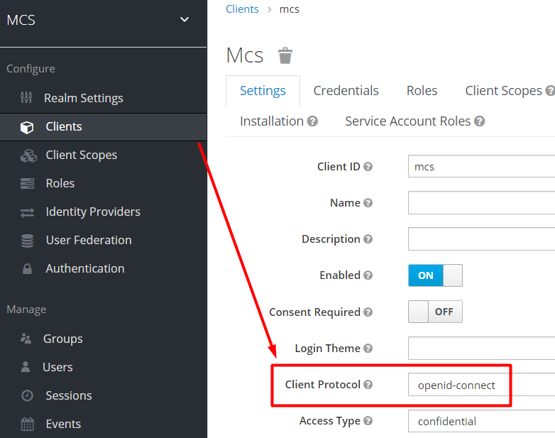
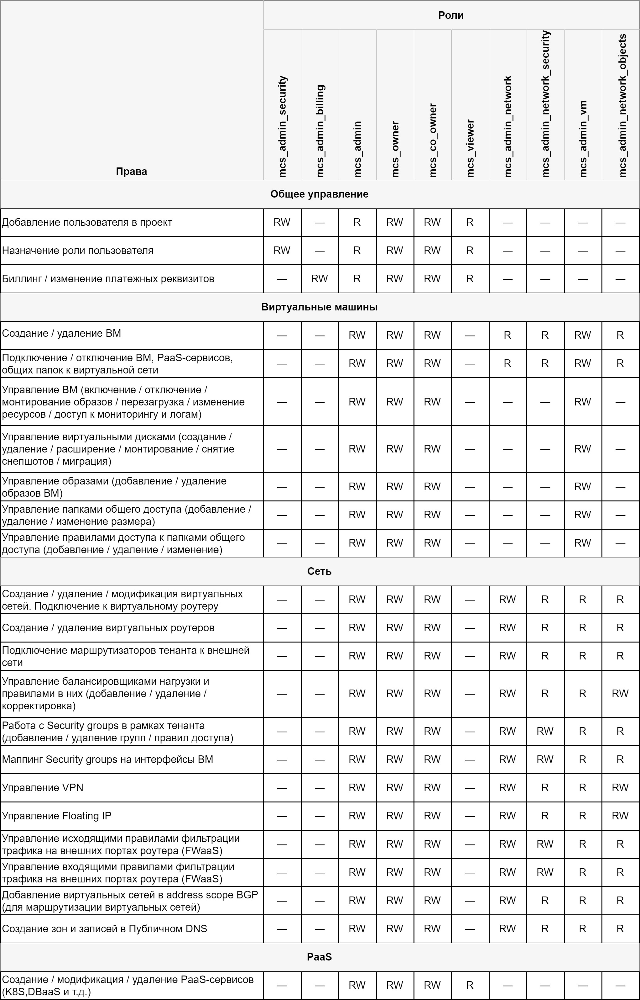

# {heading(Права и учётные записи пользователей)[id=arch_roles]}

Пользователи {var(sys2)} создаются в Портале управления доступом (Keycloak) в одной из следующих Областей безопасности (Realm):

* `Master` — только для учётных записей Администраторов {var(sys2)}.
* `MCS` — для учётных записей Пользователей {var(sys2)}.

В настройках клиентов указывается протокол OpenID Connect (см. {linkto(#pic_openid_connect)[text=рисунок %number]}).

<warn>

OpenID Connect — основной протокол обмена данными в рамках идентификации и аутентификации между Порталом самообслуживания, Keycloak и IAM (Sundog, Breeze и т.п.).

</warn>

{caption(Рисунок {counter(pic)[id=numb_pic_openid_connect]} — Настройка клиентов)[align=center;id=pic_openid_connect;number={const(numb_pic_openid_connect)}]}

{/caption}

Каждому пользователю в системе соответствует персонифицированная учётная запись.

Учетные записи пользователей условно можно разделить на группы, приведенные в {linkto(#tab_arch_users)[text=таблице %number]}.

{caption(Таблица {counter(table)[id=numb_tab_arch_users]} — Пользователи)[position=above;align=right;id=tab_arch_users;number={const(numb_tab_arch_users)}]}
[cols="1,2", options="header"]
|===
|Пользователи {var(sys2)}
|Описание

|{linkto(#role_model_mcs)[text=%text]}
.2+|Создаются в Keycloak в области безопасности (realm) `MCS` или импортируются в рамках интеграции с MS Active Directory.

К этим пользователям {var(sys2)} применяется ролевая модель управления доступом.

<err>

Чтобы назначить роль пользователю, его необходимо вручную создать в Портале управления доступом (Keycloak) или импортировать его из службы каталогов (например, MS Active Directory). Если пользователи импортируются из службы каталогов, необходимо настроить правила автоматического назначения ролей в зависимости он наличия атрибутов или принадлежности к соответствующим подразделениям.

</err>

|{linkto(#role_model_sa)[text=%text]}

|Администратор ИБ {var(sys2)}
|Администратор Портала управления доступом Keycloak. Имя учетной записи по умолчанию — `admin`. Обладает доступом ко всем учётным записям {var(sys2)} (кроме Суперадминистратора и тех, что хранятся в MS AD) и настройкам их доступа.

Учётные записи с данной ролью создаются в Keycloak в области безопасности (realm) `master` при включённой настройке неограниченного доступа к другим областям безопасности

|{linkto(#builtin_accounts)[text=%text]}
|Служебные (или сервисные) учётные записи используются сервисами OpenStack для обеспечения работы необходимых служб/сервисов
|===
{/caption}

## {heading(Пользователи Портала самообслуживания)[id=role_model_mcs]}

Для пользователей Портала самообслуживания поддерживается набор ролей, назначаемых в рамках отдельного проекта. Может быть назначена одна или несколько ролей (описаны в {linkto(#tab_mcs_users)[text=таблице %number]}) через Портал администратора → раздел «Проекты» (подробнее см. в разделе {linkto(../../usage_administration/users_management#superadmin_project_access_settings)[text=%text]}).

{caption(Таблица {counter(table)[id=numb_tab_mcs_users]} — Роли пользователей Портала самообслуживания)[position=above;align=right;id=tab_mcs_users;number={const(numb_tab_mcs_users)}]}
[cols="2,2,3", options="header"]
|===
|ID роли
|Название роли
|Описание

|`mcs_viewer`
|Наблюдатель
|Позволяет просматривать большую часть информации о проекте, но без доступа на редактирование

|`mcs_owner`
|Владелец проекта
|Служебная роль назначается автоматически только Владельцу проекта. Роль не может быть назначена другому пользователю

<warn>

Служебный пользователь с ролью «Владелец проекта» создаётся в единственном экземпляре при первоначальной настройке {var(sys2)} в Keystone и представляет собой единственного владельца всех проектов {var(sys2)}. Имя задаётся при создании. Данная учётная запись редактированию не подлежит.

</warn>

|`mcs_co_owner`
|Совладелец проекта
|Обеспечивает доступ ко всем ресурсам проекта. Может быть назначена вручную

|`mcs_admin_network`
|Администратор сети
|Обеспечивает доступ ко всем объектам сетевой подсистемы

|`mcs_admin_billing`
|Администратор биллинга проекта
|Обеспечивает доступ только к пункту «Баланс» и функциям биллинга

|`mcs_admin_security`
|Администратор пользователей
|Роль обычно не используется, так как добавление новых пользователей происходит с помощью добавления их в соответствующую группу AD

|`mcs_admin`
|Администратор проекта
|Обеспечивает доступ ко всем ресурсам проекта, кроме групп пользователей и баланса

|`mcs_admin_vm`
|Администратор виртуальных машин
|Обеспечивает доступ к виртуальным машинам проекта

|`mcs_admin_network_objects`
|Администратор сетевых ресурсов
|Обеспечивает доступ к сетевым ресурсам, связанным с Neutron и Octavia

|`mcs_admin_network_security`
|Администратор сетевой безопасности
|Обеспечивает доступ к сетевым ресурсам, связанным с безопасностью (`neutron_security`)
|===
{/caption}

Каждой роли соответствует определенный набор прав, приведенных в {linkto(#tab_mcs_roles)[text=таблице %number]}.

Условные обозначения:

* `-` — право не предоставляется.
* `RW` — право как на чтение, так и на внесение изменений.
* `R` — право только на чтение.

{caption(Таблица {counter(table)[id=numb_tab_mcs_roles]} — Права по ролям пользователей Портала самообслуживания)[position=above;align=right;id=tab_mcs_roles;number={const(numb_tab_mcs_roles)}]}

{/caption}

## {heading(Пользователи Портала администратора)[id=role_model_sa]}

Для пользователей Портала администратора поддерживается набор ролей, назначаемых персонально каждому администратору. Может быть назначена одна или несколько ролей через Портал администратора → раздел «Управление доступом».

<warn>

Роль `admin` позволяет получить полный доступ к инфраструктуре. Назначается, в том числе, служебной учётной записи `admin`, см. раздел {linkto(#builtin_accounts)[text=%text]}. Предоставляет управление сервисами OpenStack и `mcs`, которые аутентифицируются через Keystone.

</warn>

Каждой роли соответствует определенный набор прав, приведенных в {linkto(#tab_sa_roles)[text=таблице %number]}.

{caption(Таблица {counter(table)[id=numb_tab_sa_roles]} — Роли пользователей Портала администратора)[position=above;align=right;id=tab_sa_roles;number={const(numb_tab_sa_roles)}]}
[cols="3,2,2,2,2,2,2", options="header"]
|===
|Право
|sa_access<br>_admin
|sa_partners<br>_admin
|sa_billing<br>_admin
|sa_account<br>_admin
|sa_iam_admin
|sa_iam_viewer

|Взаимодействие с проектами
^.|—
^.|—
^.|R
^.|—
^.|RW
^.|R

|Взаимодействие с базовыми проектами
^.|—
^.|R
^.|—
^.|R
^.|—
^.|—

|Взаимодействие с пользователями
^.|—
^.|R
^.|R
^.|RW
^.|RW
^.|R

|Выдача sa- ролей пользователям
^.|RW
^.|—
^.|—
^.|—
^.|—
^.|—

|Выдача пользователям доступов к проектам
^.|—
^.|—
^.|—
^.|RW
^.|—
^.|—

|Управление партнерами
^.|—
^.|RW
^.|—
^.|—
^.|RW
^.|R

|Биллинг/изменение платежных реквизитов
^.|—
^.|—
^.|RW
^.|R
^.|—
^.|—

|Взаимодействие с группами пользователей
^.|—
^.|—
^.|—
^.|RW
^.|RW
^.|R

|Взаимодействие с квотами проектов
^.|—
^.|—
^.|—
^.|RW
^.|—
^.|—

|Взаимодействие с сервисами проектов
^.|—
^.|—
^.|—
^.|RW
^.|—
^.|—

|Взаимодействие с ролями пользователей
^.|—
^.|—
^.|—
^.|R
^.|R
^.|R
|===
{/caption}

Условные обозначения:

* `—` — право не предоставляется.
* `RW` — право как на чтение, так и на внесение изменений.
* `R` — право только на чтение.

## {heading(Встроенные служебные учётные записи)[id=builtin_accounts]}

Кроме пользовательских учётных записей в {var(sys3)} имеются встроенные учётные записи для внутренних запросов между компонентами.

Служебные (или сервисные) учётные записи используются сервисами OpenStack для обеспечения работы необходимых служб/сервисов. Каждый сервис OpenStack аутентифицируется по паролю во встроенном компоненте Keystone, получает одноразовый токен и выполняет требуемый запрос.

Пользовательские учётные записи используются для идентификации и аутентификации пользователей. Реализовано следующими сервисами:

* Keycloak.
* Keystone.
* Breeze.
* Dusk.
* Sundog.

Как в Keystone, так и в Keycloak для идентификации и аутентификации необходима пара из двух полей:

* Имя пользователя.
* Пароль.

Каждый сервис OpenStack использует свою сервисную учётную запись для авторизации запросов к {var(sys3)}. Исключение — суперадминистратор облака с учётной записью `admin`.

Чтобы просмотреть списки пользователей и ролей, используйте следующие команды:

* Список сервисных пользователей {var(sys2)}:
   
   ```bash
   openstack user list
   ```

  {caption(Пример вывода)[align=left;position=above]}
   ```bash
   +----------------------------------+------------------------------+
   | ID                               | Name                         |
   +----------------------------------+------------------------------+
   | 1164e0d1e5714f65882f5420c7cf9754 | panko                        |
   | 184f0b4df58c415ca332fe34371ce2d1 | katana                       |
   | 1ba360fba39d49568fecf6451020d8b7 | billing                      |
   | 312f82fa9c664c1ab344593b38014adb | glance                       |
   | 4953ca6e3d0e4d2f96dc0a44ca07a31f | magnum                       |
   | 551a6562ce334f928876b5cba24bb863 | karboii                      |
   | 596be38558474d5fa530b2fc9ce81b89 | heat                         |
   | 5cf3309b0ccf4aea90b6ba57ea685fb1 | placement                    |
   | 6ed244a042b541d79c137873737dc6b8 | cinder                       |
   | 7611854786e64f529194c63fe88e3322 | nova                         |
   | 788cf3794aac480db0b5d5f15d9d508d | neutron                      |
   | 797bb4cfc0b9427c830fc00d30b2b976 | ceilometer                   |
   | c749fc158eae4132929722460c51078f | trove                        |
   | cb1c315474b24a8380e42ae1b7174816 | octavia                      |
   | cef964c64b634e05a6b46151fa31a4d7 | barbican                     |
   | d57f498e9e354c44ab628bea10e64315 | admin                        |
   | f7dcc90ae1c44b6a83a69e9f3a1cb6ae | manila                       |
   +----------------------------------+------------------------------+
   ```
  {/caption}

* Список созданных учётных записей:
   
   ```bash
   openstack user list --domain users
   ```

  {caption(Пример вывода)[align=left;position=above]}
   ```bash
   +----------------------------------+------------------------------+
   | ID                               | Name                         |
   +----------------------------------+------------------------------+
   | 03240d7aafbc468da0d4a24d5827b3ee | tempest-user-1696297331      |
   | 058e76e5d89941e3923dff418fb51b0a | tempest-2115504947           |
   | 08ee4ae0b1714676a57b23a37d60783c | iam                          |
   | 0f51492dc5cc48ad94ae617f643e9cab | superadmin                   |
   | 1c277d03f50549f981fbdc0a338fa7ed | tempest-user-1654250193      |
   | 1d34eea9c50c40a58aeb99961d28fd44 | tempest-user-737150262       |
   | 2031fd3b88574244a2b782a0022a71ec | tempest-user-1834910734      |
   | 223a8472659c438c8854da1e7ba066a0 | tempest-user-927474618       |
   | 25f90f73f8024c369ac9e3f702081b1b | proj1@vk.team                |
   ```
  {/caption}

* Список созданных сервисных и пользовательских ролей:
   
   ```bash
   openstack role list
   ```

  {caption(Пример вывода)[align=left;position=above]}
   ```bash
   +----------------------------------+----------------------------+
   | ID                               | Name                       |
   +----------------------------------+----------------------------+
   | 07ccd8419db8439c9cb070ad5c5b4575 | mcs_admin_vm               |
   | 0b2b0e4d568241faa56aa49b47417e1a | service                    |
   | 0ccaf21e224240eb9246051ff94555a6 | mcs_admin_network_objects  |
   | 163747326a3447889da732c1483a6c3f | magnum_admin               |
   | 1f7bbde9d6544bebbb5430a273dc6467 | sahara_ci                  |
   | 26b4502c848d4051af20090209d04378 | karboii_admin              |
   | 2919118a24444f4fbbf7f0de87e06d0e | mcs_monitoring_agent       |
   | 29b93877db8249d39c236519c68b1f2a | member                     |
   | 479f1191957c4d6e9f9f7753a629ea03 | heat_stack_owner           |
   | 52c806f3afc2437785f923a30fd7832b | trove_user                 |
   | 57cf613e254d46ec8160980d0e6245cc | magnum_tester              |
   | 5cbe61730fa843318adb664a35abc4c0 | heat_stack_user            |
   | 614cc35888ca4cfb884f2ac1898845d2 | mcs_admin_network_security |
   | 66da25cf1990409b82a5feae4dfdd09e | tuareg                     |
   | 77f14e5de64344a9a2b91602882c4071 | sahara_admin               |
   ```
  {/caption}

<err>

По умолчанию на деплой-ноде в конфигурационном файле `/home/centos/inventory/<ENV>/group_vars/<ENV>/vault.yml`, где `<ENV>` — название окружения, размещаются основные пароли, используемые для работы {var(sys2)} сразу после установки.

</err>