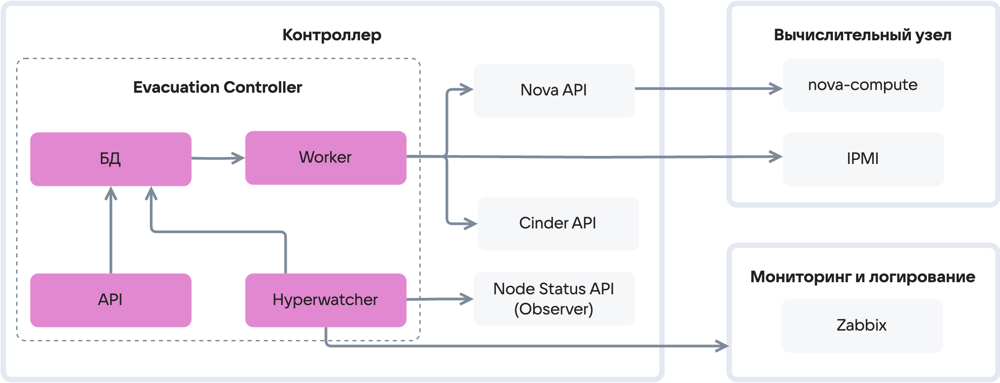

# {heading(Обзор Evacuation Controller)[id=autoevacuation_controller]}

Автоэвакуация обеспечивается механизмом Evacuation Controller. Evacuation Controller — это группа сервисов для восстановления работоспособности облака при отказе гипервизоров. Начинает работу, когда один или несколько гипервизоров
переходят в аномальное состояние. 

Задача Evacuation Controller — принять решение о необходимости эвакуации ВМ с отказавшего гипервизора, запустить этот процесс и отследить его завершение.

Evacuation Controller не запускает живую миграцию. Если он активен, гипервизор и все ВМ находятся в нерабочем состоянии.

<err>

Evacuation Controller не запускает отключенные серверы. После сбоя на гипервизоре может возникнуть некорректное состояние, требующее проверки. Администратор {var(sys2)} запускает вычислительный узел.

</err>

Функции Evacuation Controller:

* Отслеживает состояние гипервизоров.
* Принимает решение о необходимости эвакуации.
* Отправляет команду на эвакуацию.
* Отслеживает процесс эвакуации.

## {heading(Подготовка к работе)[id=controller_requirements]}

Для корректной работы Evacuation Controller необходимо:

* Настроить доступ из Management-сети в сеть IPMI.
* Настроить доменную зону для IPMI.
* Проверить доступность протокола ICMP в Management сети: вычислительные узлы должны отвечать на запрос `ping`.
* Проверить, что логин и пароль IPMI на всех вычислительных узлах одинаковые.

## {heading(Компоненты Evacuation Controller)[id=controller_components]}

В состав Evacuation Controller входят:

* Сервисы `Hyperwatcher`, `Worker`, `API`. 
* Инфраструктурные зависимости: БД MariaDB `mariadb-evacuation.service`, k8s-сервис `Observer`.

Описание компонентов Evacuation Controller приведено в таблице {linkto(#tab_ec_component)[text=таблице %number]}.

{caption(Таблица {counter(table)[id=numb_tab_ec_component]} — Описание компонентов Evacuation Controller)[align=right;position=above;id=tab_ec_component;number={const(numb_tab_ec_component)}]}

[cols="2,5", options="header"]
|===
|Компонент
|Действие

|`Hyperwatcher`
|Периодически запрашивает статусы вычислительных узлов у компонента `Observer`.
Если найден гипервизор в статусе `DOWN`, Evacuation Controller проверяет список условий для начала эвакуации:

* На гипервизоре размещены ВМ.
* Гипервизор не эвакуирован.
* Отказ гипервизоров не массовый.
* Эвакуация гипервизора возможна.

Если эти условия соблюдены, `Hyperwatcher` добавляет в БД команду на эвакуацию вычислительного узла.
Эту команду получает компонент `Worker` и начнет работу

|`Worker`
|Выполняет миграции и отключение вычислительных узлов, взаимодействуя с внешними сервисами {var(sys2)}

|`API`
|Веб-сервер, принимающий на исполнение команды, инициированные администратором {var(sys2)}.
Добавляет принятые команды в БД, откуда ее получает `Worker`

|`Observer`
|Внешний сервис по отношению к Evacuation Controller. Информирует компонент `Hyperwatcher` о статусе вычислительных узлов.
Отслеживает следующие события вычислительных узлов:
* Отсутствие ответа ping от вычислительного узла.
* Изменение статуса Consul-агента на `DOWN`.
* Отказ `nova-compute` на вычислительном узле

|`БД`
|База данных хранит записи об изолировании (fencing), о задачах для компонента `Worker` и прочее
|===

{/caption}

## {heading(Расположение компонентов на узлах)[id=controller_components_node]}

Компоненты Evacuation Controller расположены на управляющих узлах в сервисе Kubernetes в пространстве `iaas-vkcloud`:

```console
$ kubectl -n iaas-vkcloud -l app.kubernetes.io/instance=evacuation-controller get pods
NAME                                                  READY   STATUS    RESTARTS   AGE
evacuation-controller-api-8cbdcd767-78djp             1/1     Running   0          38h
evacuation-controller-hyperwatcher-8669c9fd59-kqdkc   1/1     Running   0          38h
evacuation-controller-worker-7c6459d7c9-v4fzf         1/1     Running   0          38h
```

Компонент `Observer` расположен на управляющих узлах в сервисе Kubernetes в пространстве `sre-vkcloud`:

```console
$ kubectl -n sre-vkcloud -l app.kubernetes.io/instance=observer get pods
NAME                            READY   STATUS    RESTARTS   AGE
observer-api-665d764968-t78n4   1/1     Running   0          23d
```

БД MariaDB представлена на управляющем узле как служба:

```console
$ systemctl status mariadb-evacuation
● mariadb-evacuation.service - MariaDB 3:10.10.2-2 database server
...
```

## {heading(Взаимодействие сервисов)[id=controller_components_interaction]}

Схема взаимодействия внутренних и внешних сервисов с Evacuation Controller представлена на {linkto(#pic_evacuation_controller)[text=рисунке %number]}.

{caption(Рисунок {counter(pic)[id=numb_pic_evacuation_controller]} — Схема взаимодействия внутренних и внешних сервисов с Evacuation Controller)[align=center;position=under;id=pic_evacuation_controller;number={const(numb_pic_evacuation_controller)}]}

{/caption}


