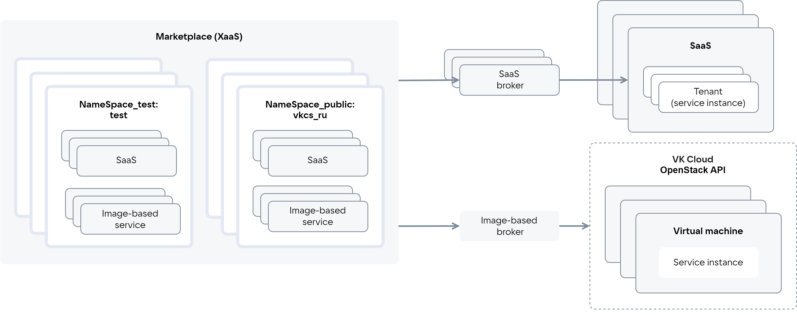

# {heading(Общая информация)[id=xaas_common]}

В Marketplace размещаются следующие типы сервисов:

* SaaS-приложение — централизованно установленный мультитенантный продукт. Инфраструктура для работы сервиса предоставляется поставщиком. Поставщик развертывает сервис либо на сторонней инфраструктуре, либо на инфраструктуре {var(sys2)} в своем проекте. Пользователю предоставляется доступ к инстансу сервиса через отдельный тенант/аккаунт.
* Image-based приложение — продукт, который развертывается на основе образов ВМ в облачном проекте пользователя. Для работы сервиса может использоваться дополнительная инфраструктура {var(sys2)}: виртуальные сети, балансировщики нагрузки, кластеры DBaaS, резервное копирование. Инфраструктура для работы сервиса предоставляется {var(sys5)}. Инстансы сервиса развертываются в проекте пользователя.

Взаимодействие Marketplace с сервисами осуществляется по протоколу VK OSB с помощью брокеров ({linkto(#pic_xaas)[text=рисунок %number]}). Брокер обеспечивает доставку конфигурации сервиса в Marketplace: Marketplace периодически опрашивает брокера о текущей конфигурации сервиса.

{caption(Рисунок {counter(pic)[id=numb_pic_xaas]} — Взаимодействие Marketplace с сервисами)[align=center;position=under;id=pic_xaas;number={const(numb_pic_xaas)}]}
{params[noBorder=true]}
{/caption}

SaaS-брокер обеспечивает взаимодействие конкретного SaaS-приложения с Marketplace. Image-based брокер обеспечивает взаимодействие image-based приложений разных поставщиков с Marketplace. Image-based брокер внутри себя имеет тенанты, объединяющие image-based приложения одного поставщика.

Marketplace включает в себя:

* Тестовые пространства имен (`NameSpace_test`), в которых проверяется конфигурация сервиса перед публикацией (подробнее — в разделах {linkto(../../marketplace_xaas/xaas_publish/xaas_publish_api#xaas_publish_api)[text=%text]}, {linkto(../../marketplace_xaas/xaas_publish/xaas_publish_playbook#xaas_publish_playbook)[text=%text]}). Доступны все ревизии сервиса.
* Открытые пространства имен (`NameSpace_public`), в которых сервис публикуется. Доступна только последняя опубликованная ревизия сервиса.

Доступ к тестовым и открытым пространствам имен выдается администратором {var(sys2)}. Доступ к тестовым пространствам имен выдается только поставщикам. Если у пользователя есть доступ к нескольким пространствам имен, в каталоге Marketplace он будет видеть все сервисы и их ревизии, размещенные хотя бы в одном пространстве имен, к которому у пользователя есть доступ.

Тестовые и открытые пространства имен для image-based приложения задаются в сервисном ключе и image-based брокере, для SaaS-приложения — в SaaS-брокере (подробнее — в разделах {linkto(../../marketplace_xaas/xaas_service_key#xaas_service_key_create)[text=%text]}, {linkto(../../marketplace_xaas/xaas_broker#xaas_broker_register)[text=%text]}).