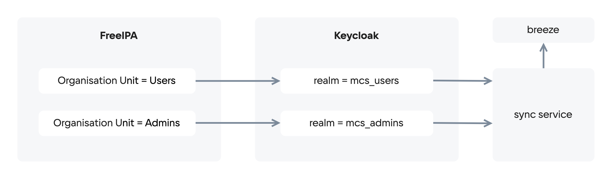

# {heading(Управление пользователями)[id=users_management]}

При входе пользователя в {var(sys4)} средствами Подсистемы управления доступом (ПУД) выполняется поиск соответствующей учетной записи в собственном хранилище. Если учетная запись не найдена, поиск продолжается в преднастроенных внешних базах данных. Вход в {var(sys4)} разрешается, если учетная запись пользователя найдена.

Управление пользователями выполняется через Портал управления доступом (Keycloak).

{ifndef(cer)}
Инструкции по выполнению операций с пользователями приведены в [официальной документации Keycloak](https://www.keycloak.org/docs/latest/server_admin/#assembly-managing-users_server_administration_guide).
{/ifndef}

## {heading(Подготовка к работе)[id=users_management_preparing_for_work]}

### {heading(Добавление LDAP-провайдера)[id=users_management_add_ldap_provider]}

<err>

В случае недоступности LDAP-сервера и неработоспособности настроенной федерации пользователей, вход в Портал администратора и Портал самообслуживания будет недоступен как для пользователей LDAP, так и для локальных Keyсloak пользователей.

</err>

{ifndef(cer)}
Чтобы добавить LDAP-провайдера в Портале управления доступом Keycloak:
{/ifndef}

{ifdef(cer)}
Чтобы добавить LDAP-провайдера в Портале управления доступом:
{/ifdef}

1. Перейдите в пункт меню **User Federation**.
1. В выпадающем списке **Add new provider** выберите пункт **ldap**.
1. Задайте параметры подключения к LDAP-провайдеру:

   * **Console display name** — имя LDAP-провайдера.
   * **Vendor** — из выпадающего списка выберите LDAP-провайдер, который используется в вашей сети. Если вы используете `FreeIPA`, выберите `Rad Hat Directory Server`.
   * **Connection URL** — указать URL для соединения с LDAP-провайдером, например, `ldap://10.28.227.59/`. Нажмите кнопку **Test connection**, чтобы убедиться, что связь с сервером установлена.
   * **Bind Type** — указать значение `simple`.
   * **Bind DN** — указать учётную запись пользователя, которая будет использоваться для доступа к LDAP-провайдеру, например, `CN=Administrator`, `CN=Users`, `DC=test`, `DC=local`. Учётная запись должна иметь права администратора.
   * **Bind Credential** — указать пароль учётной записи, которая будет использоваться для доступа к LDAP-провайдеру. Нажмите кнопку **Test Authentication**. Если результат – **Success**, настройка выполнена успешно.
   * **Edit mode** — в списке выберите **READ_ONLY** (пользовательские данные будут доступны только для чтения), или **WRITABLE** (данные будут синхронизироваться с LDAP-провайдером только по требованию), или **UNSYNCED** (пользовательские данные будут импортированы, но не синхронизированны с LDAP-провайдером).
   * **Users DN** — указать домен пользователей, например, `CN=Administrator`, `CN=Users`, `DC=test`, `DC=local`.
   * **Username LDAP attribute** — указать значение `sAMAccountName`.
   * **RDN LDAP attribute** — указать значение `cn`.
   * **UUID LDAP attribute** — указать значение `objectGUID`.
   * **User Object Classes** — указать значение `person, organizationalPerson, user, inetOrgPerson`.

1. При необходимости задайте параметры на других вкладках.
1. Нажмите кнопку **Save**.

Чтобы настроить присвоение ролей и групп всем пользователям из LDAP-провайдера:

1. Перейдите в пункт меню **User Federation**.
1. Выберите созданного поставщика хранилища, нажав на его название в списке.
1. Перейдите на вкладку **Mappers**.
1. Нажмите кнопку **Create**.
1. Задайте параметры:

   * **Name** — название сопоставления.
   * **Mapper Type** — тип сопоставления:

      * `group-ldap-mapper` — сопоставление по принадлежности к группе (в основном используется только этот тип сопоставления).

         {ifndef(cer)}
         <info>
     
         Описание остальных доступных типов сопоставления приведено в [официальной документации Keycloak](https://www.keycloak.org/docs/latest/server_admin/).
         
         </info>
         {/ifndef}

1. Заполните остальные поля, которые появляются при выборе из списка **Mapper Type**.
1. Нажмите кнопку **Save**.

{ifdef(box)}
### {heading(Настройки AD FS)[id=ad_fs_settings]}

Настройка AD FS заключается в установке параметров поставщика идентификации.

Чтобы добавить поставщика идентификации в Портале управления доступом:

1. Перейдите в пункт меню **Identity Providers**.
1. В выпадающем списке **Add provider** выберите пункт **SAML v2.0**.
1. Задайте параметры:

   * **Enabled** — оставить переключатель в положении **ON**.
   * **Trust Email** — установить переключатель в положение **ON**.
   * **Sync Mode** — указать значение `import`.
   * **Single Sign-On Service URL** — указать адрес сервиса единой точки входа, например, `https://10.28.227.59/adfs/ls/`.
   * **Single Logout Service URL** — указать адрес сервиса единой точки выхода, например, `https://10.28.227.59/adfs/ls/`.
   * **Backchannel Logout** — установить переключатель в положение **ON**.
   * **HTTP-POST Binding Response** — установить переключатель в положение **ON**.
   * **HTTP-POST Binding for AuthnRequest** — установить переключатель в положение **ON**.
   * **HTTP-POST Binding Logout** — установить переключатель в положение **ON**.
   * **Allowed clock skew** — указать значение `300`.

1. Нажмите кнопку **Save**.
1. Перейдите на вкладку **Export** и скачайте XML-файл с метаданными для выполнения настроек на стороне поставщика идентификации, нажав кнопку **Download**.

<err>

После сохранения настроек информация о пользователях автоматически не передаётся.

</err>

Для настройки процесса синхронизации заполните параметры в блоке **Sync Settings**. Значения параметров выбираются исходя из особенностей инсталляции — доступных сетевых ресурсов, производительности серверов MS AD и тому подобных.

Для синхронизации пользователей из списка **Actions**, расположенного в правой части окна, выберете **Sync all users**.

<warn>

Правила настройки домена AD и применения метаданных для работы с AD FS описаны в статье [Создание отношения доверия с проверяющей стороной](https://docs.microsoft.com/ru-ru/windows-server/identity/ad-fs/operations/create-a-relying-party-trust).

</warn>
{/ifdef}

## {heading(Создание пользователей)[id=users_create]}

Создание пользователей выполняется в разделе **Users** Keycloak.
Пользователи {var(sys2)} создаются в одной из следующих областей безопасности (realm):

* `master` — только для учётных записей Администраторов {var(sys2)}.
* `mcs_users` — для учётных записей Пользователей Портала самообслуживания.
* `mcs_admins` — для учётных записей Пользователей Портала администратора.

<!--- // #todo saml в текущей версии не поддерживается, нужно добавить, когда сделают (см. https://confluence.vk.team/pages/viewpage.action?pageId=802513031) -->

## {heading(Синхронизация пользователей)[id=users_synchronization]}

В рамках интеграции с LDAP-провайдером:

* Organisation Unit **Users** синхронизируется с областью безопасности (realm) `mcs_users` и содержит учётные записи Портала самообслуживания.
* Organisation Unit **Admins** синхронизируется с областью безопасности (realm) `mcs_admins` и содержит учётные записи Портала администратора.

Схема синхронизации учётных записей приведена на {linkto(#pic_realms)[text=рисунке %number]}.

{caption(Рисунок {counter(pic)[id=numb_pic_realms]} — Синхронизация учётных записей)[align=center;position=under;id=pic_realms;number={const(numb_pic_realms)}]}

{/caption}

<warn>

При создании пользователя для параметра **Client type** указывается протокол OpenID Connect.

</warn>

{ifndef(cer)}
OpenID Connect — основной протокол обмена данными в рамках идентификации и аутентификации между Порталом самообслуживания, Keycloak и IAM.
{/ifndef}

{ifdef(cer)}
OpenID Connect — основной протокол обмена данными в рамках идентификации и аутентификации между Порталом самообслуживания и Подсистемой управления доступом.
{/ifdef}

{ifndef(cer)}

## {heading(Создание служебной учётной записи)[id=service_account]}

Чтобы создать служебную (сервисную) учётную запись:

1. Выполните подготовительные операции (подробнее — в разделе {linkto(../../usage/interfaces_access#use_openstackcli_admin)[text=%text]})
1. Создайте сервисную учётную запись:

   ```console
   # openstack user create --password <ПАРОЛЬ> <ИМЯ_ПОЛЬЗОВАТЕЛЯ>
   ```

   {caption(Пример ожидаемого результата)[align=left;position=above]}
   ```console
   +---------------------+----------------------------------+
   | Field               | Value                            |
   +---------------------+----------------------------------+
   | domain_id           | default                          |
   | enabled             | True                             |
   | id                  | <USER_ID>                        |
   | name                | <ИМЯ_ПОЛЬЗОВАТЕЛЯ>               |
   | options             | {}                               |
   | password_expires_at | None                             |
   +---------------------+----------------------------------+
   ```
   {/caption}

   <warn>

   Значение в строке `domain_id` должно быть `default`.

   </warn>
   
1. Назначьте роль `mcs_co_owner` в необходимом проекте:

   ```console
   # openstack role add --project <ID> --project-domain <DOMAIN_ID> --user <USER_ID> mcs_co_owner
   ```

   <warn>

   Список проектов можно получить, выполнив команду:

   ```console
   # openstack project list --long
   ```

   {caption(Пример ожидаемого результата)[align=left;position=above]}
   ```console
   +------------+---------------+-------------+-----------------+---------+
   | ID         | Name          | Domain ID   | Description     | Enabled |
   +------------+---------------+-------------+-----------------+---------+
   | 12fd1b103c | mcs1901586151 | 19982d18e   | None            | True    |
   | e0d882c887 | admin         | default     | None            | True    |
   +------------+---------------+-------------+-----------------+---------+
   ```
   {/caption}

   </warn>
   
1. Создайте конфигурационный файл:

   ```console
   # cat > ~root/s2s.sh
   ```

   {caption(Пример ожидаемого результата)[align=left;position=above]}
   ```console
   export OS_USERNAME=<ИМЯ_ПОЛЬЗОВАТЕЛЯ>
   export OS_PASSWORD=<ПАРОЛЬ>
   export OS_PROJECT_NAME=<ИМЯ_ПРОЕКТА>
   export OS_USER_DOMAIN_NAME=Default
   export OS_PROJECT_DOMAIN_NAME=<ДОМЕННОЕ_ИМЯ_ПРОЕКТА>
   export OS_AUTH_URL=http://internal.private.corp.devmail.ru:35357
   export OS_IDENTITY_API_VERSION=3
   export OS_IMAGE_API_VERSION=2
   export OS_ENDPOINT_TYPE='internalURL'
   export OS_ENDPOINT=internal
   export OS_INTERFACE=internal
   export OS_REGION=RegionOne
   ```
   {/caption}

   <warn>

   Значение `ДОМЕННОЕ_ИМЯ_ПРОЕКТА` можно получить в параметре `name`, выполнив команду:

   ```console
   # openstack domain show <ID_ПРОЕКТА>
   ```

   </warn>
{/ifndef}

## {heading(Управление группами)[id=group_manage]}

{ifndef(cer)}

<warn>

Инструкции по управлению группами приведены в [официальной документации Keycloak](https://www.keycloak.org/docs/latest/server_admin/index.html#proc-managing-groups_server_administration_guide).

</warn>
{/ifndef}

С группами доступны следующие действия:

* Создание новой группы.
* Редактирование существующей группы:

   * Добавление атрибутов.
   * Маппинг ролей.

* Добавление в группу или удаление из группы существующих пользователей.
* Настройка групп по умолчанию.
* Удаление группы.

Просмотр списка всех групп доступен в разделе **Groups** Портала управления доступом.

## {heading(Просмотр списка пользователей)[id=users_list]}

### {heading(Подсистема управления доступом Keycloak)[id=users_list_keycloak]}

Просмотр списка пользователей осуществляется в разделе **Users** Keycloak. Если список не появился сразу, введите `*` в текстовом поле **Search user** и нажмите →.

### {heading(OpenStack CLI)[id=users_list_cli]}

Чтобы просмотреть списки пользователей и ролей при помощи OpenStack CLI:

1. Выполните подготовительные операции (подробнее — в разделе {linkto(../../usage/interfaces_access#use_openstackcli_admin)[text=%text]}).
1. Выполните команды:

   * Список сервисных пользователей {var(sys2)}:

      ```console
      $ openstack user list
      ```

      {ifndef(cer)}

      {caption(Пример ожидаемого результата)[align=left;position=above]}
      ```console
      +----------------------------------+------------------------------+
      | ID                               | Name                         |
      +----------------------------------+------------------------------+
      | 1164e0d1e5714f65882f5420c7cf9754 | panko                        |
      | 184f0b4df58c415ca332fe34371ce2d1 | katana                       |
      | 1ba360fba39d49568fecf6451020d8b7 | billing                      |
      | 312f82fa9c664c1ab344593b38014adb | glance                       |
      | 4953ca6e3d0e4d2f96dc0a44ca07a31f | magnum                       |
      | 551a6562ce334f928876b5cba24bb863 | karboii                      |
      | 596be38558474d5fa530b2fc9ce81b89 | heat                         |
      | 5cf3309b0ccf4aea90b6ba57ea685fb1 | placement                    |
      | 6ed244a042b541d79c137873737dc6b8 | cinder                       |
      | 7611854786e64f529194c63fe88e3322 | nova                         |
      | 788cf3794aac480db0b5d5f15d9d508d | neutron                      |
      | c749fc158eae4132929722460c51078f | trove                        |
      | cb1c315474b24a8380e42ae1b7174816 | octavia                      |
      | cef964c64b634e05a6b46151fa31a4d7 | barbican                     |
      | d57f498e9e354c44ab628bea10e64315 | admin                        |
      | f7dcc90ae1c44b6a83a69e9f3a1cb6ae | manila                       |
      +----------------------------------+------------------------------+
      ```
      {/caption}

      {/ifndef}
   
   * Список созданных учётных записей:

      ```console
      # openstack user list --domain users
      ```

      {ifndef(cer)}

      {caption(Пример ожидаемого результата)[align=left;position=above]}
      ```console
      +----------------------------------+------------------------------+
      | ID                               | Name                         |
      +----------------------------------+------------------------------+
      | 03240d7aafbc468da0d4a24d5827b3ee | tempest-user-1696297331      |
      | 058e76e5d89941e3923dff418fb51b0a | tempest-2115504947           |
      | 08ee4ae0b1714676a57b23a37d60783c | iam                          |
      | 0f51492dc5cc48ad94ae617f643e9cab | superadmin                   |
      | 1c277d03f50549f981fbdc0a338fa7ed | tempest-user-1654250193      |
      | 1d34eea9c50c40a58aeb99961d28fd44 | tempest-user-737150262       |
      | 2031fd3b88574244a2b782a0022a71ec | tempest-user-1834910734      |
      | 223a8472659c438c8854da1e7ba066a0 | tempest-user-927474618       |
      | 25f90f73f8024c369ac9e3f702081b1b | proj1@vk.team                |
      ```
      {/caption}
    
      {/ifndef}

   * Список созданных сервисных и пользовательских ролей:

      ```console
      # openstack role list
      ```

      {ifndef(cer)}
    
      {caption(Пример ожидаемого результата)[align=left;position=above]}
      ```console
      +----------------------------------+----------------------------+
      | ID                               | Name                       |
      +----------------------------------+----------------------------+
      | 07ccd8419db8439c9cb070ad5c5b4575 | mcs_admin_vm               |
      | 0b2b0e4d568241faa56aa49b47417e1a | service                    |
      | 0ccaf21e224240eb9246051ff94555a6 | mcs_admin_network_objects  |
      | 163747326a3447889da732c1483a6c3f | magnum_admin               |
      | 1f7bbde9d6544bebbb5430a273dc6467 | sahara_ci                  |
      | 26b4502c848d4051af20090209d04378 | karboii_admin              |
      | 2919118a24444f4fbbf7f0de87e06d0e | mcs_monitoring_agent       |
      | 29b93877db8249d39c236519c68b1f2a | member                     |
      | 479f1191957c4d6e9f9f7753a629ea03 | heat_stack_owner           |
      | 52c806f3afc2437785f923a30fd7832b | trove_user                 |
      | 57cf613e254d46ec8160980d0e6245cc | magnum_tester              |
      | 5cbe61730fa843318adb664a35abc4c0 | heat_stack_user            |
      | 614cc35888ca4cfb884f2ac1898845d2 | mcs_admin_network_security |
      | 66da25cf1990409b82a5feae4dfdd09e | tuareg                     |
      | 77f14e5de64344a9a2b91602882c4071 | sahara_admin               |
      ```
      {/caption}
    
<err>
    
По умолчанию на деплой-ноде в конфигурационном файле `/home/redos/inventory/<ENV>/group_vars/<ENV>/vault.yml`, где `<ENV>` — название окружения, размещаются основные пароли, используемые для работы {var(sys2)} сразу после установки.
    
</err>
{/ifndef}

## {heading(Предоставление доступа к проектам Портала самообслуживания)[id=superadmin_project_access_settings]}

<err>

Доступ к проекту настраивается не для отдельного пользователя, а для группы. Предварительно добавьте пользователя в группу, чтобы предоставить ему доступ к проекту.

</err>

Чтобы предоставить пользователю доступ к проекту Портала самообслуживания:

1. В Портале администратора перейдите в раздел **Управление проектами** → **Проекты**.
1. Нажмите на значок **•••** справа от названия проекта и выберите пункт **Управление доступом**.
1. В открывшемся окне нажмите кнопку **Добавить**.
1. Выберите группу, в которой находится пользователь, и добавьте необходимую роль пользователя в проекте.
1. Нажмите кнопку **Сохранить изменения**.

<warn>

Доступ к Порталу самообслуживания можно предоставить только пользователям из области безопасности (realm) **mcs_users** (подробнее — в {linkto(../../arch/arch-roles#arch-roles)[text=%text]}).

</warn>

<info>

Посмотреть все учётные записи пользователей Портала самообслуживания можно в Портале Администратора в разделе **Управление проектами** на странице **Пользователи**.

</info>

Описание ролей пользователей {var(sys2)} представлено в разделе {linkto(../../arch/arch-roles#arch-roles)[text=%text]}.

## {heading(Предоставление доступа к Порталу администратора)[id=superadmin_access_settings]}

Чтобы предоставить пользователю доступ к Порталу администратора:

{ifdef(box)}
1. В Портале администратора перейдите в раздел **Администрирование** → **Управление доступом**.
{/ifdef}
{ifndef(box)}
1. В Портале администратора перейдите в раздел **Управление доступом**.
{/ifndef}
1. Нажмите кнопку **Добавить**.
1. В текстовом поле **Логин** начните вводить имя учётной записи пользователя.
1. В выпадающем списке выберете учётную запись.
1. В выпадающем списке **Роли** выберите одну или несколько ролей.
1. Нажмите кнопку **Подтвердить**.

<!---
=== Kerberos

По умолчанию Kerberos не используется в {var(sys3)}. Однако Keycloak поддерживает вход (аутентификацию) пользователей через Kerberos при помощи протокола SPNEGO. Подробная информация об этом механизме и его настройках доступна в https://www.keycloak.org/docs/latest/server_admin/#_kerberos[официальной документации Keycloak].
//Формулировка не четкая, так как поддержка Kerberos не гарантируется. И вообще скорее всего не работает из коробки.
-->

<warn>

Доступ к Порталу администратора можно предоставить только пользователям из области безопасности (realm) **mcs_admins** (подробнее — в {linkto(../../arch/arch-roles#arch-roles)[text=%text]}).

</warn>

<info>

Посмотреть все учётные записи пользователей Портала администратора можно в разделе **Администрирование** на странице **Управление доступом**.

</info>

## {heading(Редактирование роли для пользователя Портала администратора)[id=superadmin_user_role_set]}

Чтобы добавить новую роль для пользователя Портала администратора:

{ifdef(box)}
1. В Портале администратора перейдите в раздел **Администрирование** → **Управление доступом**.
{/ifdef}
{ifndef(box)}
1. В Портале администратора перейдите в раздел **Управление доступом**.
{/ifndef}
1. Нажмите на значок **•••** справа от имени пользователя, которому необходимо добавить или удалить роль и выберите пункт **Редактировать**.
1. Нажмите на поле **Роль**, выберите одну или несколько ролей в списке.
1. Нажмите кнопку **Подтвердить**.

## {heading(Блокировка и разблокировка учетной записи)[id=superadmin_user_role_block_unblock]}

Учётная запись блокируется, если пользователь не входил в {var(sys4)} более 45 дней.

{ifdef(box)}
Чтобы поменять значение параметра, определяющего период неактивности пользователя:

1. Подключитесь к деплой-ноде по SSH (подробнее — в разделе {linkto(../../usage/interfaces_access#deploy_host_auth)[text=%text]}).
1. Откройте на редактирование файл `~/inventory/vkcloud/group_vars/vkcloud_kube/blocker-service.yml`.
1. Установите требуемое значения для параметра (например, 480 часов):

   ```console
   helm_BLOCKER_SERVICE_LAST_ACTIVITY_THRESHOLD: 480h
   ```

1. Сохраните изменения в файле.
1. Перезапустите плейбук для сервиса блокировки:

   ```console
   $ cd ~/inventory/vkcloud/
   $ ansible-playbook -i vkcloud.yml -e env=vkcloud ../ansible-openstack/playbooks/helm-blocker-service.yml
   ```

   <warn>

   Для перезапуска пода и применения новых настроек сервиса блокировки требуется 1 час. Обычно перезапуск идет через cron в 00 минут каждого часа.

   </warn>

{/ifdef}

При попытке войти в Портал самообслуживания или Портал Администратора с помощью заблокированной учётной записи на экране появится ошибка входа «403». Если заблокированный пользователь является владельцем проекта, работа других пользователей в проекте не ограничивается.

<warn>

Сервисные учётные записи не блокируются.

</warn>

Чтобы заблокировать или разблокировать учётную запись пользователя Портала администратора:

{ifdef(box)}
1. В Портале администратора перейдите в раздел **Администрирование** → **Управление доступом**.
{/ifdef}
{ifndef(box)}
1. В Портале администратора перейдите в раздел **Управление доступом**.
{/ifndef}
1. Нажмите на значок **•••** справа от учётной записи пользователя и выберите пункт **Заблокировать** или **Разблокировать**.
1. Нажмите кнопку **Подтвердить**.

Чтобы заблокировать или разблокировать учётную запись пользователя Портала самообслуживания:

1. В Портале администратора перейдите в раздел **Управление проектами** → **Пользователи**.
1. Нажмите на имя пользователя и перейдите на вкладку **Профиль**.
1. В строке **Пользователь активен** нажмите на значок **•••** и выберите пункт **Заблокировать** или **Разблокировать**.
1. Нажмите кнопку **Подтвердить**.

## {heading(Управление сеансами доступа)[id=superadmin_session_management]}

{ifndef(box)}

<info>

Для каждой учетной записи пользователя единовременно может быть запущен только один сеанс доступа.

</info>
{/ifndef}

{ifdef(box)}
Администратор может:

* Установить ограничение на количество одновременных сеансов доступа.
* Принудительно завершить активный сеанс доступа пользователя.

### {heading(Установка ограничения на количество одновременных сеансов доступа)[id=setting_limit_on_number_of_access_sessions]}

Чтобы установить ограничение в один активный сеанс доступа:

1. Войдите на деплой-ноду через SSH:

   ```console
   $ ssh <USERNAME>@<HOST_IP>
   ```

   где `<USERNAME>` — логин, созданный при инсталляции {var(sys2)} (например, `redos`).

1. Введите пароль от учётной записи администратора или пройдите аутентификацию с помощью файла закрытого ключа.
1. Откройте для редактирования файл `~/inventory/vkcloud/group_vars/vkcloud/vars.yml`.
1. Установите `1` в параметре `sessions_limit`.

   <info>

   Допустимые значения для параметра `sessions_limit`:

   * 0 — количество одновременных сессий не ограничено (используется по умолчанию).
   * 1 — единовременно может быть запущена только одна сессия для каждой учётной записи пользователя.

   </info>
   
1. Сохраните изменения в файле.
1. Перезапустите плейбук для сервиса авторизации:

   ```console
   $ cd ~/inventory/vkcloud/
   $ ansible-playbook -i vkcloud.yml -e env=vkcloud ../ansible-openstack/playbooks/helm-auth-service.yml
   ```

{/ifdef}

### {heading(Завершение активного сеанса доступа)[id=superadmin_ending_active_access_session]}

Чтобы остановить активный сеанс доступа пользователей Портала самообслуживания:

1. В Портале администратора перейдите в раздел **Управление сессиями** → **Пользователи ЛК**.
1. Нажмите на значок **•••** справа от учётной записи пользователя и выберите пункт **Завершить сеанс**.

Чтобы остановить активный сеанс доступа пользователя Портала администратора:

1. В Портале администратора перейдите в раздел **Управление сессиями** → **Суперадминистраторы**.
1. Нажмите на значок **•••** справа от учётной записи пользователя и выберите пункт **Завершить сеанс**.

После завершения сеанса пользователь сможет возобновить работу только после повторного входа в {var(sys4)}.