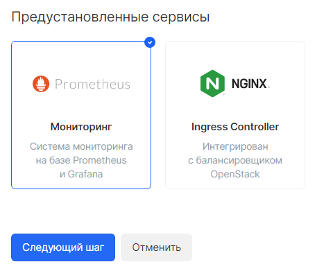
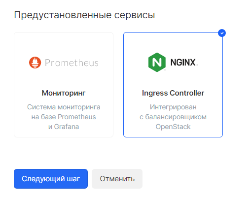
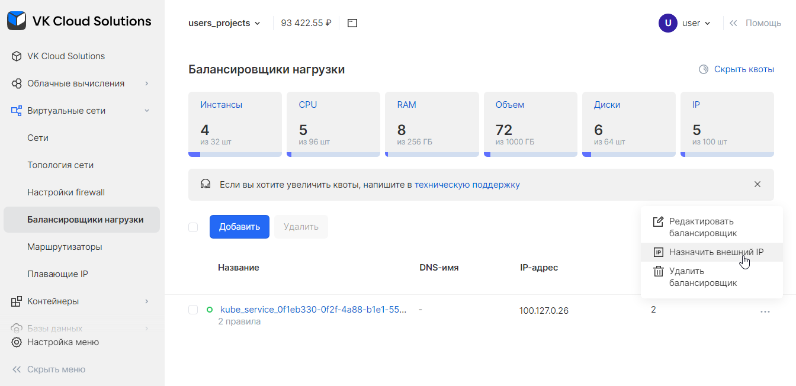
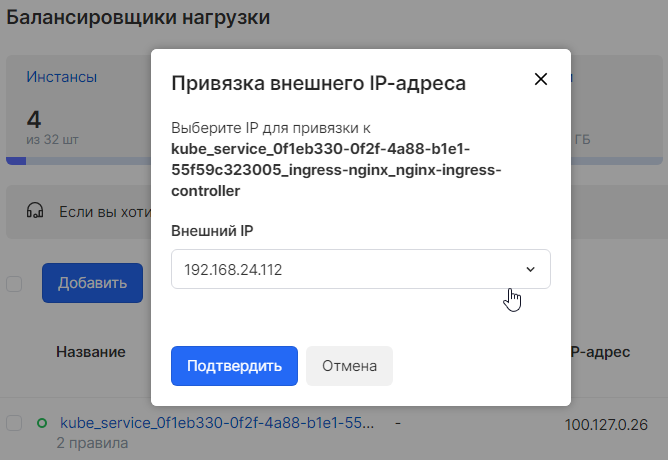
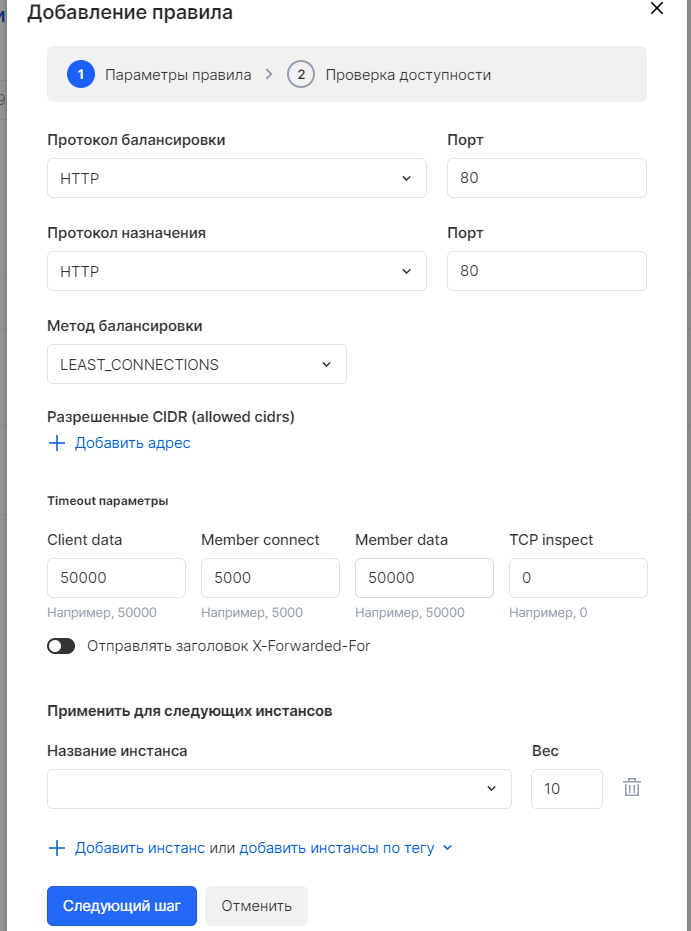

# {heading(Кластеры Kubernetes)[id=cloud_containers]}

Кластеры Kubernetes используются в высоконагруженных информационных системах для управления распределением трафика и автоматического масштабирования узлов. Ключевые особенности:

* Отказоустойчивость.
* Автоматическое масштабирование.
* Эффективное распределение трафика с помощью выделенных балансировщиков нагрузки.

Также в контейнерах Kubernetes можно быстро запускать и управлять тестовыми средами и, таким образом, автоматизировать и упростить процессы разработки и тестирования. Преимущества:

* Быстрое создание большого количества тестовых сред Kubernetes.
* Снижение затрат на хостинг тестовых сред до 3 раз.
* Автоматизация процессов `CI/CD`.
* Стандартизация разработки в распределенных командах и при работе с аутсорсерами.

## {heading(Создание и запуск кластера Kubernetes)[id=cloud_containers_create]}

Создание и запуск кластера осуществляется при помощи Портала самообслуживания. Подробная пошаговая инструкция приведена в Руководстве пользователя {var(sys2)}.

## {heading(Подключение постоянного хранилища)[id=persistent_storage_connect]}

### {heading(Объекты Persistent Volume и Persistent Volume Claim)[id=pv_pvc]}

Для обеспечения постоянного хранения данных, в Kubernetes существуют следующие виды ресурсов:

* PersistentVolume (PV) — раздел на жёстком диске, доступном из кластера. Взаимодействие кластера с PV осуществляется так же, как с узлами.
* PersistentVolumeClaim (PVC) — пользовательский запрос на использование данного диска. Взаимодействие PV с PVC осуществляется так же, как рабочий узел взаимодействует с подами, то есть PVC запрашивает у PV необходимый размер диска и тип доступа — `ReadWriteOnce`, `ReadOnlyMany` или `ReadWriteMany`.

Подключение PV и PVC выполняется автоматически из кластера на основании `Storage class`, интегрированного с Cinder.

{caption(Пример содержания файла конфигурации PVC)[align=left;position=above]}
```yaml
apiVersion: v1
kind: PersistentVolumeClaim
metadata:
  name: portal-info-data-pvc
spec:
  volumeMode: Filesystem
  accessModes:
    - ReadWriteMany
  resources:
    requests:
      storage: 100Gi
  volumeName: "portal-info-data-pv"
  storageClassName: ""
```
{/caption}

{caption(Команды создания и просмотра PV и PVC на основании файла конфигурации)[align=left;position=above]}
```bash
kubectl create -f new-pvc.yaml
kubectl get pvc
kubectl get pv | grep new-pvc
```
{/caption}

### {heading(Подключение к NFS с помощью Persistent Volume и Persistent Volume Claim)[id=pv_pvc_connect]}

Подробная инструкция по подключению к NFS с помощью Persistent Volume и Persistent Volume Claim приведена в [данной инструкции](https://cloud.vk.com/docs/kubernetes/k8s/use-cases/storage#podklyuchenie_faylovyh_hranilishch_c785fc).

### {heading(Доступ к Kubernetes Dashboard)[id=kubernetes_access_to_dashboard]}

Kubernetes Dashboard представляет собой графический интерфейс для управления контейнерами Kubernetes.

#### {heading(Установка Kubectl (для контейнеров / Kubernetes))[id=kubernetes_kubectl_installation]}

Локальный клиент для Kubernetes `kubectl` позволяет использовать команды для кластеров Kubernetes. Можно использовать `kubectl` для развертывания приложений, проверки ресурсов кластера и управления ими, а также для просмотра журналов.

Чтобы проверить актуальность установленной версии `kubectl`:

1. Узнайте номер последней стабильной версии клиента `kubectl`: например, [по ссылке запроса стабильной версии](https://storage.googleapis.com/kubernetes-release/release/stable.txt).
1. Проверьте текущую версию `kubectl`, чтобы убедиться, что она совместима с версией API сервера кластера:
   
   ```bash
   kubectl version
   ```

Установка выполняется штатными средствами используемой операционной системы (см. [официальную документацию](https://kubernetes.io/ru/docs/tasks/tools/install-kubectl/)).

##### {heading(Подключение kubectl к кластеру Kubernetes)[id=kubernetes_kubectl_connect]}

Инструкция по подключению `kubectl` к кластеру Kubernetes приведена в п. «Подключение к кластеру через Kubectl» Руководства пользователя {var(sys2)}.

#### {heading(Настройка доступа к Kubernetes Dashboard)[id=kubernetes_setting_up_access]}

Инструкция по настройке доступа к Kubernetes Dashboard приведена в п. «Подключение к Kubernetes Dashboard» Руководства пользователя {var(sys2)}.

### {heading(Система мониторинга)[id=monitoring_system]}

Система мониторинга Prometheus — опциональное дополнение, которое можно выбрать при установке кластера. Prometheus предоставляет возможности по сбору метрик производительности кластера, формированию запросов и экспорту показателей мониторинга.

Чтобы установить систему мониторинга в кластер в Портале самообслуживания:

1. В меню слева перейдите в раздел «Контейнеры» на страницу «Кластеры Kubernetes».
1. При создании кластера в разделе «Предустановленные сервисы» выберите пункт «Мониторинг» (см. {linkto(#pic_add_monitoring_service)[text=рисунок %number]}).
   
   {caption(Рисунок {counter(pic)[id=numb_pic_add_monitoring_service]} — Установка сервиса «Мониторинг» в создаваемый кластер Kubernetes)[position=under;number={const(numb_pic_add_monitoring_service)};align=center;id=pic_add_monitoring_service]}
   
   {/caption}
   
   Дождитесь завершения операции.

3. Скачайте файл конфигурации, чтобы просмотреть созданные ресурсы в пространстве имён `prometheus-monitoring`:
   
   1. Выберите кластер.
   1. Нажмите на кнопку «•••» справа от названия кластера и выберите пункт «Получить Kubeconfig для доступа к кластеру».
   
1. Выполните со скачанным файлом следующую операцию в `kubectl`:

   {caption(Команда вывода подов мониторинга)[align=left;position=above]}
   ```bash
   kubectl --insecure-skip-tls-verify=true --kubeconfig rk12_kubeconfig.yaml get po,svc,ingress -n prometheus-monitoring
   ```
   {/caption}

   {caption(Пример вывода команды)[align=left;position=above]}
   ```bash
   NAME                                                          READY   STATUS    RESTARTS   AGE
   pod/alertmanager-prometheus-alertmanager-0                    2/2     Running   0          8d
   pod/prometheus-operator-ff9d98748-bgssd                       2/2     Running   0          8d
   pod/prometheus-operator-grafana-567c7bc9c6-spq4s              2/2     Running   0          8d
   pod/prometheus-operator-kube-state-metrics-5c7847f9bc-m855b   1/1     Running   0          8d
   pod/prometheus-operator-prometheus-node-exporter-chlw7        1/1     Running   0          8d
   pod/prometheus-operator-prometheus-node-exporter-fn9pw        1/1     Running   0          8d
   pod/prometheus-prometheus-prometheus-0                        3/3     Running   1          8d
   
   NAME                                                   TYPE        CLUSTER-IP       EXTERNAL-IP   PORT(S)                      AGE
   service/alertmanager-operated                          ClusterIP   None             <none>        9093/TCP,9094/TCP,9094/UDP   8d
   service/prometheus-alertmanager                        ClusterIP   10.254.109.80    <none>        9093/TCP                     8d
   service/prometheus-operated                            ClusterIP   None             <none>        9090/TCP                     8d
   service/prometheus-operator                            ClusterIP   10.254.54.102    <none>        8080/TCP,443/TCP             8d
   service/prometheus-operator-grafana                    ClusterIP   10.254.227.161   <none>        80/TCP                       8d
   service/prometheus-operator-kube-state-metrics         ClusterIP   10.254.44.179    <none>        8080/TCP                     8d
   service/prometheus-operator-prometheus-node-exporter   ClusterIP   10.254.162.159   <none>        9100/TCP                     8d
   service/prometheus-prometheus                          ClusterIP   10.254.200.61    <none>        9090/TCP                     8d
   
   NAME                                             HOSTS                           ADDRESS        PORTS     AGE
   ingress.extensions/prometheus-alertmanager       alertmanager.rk12.mcs.mail.ru   10.31.129.13   80, 443   8d
   ingress.extensions/prometheus-operator-grafana   grafana.rk12.mcs.mail.ru        10.31.129.13   80, 443   8d
   ingress.extensions/prometheus-prometheus         prometheus.rk12.mcs.mail.ru     10.31.129.13   80, 443   8d
   ```
   {/caption}

#### {heading(Получение доступа в графический интерфейс Prometheus/Grafana/Alertmanager UI)[id=access_pga]}

Чтобы получить доступ к графическому интерфейсу Prometheus/Grafana/Alertmanager UI кластера:

1. Настройте локальное проксирование запросов:
   
   ```bash
   kubectl --insecure-skip-tls-verify=true --kubeconfig rk12_kubeconfig.yaml proxy
   ```
   
1. Откройте веб-браузер и перейдите по соответствующему адресу размещения визуального интерфейса:
   
   * `http://localhost:8001/api/v1/namespaces/prometheus-monitoring/services/prometheus-prometheus:9090/proxy`
   * `http://localhost:8001/api/v1/namespaces/prometheus-monitoring/services/prometheus-operator-grafana:80/proxy`
   * `http://localhost:8001/api/v1/namespaces/prometheus-monitoring/services/prometheus-alertmanager:9093/proxy`

### {heading(Балансировка нагрузки в кластере Kubernetes)[id=cloud_containers_load_balancing]}

Сервис Ingress Controller — опциональное дополнение, которое можно выбрать при установке кластера. Ingress Controller интегрируется с облачным балансировщиком нагрузки на базе OpenStack Octavia и поддерживает Proxy Protocol.

Чтобы получать запросы из внешних сетей, требуется сопоставить балансировщик нагрузки и Ingress Controller в Портале самообслуживания:

1. В меню слева перейдите в раздел «Контейнеры» на страницу «Кластеры Kubernetes».
2. При создании кластера в разделе «Предустановленные сервисы» выберите пункт «Ingress Controller» (см. {linkto(#pic_add_ingress_service)[text=рисунок %number]}).
   
   {caption(Рисунок {counter(pic)[id=numb_pic_add_ingress_service]} — Установка сервиса «Ingress Controller» в создаваемый кластер Kubernetes)[position=under;number={const(numb_pic_add_ingress_service)};align=center;id=pic_add_ingress_service]}
   
   {/caption}
   
   Дождитесь завершения операции.

3. В меню слева перейдите в раздел «Виртуальные сети» на страницу «Балансировщики нагрузки». Появится список созданных балансировщиков с именами вида `kube_service_<UUID>`.
4. Сопоставьте выбранный балансировщик нагрузки с Ingress Controller внутри кластера по внешнему IP адресу:
   
   1. Выберите балансировщик.
   2. Нажмите на кнопку «•••» справа от названия кластера и выберите пункт «Назначить внешний IP» (см. {linkto(#pic_load_balancers_extip_menu)[text=рисунок %number]}).
      
      {caption(Рисунок {counter(pic)[id=numb_pic_load_balancers_extip_menu]} — Меню назначения внешнего IP балансировщика)[position=under;number={const(numb_pic_load_balancers_extip_menu)};align=center;id=pic_load_balancers_extip_menu]}
      
      {/caption}
   
   3. В открывшемся окне выберите требуемый IP-адрес и нажмите на кнопку «Подтвердить» (см. {linkto(#pic_load_balancers_extip_select)[text=рисунок %number]}).
      
     {caption(Рисунок {counter(pic)[id=numb_pic_load_balancers_extip_select]} — Выбор внешнего IP для балансировщика)[position=under;number={const(numb_pic_load_balancers_extip_select)};align=center;id=pic_load_balancers_extip_select]}
     
     {/caption}
   
5. Настройте правила балансировки:
   
   1. Выберите балансировщик, нажав на его имя в списке.
   2. Нажмите на кнопку «Добавить правило».
   3. В открывшемся окне укажите параметры балансировки и сохраните изменения (см. {linkto(#pic_view_load_balancers_ic)[text=рисунок %number]}).
      
      {caption(Рисунок {counter(pic)[id=numb_pic_view_load_balancers_ic]} — Просмотр информации о балансировщике)[position=under;number={const(numb_pic_view_load_balancers_ic)};align=center;id=pic_view_load_balancers_ic]}
      
      {/caption}

## {heading(Масштабирование кластера Kubernetes)[id=cloud_containers_scaling]}

Доступно вертикальное и горизонтальное масштабирование кластера Kubernetes (с настройками автомасштабирования), см. Руководство пользователя {var(sys2)}.

## {heading(Типовые операции с контейнерами)[id=cloud_containers_typical_operations]}

### {heading(Работа с конфигурациями)[id=configurations_work]}

Конфигурация позволяет понять, с каким Kubernetes-кластером взаимодействует `kubectl`. Подробную информацию о структуре конфигурационного файла см. в статье [Configure Access to Multiple Clusters](https://kubernetes.io/docs/tasks/access-application-cluster/configure-access-multiple-clusters/).

Чтобы получить объединённые настройки kubeconfig, используйте следующую команду:

```bash
kubectl --insecure-skip-tls-verify=true --kubeconfig rk12_kubeconfig.yaml config
```

Чтобы использовать несколько файлов kubeconfig одновременно и посмотреть объединённую конфигурацию из этих файлов, используйте следующие команды:

```bash
KUBECONFIG=~/.kube/kubconfig1:~/.kube/kubconfig2
kubectl --insecure-skip-tls-verify=true --kubeconfig rk12_kubeconfig.yaml config view
```

Чтобы получить значение параметра из конфигурации, например, пароль для пользователя, используйте ключ `-о`:

```bash
kubectl --insecure-skip-tls-verify=true --kubeconfig rk12_kubeconfig.yaml config view -o jsonpath='{.users[?(@.name == "<ЛОГИН_ИНТЕРЕСУЮЩЕГО_ПОЛЬЗОВАТЕЛЯ>")].user.password}'
```

Чтобы получить список объектов выполнения утилиты `kubectl`, используйте следующую команду:

```bash
kubectl --insecure-skip-tls-verify=true --kubeconfig rk12_kubeconfig.yaml config get-contexts
```

Чтобы получить текущий объект выполнения, используйте следующую команду:

```bash
kubectl --insecure-skip-tls-verify=true --kubeconfig rk12_kubeconfig.yaml config current-context
```

Чтобы установить другой кластер в качестве контекста выполнения утилиты `kubectl` по умолчанию, используйте следующую команду:

```bash
kubectl --insecure-skip-tls-verify=true --kubeconfig rk12_kubeconfig.yaml config use-context <НАИМЕНОВАНИЕ_КЛАСТЕРА>;
```

### {heading(Работа с конфигурациями развёртывания (Deployment))[id=deployment_configurations_work]}

Deployment — это объект Kubernetes, представляющий набор множества идентичных контейнеров без уникальных номеров. Deployment позволяет запускать несколько реплик приложений и автоматически заменять экземпляры приложений в случае сбоя.

Чтобы создать новый Deployment, выполните следующую команду:

```bash
kubectl --insecure-skip-tls-verify=true --kubeconfig rk12_kubeconfig.yaml create deployment <НАЗВАНИЕ> --image=<НАИМЕНОВАНИЕ_ОБРАЗА_КОНТЕЙНЕРА>
```

Чтобы посмотреть текущий Deployment, выполните следующую команду:

```bash
kubectl --insecure-skip-tls-verify=true --kubeconfig rk12_kubeconfig.yaml describe deployment <НАИМЕНОВАНИЕ_DEPLOYMENT>
```

{caption(Пример описания Deployment в формате YAML)[align=left;position=above]}
```yaml
apiVersion: apps/v1
kind: Deployment
metadata:
  name: nginx
spec:
  replicas: 3
  selector:
    matchLabels:
      app: nginx
  template:
    metadata:
      labels:
        app: nginx
    spec:
      containers:
      - name: nginx
        image: nginx:1.7.9
        ports:
        - containerPort: 80
```
{/caption}

В данном примере создаётся три идентичных контейнера с именем `nginx` на базе образа Nginx версии 1.7.9. Доступ к контейнерам осуществляется по 80-му порту.

При обновлении Deployment Kubernetes последовательно перезапускает контейнеры с новой конфигурацией, при этом прежние контейнеры не удаляются, пока не будут успешно запущено достаточное количество новых контейнеров.

Чтобы выполнить обновление Deployment, выполните следующую команду:

```bash
kubectl --insecure-skip-tls-verify=true --kubeconfig rk12_kubeconfig.yaml apply -f <НАИМЕНОВАНИЕ_DEPLOYMENT>
```

### {heading(Просмотр журналов контейнеров)[id=viewing_container_logs]}

Чтобы получить список текущих контейнеров, выполните следующую команду:

```bash
kubectl --insecure-skip-tls-verify=true --kubeconfig rk12_kubeconfig.yaml get po -n <НАИМЕНОВАНИЕ_ПРОСТРАНСТВА_ИМЁН>
```

Чтобы получить список журналов конкретного контейнера, выполните следующую команду:

```bash
kubectl --insecure-skip-tls-verify=true --kubeconfig rk12_kubeconfig.yaml -n <НАИМЕНОВАНИЕ_ПРОСТРАНСТВА_ИМЁН> logs <ИМЯ_КОНТЕЙНЕРА>
```

Системные контейнеры расположены в пространстве имён `kube-system`. Наиболее востребованные контейнеры:

* `cluster-autoscaler-`* — журнал событий масштабирования контейнеров.
* `openstack-cloud-controller-`* — журнал взаимодействия всех компонентов платформы виртуализации (например, с Cinder для создания дисков, с Nova для создания ВМ, Octavia для балансировщиков и так далее).

{caption(Пример просмотра журнала cluster-autoscaler-*)[align=left;position=above]}
```bash
kubectl --insecure-skip-tls-verify=true --kubeconfig rk12_kubeconfig.yaml -n kube-system logs cluster-autoscaler-7f754489f8-qxsqf
...
I1230 08:33:58.952822       1 filter_out_schedulable.go:90] No schedulable pods
I1230 08:33:58.952850       1 static_autoscaler.go:334] No unschedulable pods
I1230 08:33:58.952877       1 static_autoscaler.go:381] Calculating unneeded nodes
....84c14039e967,Unschedulable:false,Taints:[]Taint{Taint{Key:CriticalAddonsOnly,Value:True,Effect:NoSchedule,TimeAdded:<nil>,},Taint{Key:dedicated,Value:master,Effect:NoSchedule,TimeAdded:<nil>,},},ConfigSource:nil,PodCIDRs:[],}
...
```
{/caption}

{caption(Пример просмотра журнала openstack-cloud-controller-*)[align=left;position=above]}
```bash
kubectl  --insecure-skip-tls-verify=true --kubeconfig rk12_kubeconfig.yaml -n kube-system logs openstack-cloud-controller-manager-nnrlx
...
Ensuring load balancer for service ingress-nginx/nginx-ingress-controller
E1222 08:23:53.451038       1 service_controller.go:255] error processing service ingress-nginx/nginx-ingress-controller (will retry): failed to ensure load balancer: there are no available nodes for LoadBalancer service ingress-nginx/nginx-ingress-controller
I1222 08:23:53.451162       1 event.go:255] Event(v1.ObjectReference{Kind:"Service", Namespace:"ingress-nginx", Name:"nginx-ingress-controller", UID:"68bb8ac5-b7f4-4404-94b2-943e7e55ddc9", APIVersion:"v1", ResourceVersion:"953", FieldPath:""}): type: 'Normal' reason: 'EnsuringLoadBalancer' Ensuring load balancer
...
```
{/caption}

## {heading(Подключение Helm)[id=helm_connect]}

Helm — менеджер пакетов для Kubernetes, который используется для быстрой установки сложных приложений, таких как CRM, e-commerce, БД и прочие.

Helm доступен в созданных кластерах по умолчанию.

## {heading(Persistent volumes и StatefulSet)[id=statefulset]}

StatefulSet — это удобный способ работы со Stateful-приложениями, которым требуется обрабатывать события об остановке работы Pod и осуществления Graceful Shutdown. Обычно, такие приложения — это базы данных и очереди сообщений, которые работают в нескольких экземплярах, синхронизируемых друг с другом посредством репликации или кластеризации.

Существует несколько способов организации таких схем: с использованием общих Persistent Volumes (RWX) и с помощью индивидуальных Persistent Volumes (RWO). Подробности см. в [данной инструкции](https://cloud.vk.com/docs/kubernetes/k8s/reference/pvs-and-pvcs).