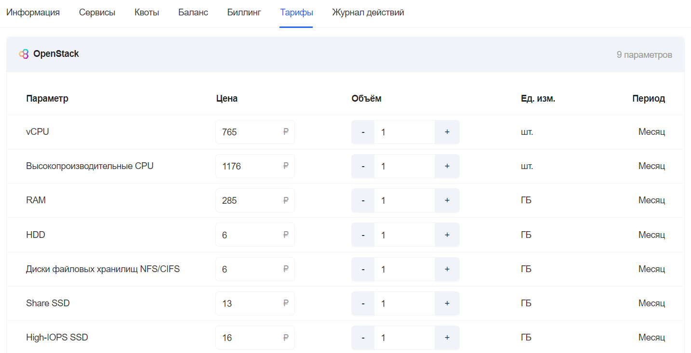
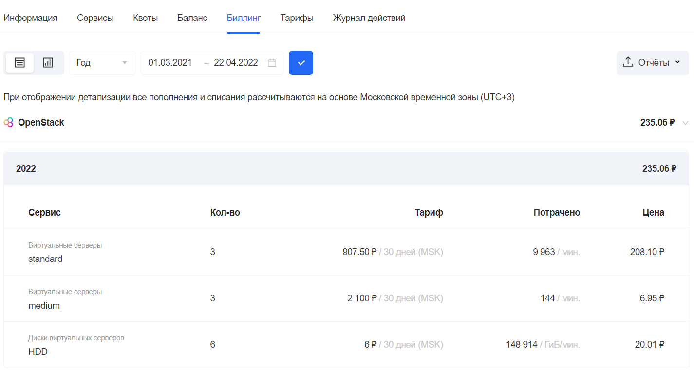
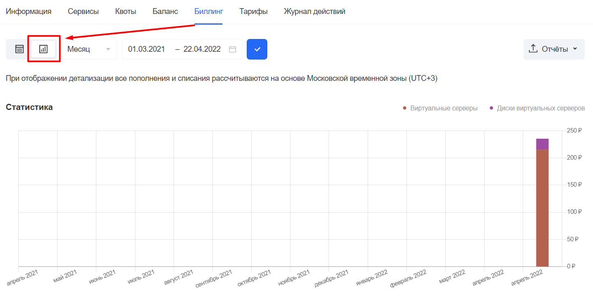
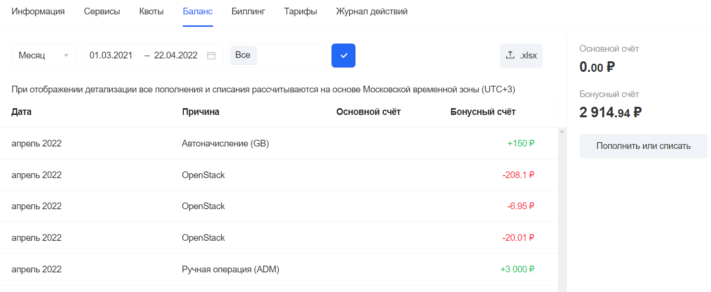
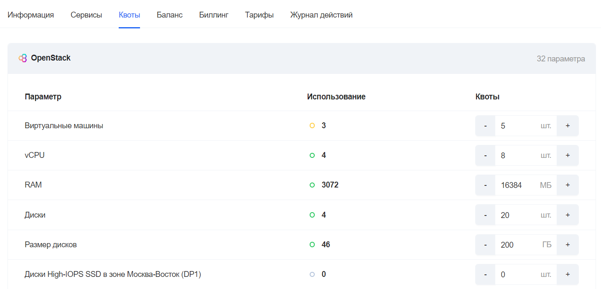

# {heading(Управление биллингом)[id=balance]}

## {heading(Установка тарифов)[id=tariffs_set]}

Для настройки тарифов используется интерфейс Портала администратора {var(sys2)}.

Чтобы настроить тарифы через Портал администратора:

1. Перейдите на вкладку «Проекты».
1. Выберите проект из списка.
1. Перейдите на вкладку «Тарифы».

В рамках биллинга {var(sys2)} определён набор ресурсов для тарификации. Их описание представлено в таблице ниже (см. {linkto(#tab_billing_res_description)[text=таблицу %number]}).

{caption(Таблица {counter(table)[id=numb_tab_billing_res_description]} — Описание ресурсов биллинга {var(sys2)})[position=above;number={const(numb_tab_billing_res_description)};align=right;id=tab_billing_res_description]}
[cols="1,4", options="header"]
|===

|Ресурс биллинга
|Описание

|vCPU
|Тариф указывает стоимость в месяц за один виртуальный CPU

|Высокопроизводительные CPU
|Тариф указывает стоимость в месяц за один виртуальный CPU с повышенной частотой. На данный момент не используется, может быть применён в дальнейшем при добавлении в плечо новых серверов с повышенной частотой

|RAM
|Тариф указывает стоимость в месяц за один ГБ оперативной памяти (RAM)

|HDD
|Тариф указывает стоимость в месяц за один ГБ пространства хранения уровня HDD

|Диски файловых хранилищ NFS/CIFS
|Тариф указывает стоимость в месяц за использование хранилищ NFS/CIFS

|SHARE HDD
|Тариф указывает стоимость в месяц за один ГБ пространства хранения для папок общего доступа NFS и CIFS

|High-IOPS SSD
|Тариф указывает стоимость в месяц за один ГБ пространства хранения уровня HDD повышенной производительности. На данный момент не используется, может быть применён в дальнейшем при добавлении в плечо нового типа хранения с повышенной производительностью

|SSD
|Тариф указывает стоимость в месяц за один ГБ пространства хранения уровня SSD

|Low Latency Disk
|Тариф указывает стоимость в месяц за один ГБ пространства хранения уровня SSD с пониженным временем отклика

|===
{/caption}

На {linkto(#pic_superadmin_tariffs)[text=рисунке %number]} отображён список тарифов для пользователя.

{caption(Рисунок {counter(pic)[id=numb_pic_superadmin_tariffs]} — Отображение тарифов для пользователей)[position=under;number={const(numb_pic_superadmin_tariffs)};align=center;id=pic_superadmin_tariffs]}

{/caption}

## {heading(Просмотр списаний по ресурсам в проекте)[id=view_write-offs_project]}

Биллинг {var(sys2)} позволяет просматривать, какие списания проводились для проекта за тот или иной промежуток времени. Для просмотра информации по биллингу проекта, используется интерфейс Портала администратора {var(sys2)}.

Чтобы посмотреть списания по ресурсам в проекте:

1. В интерфейсе Портала администратора {var(sys2)} перейдите на вкладку «Проекты».
1. Выберите проект из списка.
1. Перейдите на вкладку «Биллинг».
1. Укажите необходимый период и нажмите на иконку галочки справа от календаря.

Отображение списка транзакций приведено на рисунке ниже (см. {linkto(#pic_superadmin_transaction_list)[text=рисунок %number]}).

{caption(Рисунок {counter(pic)[id=numb_pic_superadmin_transaction_list]} — Список транзакций)[position=under;number={const(numb_pic_superadmin_transaction_list)};align=center;id=pic_superadmin_transaction_list]}

{/caption}

### {heading(Просмотр потребления ресурсов)[id=view_resource_consumption]}

Просмотр потребления ресурсов происходит через Портал администратора {var(sys2)} на вкладке «Биллинг» управления проектом. Для просмотра отчёта в виде диаграмм нажмите на иконку графика в левом верхнем углу (см. {linkto(#pic_superadmin_graffic_type)[text=рисунок %number]}).

{caption(Рисунок {counter(pic)[id=numb_pic_superadmin_graffic_type]} — Потребление ресурсов в формате графика)[position=under;number={const(numb_pic_superadmin_graffic_type)};align=center;id=pic_superadmin_graffic_type]}

{/caption}

Также присутствует функция скачивания отчёта в формате XLSX по кнопке «Отчеты» в правом верхнем углу таблицы. Возможно скачивание обычного отчёта и отчёта для бухгалтерии.

### {heading(Пополнение счёта)[id=refill]}

Чтобы пополнить счёт проекта:

1. В интерфейсе Портала администратора {var(sys2)} перейдите на вкладку «Пользователи».
2. Перейдите на вкладку «Проекты».
3. Выберите проект из списка.
4. Перейдите на вкладку «Баланс» (см. {linkto(#pic_superadmin_balance)[text=рисунок %number]}).
   
  {caption(Рисунок {counter(pic)[id=numb_pic_superadmin_balance]} — Вкладка «Баланс» Портала администратора)[position=under;number={const(numb_pic_superadmin_balance)};align=center;id=pic_superadmin_balance]}
  
  {/caption}

5. Нажмите на кнопку «Пополнить или списать».
6. В открывшейся форме (см. {linkto(#pic_superadmin_balance_change)[text=рисунок %number]}) внесите изменения и нажмите на кнопку «Внести изменение».
   
  {caption(Рисунок {counter(pic)[id=numb_pic_superadmin_balance_change]} — Форма «Основной счёт проекта»)[position=under;number={const(numb_pic_superadmin_balance_change)};align=center;id=pic_superadmin_balance_change]}
  
  {/caption}

На форме «Основной счёт проекта» доступно как пополнение баланса проекта, так и списание средств со счёта.

<info>

Для разморозки счёта с отрицательным балансом достаточно пополнить баланс проекта до положительного значения.

</info>

<warn>

Чтобы изменить баланс на нескольких проектах:

1. В интерфейсе Портала администратора {var(sys2)} перейдите на вкладку «Изменение бонусов».
1. Укажите тип изменения баланса, количество бонусов, а также PID проектов, для которых применяются изменения.
1. Нажмите на кнопку «Подтвердить».

</warn>

### {heading(Настройка квот для каждого проекта отдельно)[id=setting_quotas_for_each_project]}

Чтобы настроить квоты в определенном проекте:

1. В интерфейсе Портала администратора {var(sys2)} перейдите на вкладку «Проекты».
2. Выберите проект из списка.
3. Перейдите на вкладку «Квоты» (см. {linkto(#pic_superadmin_quotas)[text=рисунок %number]}).
   
  {caption(Рисунок {counter(pic)[id=numb_pic_superadmin_quotas]} — Вкладка «Квоты»)[position=under;number={const(numb_pic_superadmin_quotas)};align=center;id=pic_superadmin_quotas]}
  
  {/caption}
4. Измените квоты необходимых параметров с помощью кнопок уменьшения («-») и увеличения («+») квот.

   <info>

   Строки с измененными параметрами будут подсвечены жёлтым.

   </info>

5. Нажмите на кнопку «Изменить квоты».

## {heading(Настройка глобальных тарифов)[id=setting_global_rates]}

Настройка глобальных тарифов и квот, действующих по умолчанию для всех проектов {var(sys2)}, выполняется на деплой-ноде в конфигурационном файле `home/centos/inventory/<ENV>/group_vars/<ENV>_billing/vars.yml`, где `<ENV>` — название окружения.

{caption(Пример содержимого фрагмента файла vars.yml)[align=left;position=above]}
```yaml
billing_quota_templates:
  * id: 78d1a5bb-3f11-4989-922c-c897bfab3569
    name: infra
    quotas:
        cores: 2
        instances: 1
        ram: 2048  # 2Gb
        volumes: 3
        gigabytes: 100
        floating_ips: 1
        routers: 3
        octavia_lbs: 3
        lbaas_lbs: 3
        secgroups: 3
        ports: 30
        volumes_high-iops: 3
        gigabytes_high-iops: 100
        secgroups_rules: 200
        share_gigabytes: 100
        share_snapshots: 5
        share_snapshot_gigabytes: 100
        shares: 5
        share_networks: 5
        networks: 5
        subnets: 5
        sprut_networks: 5
        sprut_subnets: 5
        sprut_ports: 30
        sprut_routers: 3
        sprut_floatingips: 1
        sprut_secgroups: 3
        sprut_secgroup_rules: 200
```
{/caption}

Названия переменных и значения по умолчанию из коробки (сразу после первоначальной установки) можно найти в конфигурационном файле `home/centos/inventory/ansible-openstack/roles/billing/defaults/main.yml`.

{caption(Пример содержимого фрагмента файла main.yml)[align=left;position=above]}
```yaml
billing_default_quota_volumes: "1"
billing_default_quota_gigabytes: "20"
billing_default_quota_cores: "2"
billing_default_quota_instances: "1"
billing_default_quota_ram: "2048"
billing_default_quota_floatingip: "1"
billing_default_quota_router: "1"
billing_default_quota_octavia_lbs: "1"
billing_default_quota_lbaas_lbs: "1"
billing_default_quota_secgroup: "1"
billing_default_quota_port: "10"
billing_default_quota_high_iops_volumes: "high-iops:1"
billing_default_quota_high_iops_gigabytes: "high-iops:20"
billing_default_quota_secgroup_rule: "200"
billing_default_quota_share_snapshot_gigabytes: "20"
billing_default_quota_share_snapshots: "1"
billing_default_quota_share_gigabytes: "20"
billing_default_quota_shares: "1"
billing_default_quota_share_networks: "1"
billing_default_quota_networks: "1"
billing_default_quota_subnets: "1"
billing_default_quota_sprut_networks: "1"
billing_default_quota_sprut_subnets: "1"
billing_default_quota_sprut_ports: "10"
billing_default_quota_sprut_routers: "1"
billing_default_quota_sprut_floatingips: "1"
billing_default_quota_sprut_secgroups: "1"
billing_default_quota_sprut_secgroup_rules: "200"
```
{/caption}

После изменений в конфигурационном файле выполните команды (от пользователя `centos`):

```bash
cd /home/centos/inventory/<НАИМЕНОВАНИЕ_ОКРУЖЕНИЯ>/
ansible-playbook -i <НАИМЕНОВАНИЕ_ОКРУЖЕНИЯ>.yml -e env=<НАИМЕНОВАНИЕ_ОКРУЖЕНИЯ> /home/centos/inventory/ansible-openstack/playbooks/billing-deploy.yml
```
<warn>

Значения не поменяются у действующих тарифов проектов.

</warn>

Тарифы устанавливаются для каждого ресурса биллинга.

Отдельно настраивается сервис-фактор для компонентов {var(sys2)}, по которым применяется повышающий (понижающий) коэффициент.