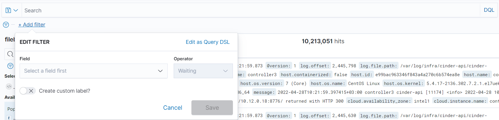

# {heading(Журналы событий)[id=journal_files]}

{var(sys1)} осуществляет логирование или сбор записей о событиях в соответствующие журналы (журналирование событий).

## {heading(Файлы журналов (логов))[id=log]}

Поскольку {var(sys1)} представляет собой распределённую систему, состоящую из множества компонентов, то журналы (логи) могут храниться в разных файлах и даже на разных серверах.

Основные лог-файлы хранятся в директории `/var/log/infra` (на управляющих и вычислительных узлах). В директории `/var/log/infra-latest` находится символическая ссылка на последний лог-файл из директории `/var/log/infra`.

<info>

Логи docker-контейнеров записываются в `/var/log/containers/`.

</info>

## {heading(Анализ записей журналов (логов))[id=log_analysis]}

Все журналы собираются с использованием Fluentd в OpenSearch подсистемы логирования. В качестве интерфейса для централизованной обработки и анализа записей о событиях используется Портал логирования (OpenSearch Dashboards).

Портал логирования позволяет оперировать поисковыми запросами, поддерживающими синтаксис Apache Lucene. Для получения нужных событий используется инструмент поиска: сформируйте запрос, состоящий из нескольких слов или включающих условия, разделённые ключевыми словами (`AND` / `OR`); текст необходимо заключать в двойные кавычки (" "). Далее приведены примеры настроек поиска для отображения основных типов событий безопасности.

Для поиска информации в Портале логирования:

1. Перейдите в раздел «OpenSearch Dashboards» → «Discover».
2. Введите поисковый запрос, используя инструмент поиска (см. {linkto(#pic_search_tool)[text=рисунок %number]}).
   
   {caption(Рисунок {counter(pic)[id=numb_pic_search_tool]} — Инструмент поиска)[position=under;number={const(numb_pic_search_tool)};align=center;id=pic_search_tool]}
   
   {/caption}
   
3. Нажмите клавишу ENTER для запуска поиска.
   
   Результаты поиска отображаются ниже в виде списка.

Для получения полной информации о событии, включая представление в виде JSON, нажмите на треугольник слева от результата запроса.

Если в результате выполнения запроса не обнаружены записи о событиях, попробуйте увеличить интервал времени для поиска событий.

Для использования индексов в процессе поиска данных используйте выпадающий список, расположенный под кнопкой «Add a filter».

В {var(sys2)} после развёртывания доступны следующие индексы:

* `*_cinder-*` — отражает события, связанные с работой компонента Cinder (резервное копирование).
* `filebeat-7.8.0-20*` — индекс, создаваемый по умолчанию (см. [официальную документацию](https://www.elastic.co/guide/en/beats/filebeat/current/change-index-name.html)); отображает события по всем компонентам в Kubernetes.
* `filebeat-*` — отображает события по всем компонентам {var(sys2)} (с хостов и Kubernetes); включает в себя данные по индексу `filebeat-7.8.0-20*`.
* `*_glance-*` — отражает события, связанные с работой компонента Glance (работа с образами).
* `*_haproxy-*` — события компонента HAProxy (балансировка нагрузки).
* `*_heat-*` — события компонента Heat (оркестрация).
* `*_iam-*` — события компонента IAM (биллинг, ролевая модель).
* `*_keystone-*` — события компонента Keystone (аутентификация).
* `*_magnum-*` — события компонента Magnum (оркестрация контейнеров).
* `*_neutron-*` — события компонента Neutron (сети).
* `*_nova-*` — события компонента Nova (виртуализация).
* `*_scrooge-*` — события компонента Scrooge (биллинг и квоты).
* `*_trove-*` — события компонента Trove (инстансы СУБД).

<info>

Полный список доступных индексов перечислен в разделе «Index Management» → «Indices». Также данные индексы доступны в формате `ndjson` на деплой-ноде в репозитории `/home/centos/inventory/ansible-openstack/roles/opensearch/files/saved_objects/` (с суффиксом `01-index-pattern`).

</info>