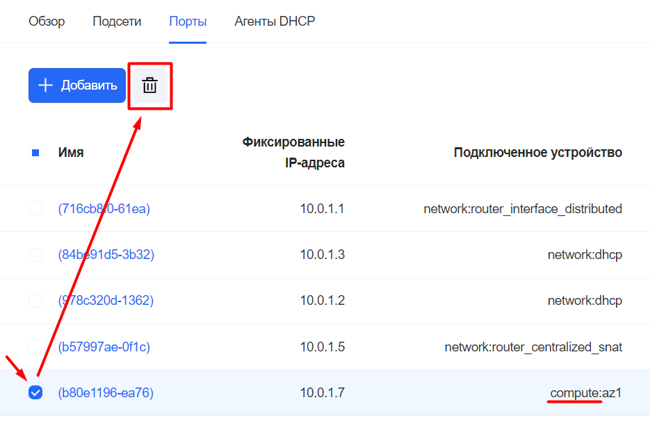
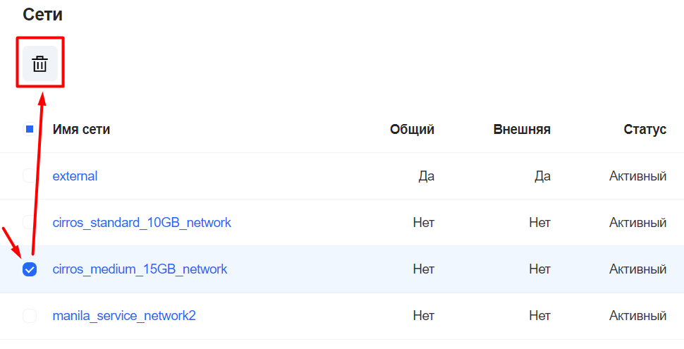

# {heading(Настройка сети)[id=network_configuration]}

{var(sys1)} поддерживает варианты сетей:

* `VLAN`.
* `VxLAN` внутри тенанта.
* `VxLAN` с анонсом через `BGP`.

## {heading(Создание внешней сети с доступом в корпоративную сеть)[id=network_configuration_create]}

В этом разделе приведена краткая инструкция по созданию внешней VLAN-сети с использованием команд OpenStack CLI.

Для реализации данной задачи на уровне Neutron создаётся связка `Network-Subnet`, которая будет выходить в корпоративную сеть в виде инкапсулированного VLAN-трафика.

<err>

Настройки доступа по умолчанию запрещают создание внешней сети под любым пользователем, кроме Администратора {var(sys2)}.

</err>

<err>

Адреса сетей, указанные в конфигурациях, могут отличаться в зависимости от реализации сети Заказчика. Адреса следующих узлов должны быть доступны через маршрутизатор:

* DNS-сервер, установленный на маршрутизаторе стенда.
* <ПОРТАЛ_САМООБСЛУЖИВАНИЯ>:443 — публичный VIP инсталляции. Через него выполняется взаимодействие между magnum-агентом внутри инстансов кластера и сервисами на стенде.
* `registry-`<ПОРТАЛ_САМООБСЛУЖИВАНИЯ>:5010 — docker-registry на управляющих узлах. В нем хранятся артефакты для разворачивания кластера.
* `registry-`<ПОРТАЛ_САМООБСЛУЖИВАНИЯ>:443 — helm-registry и raw-registry с артефактами, необходимыми для пользовательского кластера Kubernetes, а так же trove-capabilities с расширениями для клиентских экземпляров PostgreSQL.

</err>

<err>

При задании VLAN ID (например, 123) для пользовательской сети убедитесь, что у ОС нет прямых интерфейсов, которые работают с тем же VLAN ID (например, bond0.123). Иначе работоспособность сети будет нарушена из-за конфликтов на уровне L2.

</err>

Чтобы создать внешнюю сеть:

1. Измените настройки в конфигурационных файлах, расположенных в директории `<STAND_NAME>/group_vars/` на деплой-ноде (где <STAND_NAME> — путь до директории окружения, заданной при его установке. Например, `/home/centos/inventory/vks`):
   
   1. В файле `<STAND_NAME>/vars.yml` задайте параметры конфигурации для внешней Neutron-сети:
      
      ```yaml
      external_networks_extend:
        "172.25.120.0/24": # адрес внешней подсети
          vlan: 2013 # Номер VLAN во внешней подсети
          project_id: "e01b26b84caa463f9c1691720fba5d53" # ID проекта "admin"; можно узнать через команду `openstack project show admin`
          network_name: "ext-net" # Название сети (будет отображаться в веб-интерфейсе под этим именем)
          shared: "True" # Всегда True
      ```
   1. В следующих файлах задайте настройки мостов для выхода ВМ во внешнюю сеть: br-vlan интерфейс для выхода с VLAN, br-ex интерфейс для выхода без VLAN (создаётся как дополнение, без какого-либо присвоенного IP):
   
      <warn>
   
      В настройках, приведенных ниже, `bond0` — это агрегированный сетевой интерфейс, через который доступен VLAN в сторону пользователей наряду с другими VLAN.
   
      </warn>
      
      * `<STAND_NAME>_compute/vars.yml` — файл с настройками вычислительных узлов, на которых будут запускаться ВМ.
      
         ```yaml
         compute_network_ifcfg_vlan: |
           DEVICE=br-vlan
           DEVICETYPE=ovs
           TYPE=OVSBridge
           BOOTPROTO=none
           ONBOOT=yes
           NOZEROCONF=yes
           OVS_EXTRA="add-port br-vlan bond0"

         compute_network_ifcfg_external: |
           DEVICE=br-ex
           DEVICETYPE=ovs
           TYPE=OVSBridge
           BOOTPROTO=static
           ONBOOT=yes
           NOZEROCONF=yes
           
           IPADDR{{ loop.index }}={{ gw_ip | ipaddr('address') }}
           NETMASK{{ loop.index }}=255.255.255.255
           
         ```
      * `<STAND_NAME>_dhcp/vars.yml` — файл с настройками DHCP:
      
         ```yaml
         neutron_dhcp_ifcfg_external: |
           DEVICE=br-ex
           DEVICETYPE=ovs
           TYPE=OVSBridge
           BOOTPROTO=static
           ONBOOT=yes
           NOZEROCONF=yes
           
           IPADDR{{ loop.index }}={{ gw_ip | ipaddr('address') }}
           NETMASK{{ loop.index }}=255.255.255.255
           

         neutron_dhcp_ifcfg_vlan: |
           DEVICE=br-vlan
           DEVICETYPE=ovs
           TYPE=OVSBridge
           BOOTPROTO=none
           ONBOOT=yes
           NOZEROCONF=yes
           OVS_EXTRA="add-port br-vlan bond0"
         ```
      * `<STAND_NAME>_octavia/vars.yml` — файл с настройками балансировщика Octavia:
      
         ```yaml
         octavia_network_ifcfg_external: |
           DEVICE=br-ex
           DEVICETYPE=ovs
           TYPE=OVSBridge
           BOOTPROTO=static
           ONBOOT=yes
           NOZEROCONF=yes
           
           IPADDR{{ loop.index }}={{ gw_ip | ipaddr('address') }}
           NETMASK{{ loop.index }}=255.255.255.255
           

         octavia_network_ifcfg_vlan: |
           DEVICE=br-vlan
           DEVICETYPE=ovs
           TYPE=OVSBridge
           BOOTPROTO=none
           ONBOOT=yes
           NOZEROCONF=yes
           OVS_EXTRA="add-port br-vlan bond0"
         ```
            
      * `<STAND_NAME>_network/vars.yml` — файл с настройками Neutron-сети:
      
         ```yaml
         neutron_network_ifcfg_external: |
           DEVICE=br-ex
           DEVICETYPE=ovs
           TYPE=OVSBridge
           BOOTPROTO=static
           ONBOOT=yes
           NOZEROCONF=yes
           
           IPADDR{{ loop.index }}={{ gw_ip | ipaddr('address') }}
           NETMASK{{ loop.index }}=255.255.255.255
           

         neutron_network_ifcfg_vlan: |
           DEVICE=br-vlan
           DEVICETYPE=ovs
           TYPE=OVSBridge
           BOOTPROTO=none
           ONBOOT=yes
           NOZEROCONF=yes
           OVS_EXTRA="add-port br-vlan bond0"
         ```
         
      <err>
   
      Во всех файлах с конфигурациями отключите настройку физического интерфейса — закомментируйте/удалите все строки для блоков настроек `_physinterface`.
   
      </err>

1. Задайте название окружения и запустите плейбуки:
   
   ```bash
   STAND_NAME=<НАЗВАНИЕ_ОКРУЖЕНИЯ>
   cd /home/centos/inventory/${STAND_NAME}/
   ansible-playbook --diff -i ${STAND_NAME}.yml -e env=${STAND_NAME} -e bootstrap=yes ../ansible-openstack/playbooks/neutron-controller-deploy.yml | tee ~/neutron-controller-deploy
   ansible-playbook --diff -i ${STAND_NAME}.yml -e env=${STAND_NAME} -e bootstrap=yes ../ansible-openstack/playbooks/neutron-network-deploy.yml | tee ~/neutron-network-deploy
   ansible-playbook --diff -i ${STAND_NAME}.yml -e env=${STAND_NAME} -e bootstrap=yes ../ansible-openstack/playbooks/compute-deploy.yml | tee ~/compute-deploy
   ansible-playbook --diff -i ${STAND_NAME}.yml -e env=${STAND_NAME} -e bootstrap=yes ../ansible-openstack/playbooks/neutron-dhcp-deploy.yml | tee ~/neutron-dhcp-deploy
   ansible-playbook --diff -i ${STAND_NAME}.yml -e env=${STAND_NAME} -e bootstrap=yes ../ansible-openstack/playbooks/octavia-deploy.yml | tee ~/octavia-deploy
   ```
1. Создайте внешнюю сеть, через которую будет осуществляться взаимодействие приватных пользовательских сетей с внешними сетями организации:
   
   ```bash
   openstack network create --provider-network-type vlan --external --provider-physical-network vlan --provider-segment <VLAN_ID> --share <НАЗВАНИЕ_ВНЕШНЕЙ_СЕТИ>
   ```
1. Создайте подсеть в только что созданной сети:
   
   ```bash
   openstack subnet create --network <НАЗВАНИЕ_ВНЕШНЕЙ_СЕТИ> --subnet-range <ПОДСЕТЬ> --allocation-pool <ПУЛ_АДРЕСОВ> --dhcp --gateway <IP_АДРЕС_ШЛЮЗА> --dns-nameserver <АДРЕС_DNS_СЕРВЕРА> <НАЗВАНИЕ_ПОДСЕТИ>
   ```
   , где:
   
  * <ПОДСЕТЬ> — адрес подсети, которую вам выдали в этом VLAN. Например, `172.25.120.0/24`.
  * <ПУЛ_АДРЕСОВ> — пул IP-адресов для ВМ (не забудьте оставить место для шлюза и двух DHCP-серверов). Например, `start=172.25.120.4,end=172.25.120.245`.
  
### {heading(Подключение пользовательских сетей к внешней сети)[id=network_configuration_connection]}

<err>

Настройки доступа по умолчанию запрещают подключение к внешней сети внутренних сетей под любым пользователем, кроме Администратора {var(sys2)}.

</err>

Для обеспечения доступа ВМ в пользовательских внутренних сетях во внешнюю сеть необходимо задать внешнюю сеть как шлюз для маршрутизатора внутренней:

1. Войдите в Портал самообслуживания с использованием учётной записи Администратора {var(sys2)}.
1. В меню слева перейдите в раздел «Виртуальные сети» на страницу «Маршрутизаторы».
1. Нажмите на кнопку «Добавить маршрутизатор».
1. В открывшейся форме укажите название пользовательской сети. Включите флажок «Подключение к внешней сети».
1. Нажмите на кнопку «Создать».
   
   <info>

   В случае успешного выполнения настройки в Портале самообслуживания на странице с информацией о выбранном маршрутизаторе на вкладке «Общая информация» в графе «Подключение к внешней сети» будет указано значение «Есть».

   </info>

1. Перейдите в раздел «Виртуальные сети» на страницу «Сети».
1. Нажмите на кнопку «Создать».
1. Укажите название сети при необходимости, в списке «Маршрутизатор» выберите ранее созданный маршрутизатор.
1. В области «Список подсетей» нажмите на кнопку «•••» справа от названия подсети и выберите пункт «Редактировать подсеть». Включите параметр «Включить DHCP».
1. Выключите параметр «Приватный DNS» и укажите используемые DNS-серверы.
1. Нажмите на кнопку «Создать».
1. Нажмите на кнопку «Добавить сеть».

После подключения внутренней сети к внешней для ВМ во внутренней сети появляется возможность назначения Внешнего IP-адреса.

<info>

Также можно подключить внешнюю сеть к пользовательской при создании сети в Портале самообслуживания (см. раздел {linkto(../../../usage_administration/v_infrastructure_management#network_creating)[text=%text]}). На этапе создания сети активируйте флажок «Доступ в интернет».

</info>

Для выполнения аналогичных шагов в OpenStack CLI воспользуйтесь следующими командами (предварительно необходимо выполнить подготовительные операции для использования OpenStack Cli. См. {linkto(../../../usage_administration/interfaces_access#use_openstackcli_admin)[text=%text]}):

```bash
openstack router create <НАИМЕНОВАНИЕ_РОУТЕРА>
openstack network create <НАИМЕНОВАНИЕ_ВНУТРЕННЕЙ_СЕТИ>
openstack subnet create <НАИМЕНОВАНИЕ_ВНУТРЕННЕЙ_ПОДСЕТИ> --network <НАИМЕНОВАНИЕ_ВНУТРЕННЕЙ_СЕТИ> --subnet-range 192.168.100.0/24 --dns-nameserver 10.14.0.12
openstack router set <НАИМЕНОВАНИЕ_РОУТЕРА> --external-gateway <НАИМЕНОВАНИЕ_ВНЕШНЕЙ_СЕТИ>
openstack router add subnet <НАИМЕНОВАНИЕ_ВНУТРЕННЕЙ_СЕТИ> <НАИМЕНОВАНИЕ_ВНУТРЕННЕЙ_ПОДСЕТИ>
```

## {heading(Удаление сетевых подключений и самой сети)[id=network_configuration_delete]}

Удалять сети и сетевые подключения можно через:

* Портал самообслуживания
* Портал администратора

<err>

Для удаления сетей может потребоваться удаление/освобождение других сущностей OpenStack (кластеров Kubernetes, баз данных Trove, балансировщиков Octavia, файловых хранилищ Manila и др.), которые используют сеть.

</err>

### {heading(Портал самообслуживания)[id=network_configuration_delete_ui]}

Шаги по удалению сети через Портал самообслуживания см. в документе «Руководство пользователя».

### {heading(Портал администратора)[id=network_configuration_delete_sa_ui]}

1. В меню слева перейдите в раздел «Нейтрон» на страницу «Сети».
1. Удалите подключения сети со всех инстансов во всех проектах:
   
   1. Выберите сеть, нажав на её название в списке.
   1. Перейдите на вкладку «Порты».
   
      <info>
   
      Можно удалять как подключения с инстансов, так и сами инстансы при необходимости.
   
      </info>

   1. Установите флажки для портов, у которых в столбце «Подключенное устройство» указано значение «compute».
   1. Нажмите на иконку удаления над таблицей (см. {linkto(#pic_network_setup_delete_ports_via_superadmin)[text=рисунок %number]}).

      {caption(Рисунок {counter(pic)[id=numb_pic_network_setup_delete_ports_via_superadmin]} — Удаление подключений с инстансов)[position=under;align=center;id=pic_network_setup_delete_ports_via_superadmin;number={const(numb_pic_network_setup_delete_ports_via_superadmin)}]}
      
      {/caption}

3. В списке сетей установите флажок для сети, которую необходимо удалить.
1. Нажмите на иконку удаления над таблицей (см. {linkto(#pic_network_setup_delete_network_via_superadmin)[text=рисунок %number]}).
   
   {caption(Рисунок {counter(pic)[id=numb_pic_network_setup_delete_network_via_superadmin]} — Удаление сети)[position=under;align=center;id=pic_network_setup_delete_network_via_superadmin;number={const(numb_pic_network_setup_delete_network_via_superadmin)}]}
   
   {/caption}

## {heading(Добавление нового сегмента внешних адресов)[id=id=network_configuration_add_adress]}

Для добавления подсети адресов во внешнюю сеть создайте новую подсеть в этой внешней сети (см. раздел {linkto(../../../usage_administration/v_infrastructure_management#subnet_creating)[text=%text]}).

{caption(Пример выполнения команды)[align=left;position=above]}
```bash
openstack subnet create --network ext-net --subnet-range 203.0.114.0/24 --allocation-pool start=203.0.114.1,end=203.0.114.253 --gateway 203.0.114.254 ext-net-subnet2
```
{/caption}
