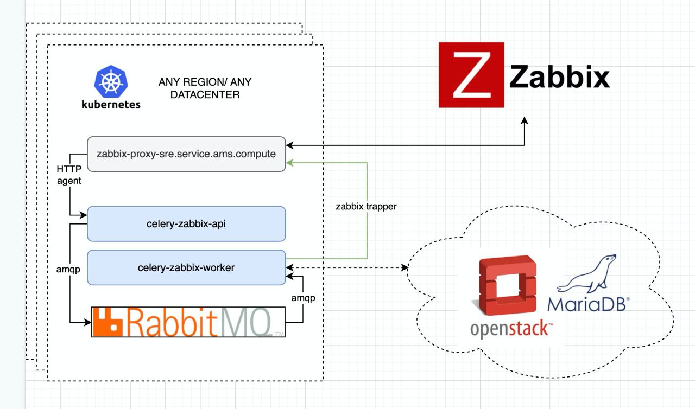
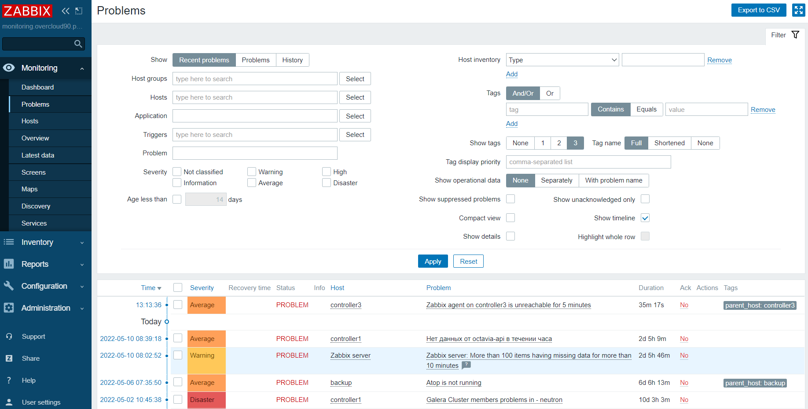
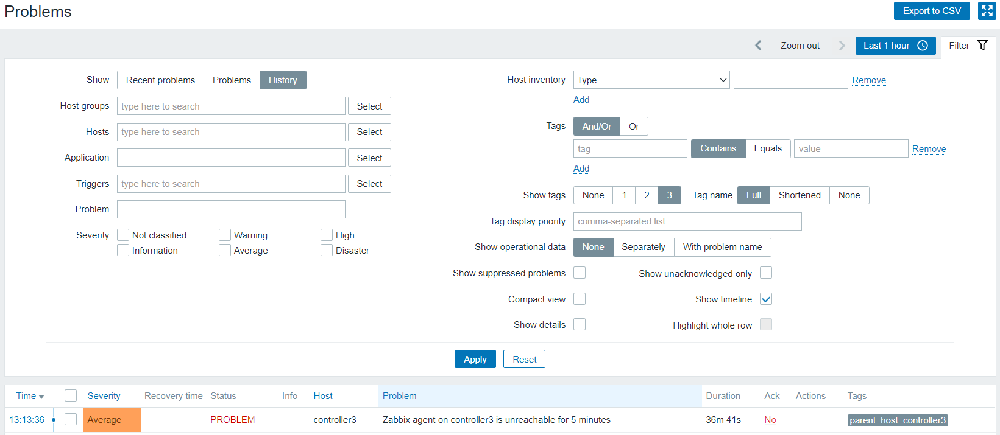
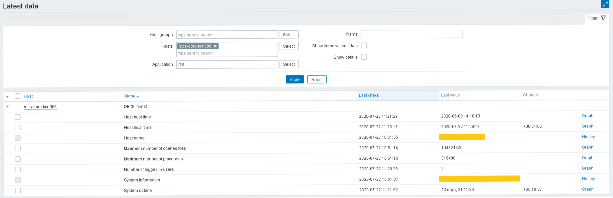
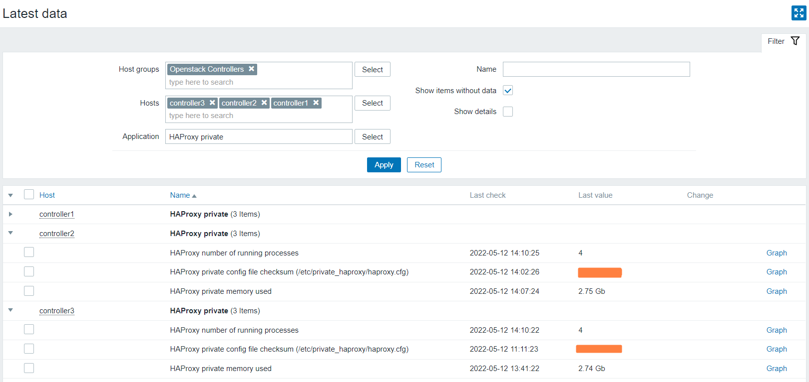
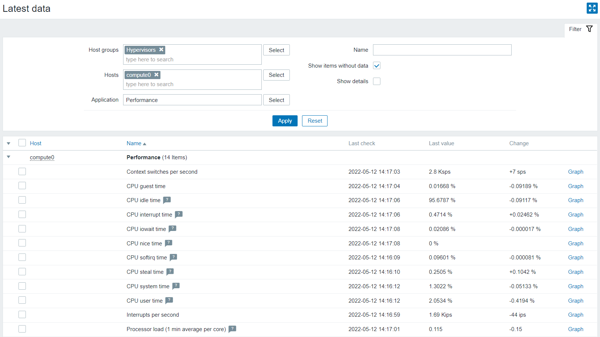

# {heading(Мониторинг)[id=monitoring]}

За мониторинг {var(sys2)} отвечают компоненты, построенные на базе решений Zabbix: zabbix-server, zabbix-agent, celery-zabbix, zabbix-openstack. Структурная схема celery-zabbix показана на рисунке ниже (см. {linkto(#pic_celery_zabbix_str_scheme)[text=рисунок %number]}).

{caption(Рисунок {counter(pic)[id=numb_pic_celery_zabbix_str_scheme]} — Структурная схема celery-zabbix)[position=under;align=center;id=pic_celery_zabbix_str_scheme;number={const(numb_pic_celery_zabbix_str_scheme)}]}

{/caption}

Для работы мониторинга разворачивается отдельный экземпляр БД MariaDB; сервис мониторинга функционирует на отдельном хосте. Для доступа к данным мониторинга необходимо использовать {linkto(../../../arch/arch-interfaces#arch_portal_monitoring)[text=%text]}.

## {heading(Перечень объектов мониторинга)[id=monitoring_list]}

Реализованы хосты и шаблоны (темплейты) по основным объектам:

* Мониторинг ОС, синхронизации времени и доступности узлов.
* Ceph.
* RabbitMQ (в составе Kubernetes).
* RabbitMQ (в составе Docker).
* Компоненты Openstack (наличие запущенных процессов, статистика).
* Openvswitch.
* Kubernetes.
* Haproxy.
* Databases (galera).
* Billing, IAM.
* Memcached.
* etcd.

## {heading(Собираемые метрики)[id=monitoring_metrics]}

Детальную информацию обо всех элементах данных (items) физических серверов можно получить в Портале мониторинга, перейдя в раздел «Monitoring» на страницу «Latest Data».

Собирается информация о процессорном времени, памяти, файловых системах, обнаружении/доступности узла, службах, запущенных на серверах.

Мониторинг состояния серверов осуществляется на вкладке «Monitoring» → «Hosts».

### {heading(Графики состояния серверов)[id=monitoring_schedule]}

Просмотр графиков состояния серверов осуществляется на вкладке «Monitoring» → «Hosts». Нажмите на ссылку «Graphs» справа от названия сервера в столбце «Graphs».

### {heading(Мониторинг проблем {var(sys2)})[id=monitoring_problems]}

Мониторинг текущих проблем {var(sys2)} осуществляется на вкладке «Monitoring» → «Dashboard» (область «Problems») или «Monitoring» → «Problems».

На вкладке «Monitoring» → «Problems» выберите «Recent Problems» в поле «Show» и нажмите на кнопку «Apply» (см. {linkto(#pic_zabbix_problems)[text=рисунок %number]}).

{caption(Рисунок {counter(pic)[id=numb_pic_zabbix_problems]} — Мониторинг текущих проблем на вкладке «Monitoring» → «Problems»)[position=under;align=center;id=pic_zabbix_problems;number={const(numb_pic_zabbix_problems)}]}

{/caption}

Мониторинг истории проблем {var(sys2)} осуществляется на вкладке «Monitoring» → «Problems». На вкладке выберите «History» в поле «Show» и нажмите на кнопку «Apply» (см. {linkto(#pic_zabbix_problems_history)[text=рисунок %number]}).

{caption(Рисунок {counter(pic)[id=numb_pic_zabbix_problems_history]} — Мониторинг истории проблем)[position=under;align=center;id=pic_zabbix_problems_history;number={const(numb_pic_zabbix_problems_history)}]}

{/caption}

### {heading(Мониторинг состояния ОС)[id=monitoring_status]}

Мониторинг состояния ОС осуществляется на вкладке «Monitoring» → «Latest data».

1. На вкладке выберите необходимые серверы:
   
   1. Нажмите на кнопку «Select» справа от поля «Hosts».
   1. Установите флажки для необходимых серверов.
   1. Нажмите на кнопку «Select».
1. Выберите «OS» нажатием кнопки «Select» справа от поля «Application».
2. Нажмите на кнопку «Apply». Отобразится информация о состоянии ОС выбранных серверов (см. {linkto(#pic_zabbix_os_monitoring)[text=рисунок %number]}).

{caption(Рисунок {counter(pic)[id=numb_pic_zabbix_os_monitoring]} — Мониторинг состояния ОС)[position=under;align=center;id=pic_zabbix_os_monitoring;number={const(numb_pic_zabbix_os_monitoring)}]}

{/caption}

### {heading(Мониторинг состояния узлов управления и сервисов на них)[id=monitoring_nods]}

Мониторинг состояния узлов осуществляется на вкладке «Monitoring» → «Latest data».

1. На вкладке выберите группу серверов «Openstack controllers».
1. Выберите необходимые серверы:
   
   1. Нажмите на кнопку «Select» справа от поля «Hosts».
   1. Установите флажки для необходимых серверов.
   1. Нажмите на кнопку «Select».
1. Выберите один из сервисов: «Galera», «HAProxy», «HAProxy Backend», «HAProxy Backend Server», «HAProxy Frontend» или «MySQL» нажатием кнопки «Select» справа от поля «Application».
2. Нажмите на кнопку «Apply». Отобразится информация о состоянии выбранного сервиса (см. {linkto(#pic_zabbix_openstack_services)[text=рисунок %number]}).
3. При необходимости повторите п.п. 3-4.

{caption(Рисунок {counter(pic)[id=numb_pic_zabbix_openstack_services]} — Мониторинг состояния узлов управления)[position=under;align=center;id=pic_zabbix_openstack_services;number={const(numb_pic_zabbix_openstack_services)}]}

{/caption}

### {heading(Мониторинг наличия свободных ресурсов на вычислительных узлах)[id=monitoring_computing]}

Мониторинг наличия свободных ресурсов на вычислительных узлах осуществляется на вкладке «Monitoring» → «Latest data».

1. На вкладке выберите группу серверов «Hypervisors».
1. Выберите необходимые серверы:
   1. Нажмите на кнопку «Select» справа от поля «Hosts».
   1. Установите флажки для необходимых серверов.
   1. Нажмите на кнопку «Select».
1. Выберите «Performance», «Filesystems» или «Memory» нажатием кнопки «Select» справа от поля «Application».
2. Нажмите на кнопку «Apply». Отобразится информация о наличии свободных ресурсов на вычислительных узлах (см. {linkto(#pic_zabbix_performance)[text=рисунок %number]}).

{caption(Рисунок {counter(pic)[id=numb_pic_zabbix_performance]} — Мониторинг наличия свободных ресурсов на вычислительных узлах)[position=under;align=center;id=pic_zabbix_performance;number={const(numb_pic_zabbix_performance)}]}

{/caption}