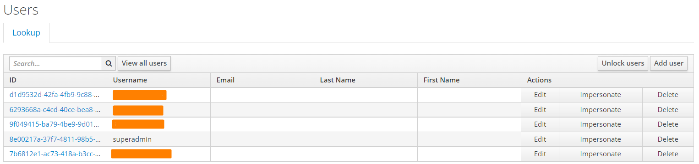
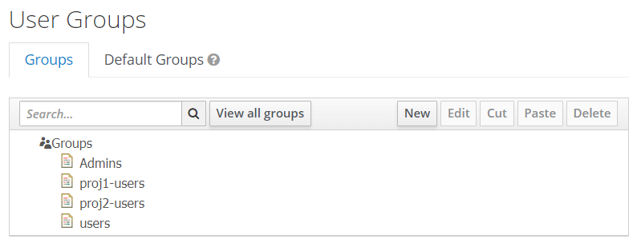
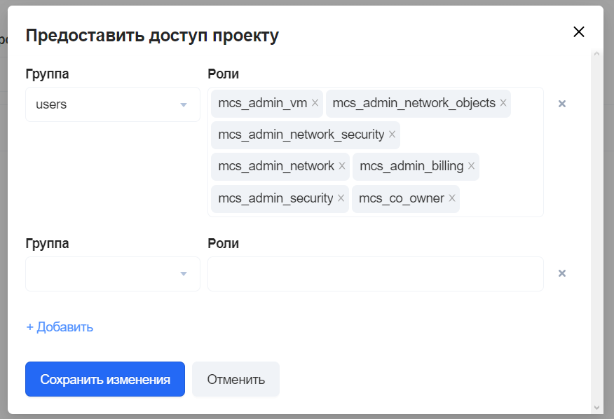

# {heading(Управление пользователями)[id=user_management]}

Когда пользователь выполняет вход в {var(sys4)}, Подсистема управления доступом (ПУД) просматривает собственное хранилище пользователей, чтобы найти пользователя. Если пользователь не найден в собственном хранилище, то ПУД будет перебирать все настроенные внешние базы данных пользователей, пока не найдет совпадение.

Чтобы добавить поставщика хранилища Active Directory (AD), в Портале управления доступом выполните следующие шаги:

1. Перейдите в пункт меню «User Federation».
1. В выпадающем списке «Add provider...» выберите пункт «ldap».
1. В форме на вкладке «Required Settings» укажите параметры подключения к AD:
   
   * «Enabled» — оставить переключатель в положении «ON».
   * «Import Users» — оставить переключатель в положении «ON».
   * «Edit Mode» — указать значение `READ_ONLY`.
   * «Sync Registrations» — оставить переключатель в положении «OFF».
   * «Vendor» — указать значение `Active Directory`.
   * «Username LDAP attribute» — указать значение `sAMAccountName`.
   * «RDN LDAP attribute» — указать значение `cn`.
   * «UUID LDAP attribute» — указать значение `objectGUID`.
   * «User Object Classes» — указать значение `person, organizationalPerson, user`.
   * «Connection URL» — указать URL для соединения с AD, например, `ldap://10.28.227.59/`.
   * «Users DN» — указать домен пользователей, например, `OU=Users,OU=Company,DC=private,DC=local`.
   * «Bind Type» — указать значение `simple`.
   * «Bind DN» — указать учётную запись пользователя, которая будет использоваться для доступа к AD.
   * «Bind Credential» — указать пароль учётной записи, которая будет использоваться для доступа к AD.
1. При необходимости заполните другие вкладки формы.
1. Нажмите на кнопку «Save».

Чтобы настроить присвоение ролей и групп всем пользователям из AD:

1. Перейдите в пункт меню «User Federation».
1. Выберите созданного поставщика хранилища, нажав на его название в списке.
1. Перейдите на вкладку «Mappers».
1. Нажмите на кнопку «Create».
1. В форме заполните поля:
   
   * «Name» — наименование сопоставления.
   * «Mapper Type» — тип сопоставления:
      
      * `group-ldap-mapper` — сопоставление по принадлежности к группе (в основном используется только этот тип сопоставления).
         
      <info>
   
      Описание остальных доступных типов сопоставления приведено в [официальной документации Keycloak](https://www.keycloak.org/docs/latest/server_admin/).
   
      </info>
   
1. Заполните остальные поля, которые появляются при выборе из списка «Mapper Type».
1. Нажмите на кнопку «Save».

## {heading(Настройки AD FS)[id=ad_fs_settings]}

Настройка AD FS заключается в установке параметров поставщика идентификации.

Чтобы добавить поставщика идентификации в Портале управления доступом:

1. Перейдите в пункт меню «Identity Providers».
1. В выпадающем списке «Add provider...» выберите пункт «SAML v2.0».
1. В форме заполните поля:
   
   * «Enabled» — оставить переключатель в положении «ON».
   * «Trust Email» — установить переключатель в положение «ON».
   * «Sync Mode» — указать значение `import`.
   * «Single Sign-On Service URL» — указать адрес сервиса единой точки входа, например, `https://10.28.227.59/adfs/ls/`.
   * «Single Logout Service URL» — указать адрес сервиса единой точки выхода, например, `https://10.28.227.59/adfs/ls/`.
   * «Backchannel Logout» — установить переключатель в положение «ON».
   * «HTTP-POST Binding Response» — установить переключатель в положение «ON».
   * «HTTP-POST Binding for AuthnRequest» — установить переключатель в положение «ON».
   * «HTTP-POST Binding Logout» — установить переключатель в положение «ON».
   * «Allowed clock skew» — указать значение `300`.
   
1. Нажмите на кнопку «Save».
1. Перейдите на вкладку «Export» и скачайте XML-файл с метаданными для выполнения настроек на стороне поставщика идентификации, нажав на кнопку «Download».

<err>

После сохранения настроек синхронизации (кнопкой «Save») никакие данные о пользователях ещё не переданы автоматически.

</err>

Для настройки процесса синхронизации необходимо заполнить параметры в блоке «Sync Settings». Значения параметров выбираются исходя из особенностей инсталляции — доступных сетевых ресурсов, производительности серверов MS AD и тому подобных.

Для немедленного начала синхронизации имеется кнопка «Synchronize all users».

<warn>

Правила настройки домена AD и применения метаданных для работы с AD FS описаны в статье [Создание отношения доверия с проверяющей стороной](https://docs.microsoft.com/ru-ru/windows-server/identity/ad-fs/operations/create-a-relying-party-trust).

</warn>

## {heading(Операции над пользователями)[id=operations_on_users]}

Просмотр списка всех пользователей доступен в разделе «Users» Портала управления доступом (см. {linkto(#pic_keycloak_users_list)[text=рисунок %number]}). Если список не появился сразу, нажмите на кнопку «View all users» над таблицей.

{caption(Рисунок {counter(pic)[id=numb_pic_keycloak_users_list]} — Общий список пользователей)[position=under;number={const(numb_pic_keycloak_users_list)};align=center;id=pic_keycloak_users_list]}

{/caption}

Доступны следующие операции над пользователями:

* Поиск пользователя в общем списке.
* Создание нового пользователя.
* Редактирование информации о существующем пользователе:
   
   * Добавление атрибутов.
   * Управление учетными данными (credentials).
   * Маппинг ролей.
   * Добавление в группу.
   * Управление разрешениями (consents).
   * Управление активными сессиями.
  
* Просмотр личной информации от имени пользователя (impersonation).
* Блокировка / разблокировка пользователя.
* Удаление пользователя.

Инструкции по выполнению вышеперечисленных операций см. в [официальной документации](https://www.keycloak.org/docs/latest/server_admin/index.html#assembly-managing-users_server_administration_guide).

## {heading(Операции над группами)[id=operations_on_groups]}

Просмотр списка всех пользователей доступен в разделе «Groups» Портала управления доступом (см. {linkto(#pic_keycloak_groups_list)[text=рисунок %number]}).

{caption(Рисунок {counter(pic)[id=numb_pic_keycloak_groups_list]} — Общий список групп)[position=under;number={const(numb_pic_keycloak_groups_list)};align=center;id=pic_keycloak_groups_list]}

{/caption}

Доступны следующие операции над группами:

* Создание новой группы.
* Редактирование существующей группы:
   
   * Добавление атрибутов.
   * Маппинг ролей.

* Добавление в группу / удаление из группы существующих пользователей.
* Настройка групп по умолчанию.
* Удаление группы.

Инструкции по выполнению вышеперечисленных операций см. в [официальной документации](https://www.keycloak.org/docs/latest/server_admin/index.html#proc-managing-groups_server_administration_guide).

## {heading(Предоставление доступа к проекту)[id=superadmin_project_access_settings]}

<err>

Доступ к проекту настраивается не для отдельного пользователя, а для группы. Предварительно добавьте пользователя в группу, чтобы предоставить ему доступ к проекту.

</err>

Чтобы предоставить пользователю доступ к проекту в Портале администратора:

1. Перейдите на вкладку «Проекты» раздела «Управление проектами».
1. Нажмите на кнопку «•••» справа от названия проекта и выберите пункт «Управление доступом».
1. В открывшемся окне нажмите на кнопку «Добавить».
1. Выберите группу, в которой находится данный пользователь, и добавьте необходимую роль пользователя в проекте (см. {linkto(#pic_add_project_role)[text=рисунок %number]}).
   
   {caption(Рисунок {counter(pic)[id=numb_pic_add_project_role]} — Мастер добавления групп и ролей в проект)[position=under;number={const(numb_pic_add_project_role)};align=center;id=pic_add_project_role]}
   
   {/caption}

1. Нажмите на кнопку «Сохранить изменения».

Описание ролей пользователей {var(sys2)} представлено в разделе {linkto(../../arch/arch-roles#arch_roles)[text=%text]}.