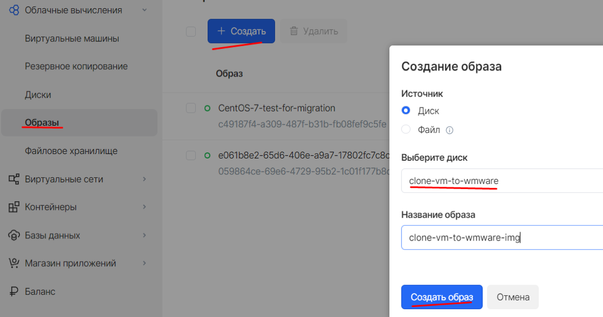
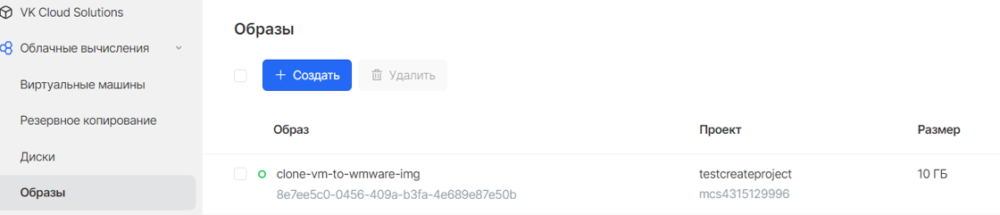
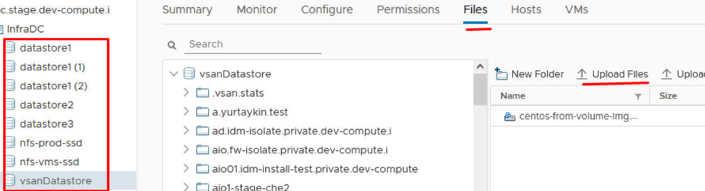
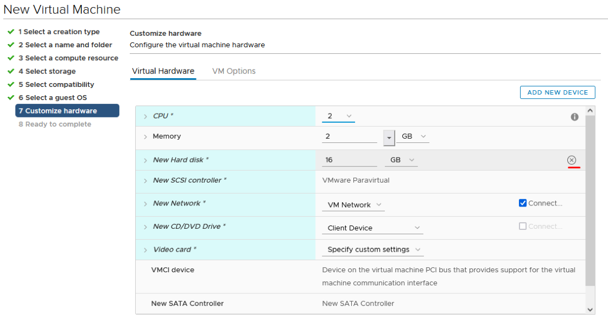
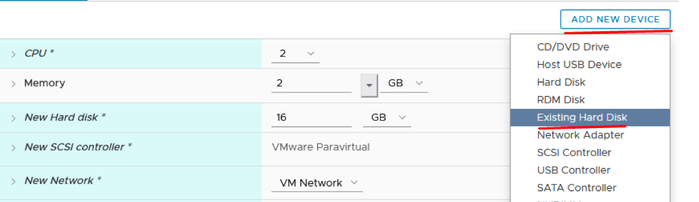
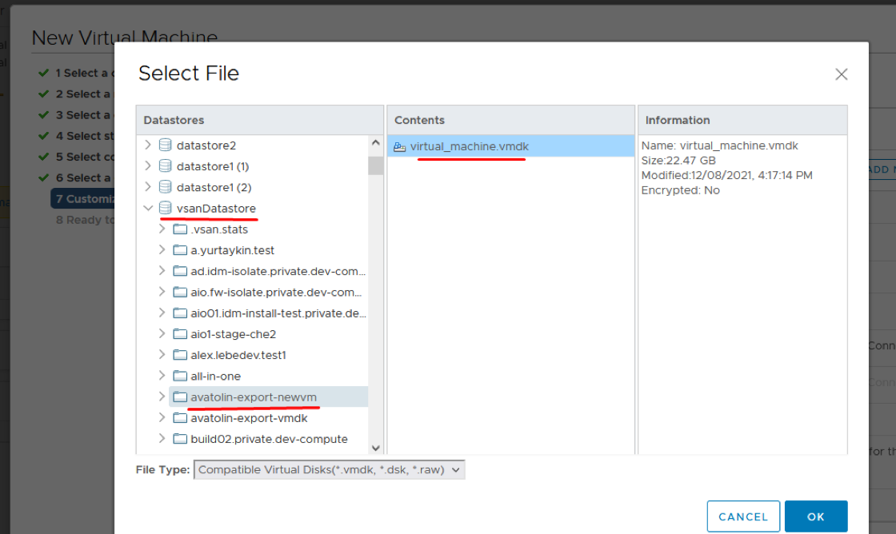
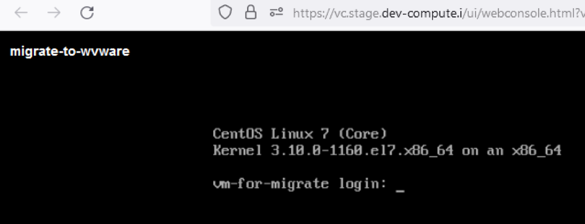

# {heading(IaaS)[id=iaas]}

## {heading(Работа с шаблонами ВМ)[id=vm_templates]}

### {heading(Просмотр списка шаблонов ВМ)[id=vm_templates_list]}

Просмотр списка шаблонов осуществляется при помощи:

* Портала администратора.
* OpenStack CLI.

#### {heading(Портал администратора)[id=vm_templates_list_portal_admin]}

Чтобы посмотреть список шаблонов через Портал администратора:

1. Выполните вход на Портал администратора.
1. Перейдите в раздел «ОБЛАЧНЫЕ ВЫЧИСЛЕНИЯ», на страницу «Типы инстансов».
   
   Список шаблонов отобразится в таблице.

#### {heading(OpenStack CLI)[id=vm_templates_list_openstack]}

Чтобы посмотреть список шаблонов при помощи Openstack CLI:

1. Выполните подготовительные операции (см. раздел {linkto(../../usage_administration/interfaces_access#use_openstackcli_admin)[text=%text]}).
1. Выполните команду:

    {include(../../cli_commands/_includes/_cli_commands.md)[tags=cli_openstack_flavor_list_cmd]}

   {caption(Пример вывода команды)[align=left;position=above]}
   ```bash
   +-----+-----------+-------+------+-----------+-------+-----------+
   | ID  |   Name    |  RAM  | Disk | Ephemeral | VCPUs | Is_Public |
   +-----+-----------+-------+------+-----------+-------+-----------+
   |  1  | m1.tiny   | 512   |    1 |         0 |     1 | True      |
   +-----+-----------+-------+------+-----------+-------+-----------+
   ```
   {/caption}

### {heading(Создание шаблона ВМ)[id=vm_templates_create]}

Создание шаблона осуществляется при помощи:

* Портала администратора.
* OpenStack CLI.

#### {heading(Портал администратора)[id=vm_templates_create_portal_admin]}

Чтобы создать шаблон через Портал администратора:

1. В меню слева перейдите в раздел «ОБЛАЧНЫЕ ВЫЧИСЛЕНИЯ», на страницу «Типы инстансов».
1. Нажмите на кнопку «Добавить».
1. В открывшейся форме нажмите на кнопку «Показать дополнительные параметры» и настройте следующие параметры шаблона:
   
   * «Имя» — название шаблона ВМ. Обязательный параметр.
   * «VCPU» — количество виртуальных CPU. Обязательный параметр.
   * «RAM» — объём выделяемой RAM в МБ. Обязательный параметр.
   * «Публичный» — признак публичности шаблона.
   * «Корневой диск» — объём корневого диска в ГБ. Обязательный параметр. Может быть равен 0, если ВМ запускалась с диска.
   * «Временный диск» — объём временного диска в ГБ.
   * «Диск подкачки» — объём swap-диска в МБ.
   * «RX/TX фактор» — показатель фактора RX/TX.
   
1. Заполните обязательные поля и нажмите на кнопку «Добавить и перейти к изменению метаданных».
1. В открывшейся форме добавьте метаданные:
   
   1. Раскройте список «MCS metadata» и отметьте вариант «mcs:cpu_type».
   1. В появившемся поле «mcs:cpu_type» выберите вариант «standard».
   1. При необходимости можете добавить пользовательские метаданные (пары «ключ» — «значения»), нажимая кнопку «Добавить» для каждой пары значений.
   
1. Нажмите на кнопку «Сохранить изменения» и дождитесь нотификации об успешном выполнении операции.

Чтобы изменить метаданные созданного шаблона:

1. В меню слева перейдите в раздел «ОБЛАЧНЫЕ ВЫЧИСЛЕНИЯ», на страницу «Типы инстансов».
1. Нажмите на иконку справа от поля поиска и выберите вариант «Реальные данные» (по умолчанию показаны «Кешированные данные»).
1. Найдите в списке созданный тип инстанса, нажмите на кнопку «•••» справа от названия шаблона и выберите пункт «Обновление метаданных».
1. В открывшемся окне нажмите на кнопку «Редактировать». Откроется окно с настройками, аналогичными настройкам метаданных при создании шаблона.
1. Отредактируйте метаданные и нажмите на кнопку «Сохранить изменения».

#### {heading(OpenStack CLI)[id=vm_templates_create_openstack]}

Чтобы создать шаблоны при помощи Openstack CLI:

1. Выполните подготовительные операции (см. раздел {linkto(../../usage_administration/interfaces_access#use_openstackcli_admin)[text=%text]}).
1. Выполните команду:

    {include(../../cli_commands/_includes/_cli_commands.md)[tags=cli_openstack_flavor_create_cmd]}
   
   Описание опций см. в разделе {linkto(../../cli_commands#cli_openstack_flavor_create)[text=%text]}.

<warn>

Для корректной работы биллинга добавьте к шаблону метаданные `--property mcs:cpu_type=standard`.

</warn>

### {heading(Изменение параметров шаблона ВМ)[id=v_infra_flavor_set]}

Изменение параметров шаблона осуществляется при помощи:

* Портала администратора.
* OpenStack CLI.

#### {heading(Портал администратора)[id=v_infra_flavor_set_portal_admin]}

Через Портал администратора доступно только добавление / редактирование метаданных шаблона ВМ. Существующие метаданные отображаются в столбце «extra_spec» при варианте отображения «Кешированные данные».

Чтобы добавить новые / редактировать существующие метаданные для шаблона через Портал администратора:

1. В меню слева перейдите в раздел «Облачные вычисления» на страницу «Типы инстансов».
1. Нажмите на иконку справа от поля поиска и выберите вариант «Реальные данные» (по умолчанию показаны «Кешированные данные»).
1. Нажмите на кнопку «•••» справа от названия шаблона и выберите пункт «Обновление метаданных».
1. Нажмите на кнопку «Редактировать».
1. Добавьте метаданные из области слева (если таковые имеются) или укажите пользовательские метаданные в формате «Имя-Значение» в одноимённых полях.
1. Нажмите на кнопку «Сохранить изменения».

#### {heading(OpenStack CLI)[id=v_infra_flavor_set_openstack]}

Создание шаблонов можно выполнить при помощи Openstack CLI. Для этого выполните подготовительные операции (см. раздел {linkto(../../usage_administration/interfaces_access#use_openstackcli_admin)[text=%text]}) и используйте команду:

 {include(../../cli_commands/_includes/_cli_commands.md)[tags=cli_openstack_flavor_set_cmd]}

Описание опций см. в разделе {linkto(../../cli_commands#cli_openstack_flavor_create)[text=%text]}.

{caption(Пример добавления метаданных для шаблона)[align=left;position=above]}
```bash
openstack flavor set --property agg_common=true b5cdc571-652f-4c1a-bb3b-8377eeccd124
```
{/caption}

### {heading(Удаление шаблона ВМ)[id=vm_templates_delete]}

Удаление шаблона осуществляется при помощи:

* Портала администратора.
* OpenStack CLI.

<err>

Удаление шаблона ВМ, который используется в активной ВМ, может повлечь поломку пересчёта биллинга.

</err>

#### {heading(Портал администратора)[id=vm_templates_delete_portal_admin]}

Чтобы удалить один или несколько шаблонов через Портал администратора:

1. В меню слева перейдите в раздел «ОБЛАЧНЫЕ ВЫЧИСЛЕНИЯ» на страницу «Типы инстансов».
1. Нажмите на иконку справа от поля поиска и выберите вариант «Реальные данные» (по умолчанию показаны «Кешированные данные»).
1. Установите флажки для шаблонов, которые необходимо удалить.
1. Нажмите на иконку удаления над таблицей.
1. В открывшемся окне подтвердите удаление.

#### {heading(OpenStack CLI)[id=vm_templates_delete_openstack]}

Чтобы удалить шаблон при помощи Openstack CLI:

1. Выполните подготовительные операции (см. раздел {linkto(../../usage_administration/interfaces_access#use_openstackcli_admin)[text=%text]}).
1. Выполните команду:

    {include(../../cli_commands/_includes/_cli_commands.md)[tags=cli_openstack_flavor_delete_cmd]}
   
   Описание опций см. в разделе {../../cli_commands#cli_openstack_flavor_delete)[text=%text]}.

## {heading(Работа с образами ВМ)[id=vm_images]}

### {heading(Просмотр списка образов)[id=vm_images_list]}

Просмотр образов осуществляется при помощи:

* Портала самообслуживания (см. Руководство пользователя {var(sys2)}).
* Портала администратора.
* OpenStack CLI.

#### {heading(Портал администратора)[id=vm_images_list_portal_admin]}

Чтобы посмотреть список образов через Портал администратора:


1. Выполните вход на Портал администратора.
1. Перейдите в раздел «ОБЛАЧНЫЕ ВЫЧИСЛЕНИЯ», на страницу «Образы».
   
   Список образов отобразится в таблице.

#### {heading(OpenStack CLI)[id=vm_images_list_openstack]}

Чтобы посмотреть список образов при помощи Openstack CLI:

1. Выполните подготовительные операции (см. раздел {linkto(../../usage_administration/interfaces_access#use_openstackcli_admin)[text=%text]}).
1. Выполните команду:

    {include(../../cli_commands/_includes/_cli_commands.md)[tags=cli_openstack_image_list_cmd]}

   {caption(Пример вывода команды)[align=left;position=above]}
   ```bash
   +--------------------------------------+-----------------------------------+--------+
   | ID                                   | Name                              | Status |
   +--------------------------------------+-----------------------------------+--------+
   | 42f43e9d-7c53-46fa-ad87-846ef524d721 | CentOS-7-x86_64-GenericCloud-1905 | active |
   +--------------------------------------+-----------------------------------+--------+
   ```
   {/caption}

### {heading(Создание образа)[id=vm_images_create]}

Создание образа осуществляется при помощи:

* Портала самообслуживания (см. Руководство пользователя {var(sys2)}).
* Портала администратора.
* OpenStack CLI.

Образ можно создать путем загрузки файла в формате `RAW` или создания из существующего диска.

<err>

Публичные образы ВМ, взятые вне {var(sys2)}, необходимо предварительно подготовить для загрузки в {var(sys4)} (см. раздел {linkto(../../usage_administration/platform_administration/images_preparation#images_preparation)[text=%text]}). Иначе может не работать часть функций, например, резервное копирование.

</err>

#### {heading(Создание образа из файла)[id=vm_images_create_from_file]}

##### {heading(Портал администратора)[id=vm_images_create_from_file_portal_admin]}

Чтобы создать образ из файла в Портале администратора:

1. В меню слева перейдите в раздел «ОБЛАЧНЫЕ ВЫЧИСЛЕНИЯ», на страницу «Образы».
1. Нажмите на кнопку «Добавить». В открывшейся форме задайте следующие параметры образа:
   
   * Подробности образа:
      
      * «Имя образа» — наименование образа. Обязательный параметр.
      * «Описание образа» — краткое описание образа.
      * «Тип источника» — тип источника, из которого загружается образ.
      * «Формат» — формат загруженного файла образа.
      * «Файл» — файл образа.
     
   * Требования Образа:
      
      * «Ядро» — образ ядра.
      * «Диск в памяти» — образ диска RAM.
      * «Архитектура» — архитектура образа. Например, `i386` для 32-битной или `x86_64` для 64-битной архитектуры.
      * «Минимальный размер диска (ГБ)» — минимальный размер диска в ГБ. Оставить поле пустым.
      * «Минимальный размер памяти (МБ)» — минимальный размер RAM в МБ. Оставить поле пустым.
   
   * Общий доступ к образу:
      
      * Видимость:
         * «Публ.» — публичный (доступен всем проектам).
         * «Приватный» — приватный (доступен только в том проекте, в котором создан).
      * «Защищенный» — признак защищенности образа. В случае опции «Да» его смогут удалить только пользователи с соответствующими правами.

1. Нажмите на кнопку «Создать образ» и дождитесь нотификации об успешном выполнении операции.
1. Вернитесь на страницу «Образы» и найдите в списке созданный образ.
1. Нажмите на иконку справа от поля поиска и выберите вариант «Реальные данные» (по умолчанию показаны «Кешированные данные»).
1. Нажмите на кнопку «•••» справа от названия созданного образа и выберите пункт «Обновление метаданных».
1. Нажмите на кнопку «Редактировать».
1. В открывшейся форме добавьте пользовательские метаданные (пары «ключ» — «значения»), нажимая кнопку «Добавить» для каждой пары значений:
   
   * `hw_qemu_guest_agent` — `yes`.
   * `hw_vif_multiqueue_enabled` — `true`.
   * `os_require_quiesce` — `yes`.
   * `os_type` — `linux`.
   
1. Нажмите на кнопку «Сохранить изменения».

<warn>

Максимальная длина каждого ключа и значения — 255 символов.

</warn>

##### {heading(OpenStack CLI)[id=vm_images_create_from_file_openstack]}

Чтобы загрузить образ в Openstack CLI:

1. Выполните подготовительные операции (см. раздел {linkto(../../usage_administration/interfaces_access#use_openstackcli_admin)[text=%text]}).
1. Выполните команду:

    {include(../../cli_commands/_includes/_cli_commands.md)[tags=cli_openstack_image_create_cmd]}

1. Если необходимо загрузить образ с поддержкой резервного копирования, добавьте свойства для работы с `qemu-guest-agent`:
   
   ```bash
   openstack image create --private --container-format bare --disk-format raw --file <ИМЯ_ФАЙЛА.raw> --property hw_qemu_guest_agent=yes --property os_require_quiesce=yes <ИМЯ_ОБРАЗА>
   ```

<info>

Полный список доступных команд приведен в [документации OpenStack](https://docs.openstack.org/glance/rocky/admin/useful-image-properties.html).

</info>

### {heading(Выгрузка образа)[id=vm_images_upload]}

Чтобы выгрузить образ в файл, выполните следующую команду OpenStack CLI:

 {include(../../cli_commands/_includes/_cli_commands.md)[tags=cli_openstack_image_save_cmd]}

Описание опций см. в разделе {linkto(../../cli_commands#cli_openstack_image_save)[text=%text]}.

### {heading(Удаление образа)[id=vm_images_delete]}

Удаление образа осуществляется при помощи:

* Портала самообслуживания (см. Руководство пользователя {var(sys2)}).
* Портала администратора.
* OpenStack CLI.

<err>

Удаление образа, который используется в активной ВМ, может повлечь поломку пересчёта биллинга.

</err>

#### {heading(Портал администратора)[id=vm_images_delete_portal_admin]}

Чтобы удалить один или несколько образов в Портале администратора:

1. В меню слева перейдите в раздел «ОБЛАЧНЫЕ ВЫЧИСЛЕНИЯ», на страницу «Образы».
1. Нажмите на иконку справа от поля поиска и выберите вариант «Реальные данные» (по умолчанию показаны «Кешированные данные»).
1. Установите флажки для образов, которые необходимо удалить.
1. Нажмите на иконку удаления над таблицей.
1. В открывшемся окне подтвердите удаление.

<err>

Удаление образов в Портале администратора не поддерживается, если:

* Образ создан на основе другого образа.
* Образ создан другим пользователем.
* Образ используется в одном из существующих (не обязательно включённых) инстансов.

</err>

#### {heading(OpenStack CLI)[id=vm_images_delete_openstack]}

Чтобы удалить образ при помощи Openstack CLI:

1. Выполните подготовительные операции (см. раздел {linkto(../../usage_administration/interfaces_access#use_openstackcli_admin)[text=%text]}).
1. Выполните команду:

    {include(../../cli_commands/_includes/_cli_commands.md)[tags=cli_openstack_image_delete_cmd]}
   
   Описание опций см. в разделе {linkto(../../cli_commands#cli_openstack_image_delete)[text=%text]}.

## {heading(Создание экземпляра ВМ)[id=vm_instance_create]}

Создание ВМ осуществляется при помощи:

* Портала самообслуживания (см. Руководство пользователя {var(sys2)}).
* OpenStack CLI.

### {heading(OpenStack CLI)[id=vm_instance_create_openstack]}

Чтобы создать ВМ при помощи Openstack CLI:

1. Выполните подготовительные операции (см. раздел {linkto(../../usage_administration/interfaces_access#use_openstackcli_admin)[text=%text]}).
1. Выполните команду:

    {include(../../cli_commands/_includes/_cli_commands.md)[tags=cli_openstack_server_create_cmd]}
   
   Описание опций см. в разделе {linkto(../../cli_commands#cli_openstack_server_create)[text=%text]}.

## {heading(Создание копии ВМ)[id=vm_copy_create]}

Для создания полной копии ВМ без прерывания работы копируемой ВМ проще всего создать полную копию диска (или дисков ВМ). Шаги по созданию копии ВМ см. в Руководстве пользователя {var(sys2)}.

## {heading(Управление виртуальной машиной)[id=vm_management]}

### {heading(Запуск, перезапуск и останов ВМ)[id=vm_start_restart_stop]}

Запуск, перезапуск и останов ВМ осуществляется при помощи:

* Портала самообслуживания (см. Руководство пользователя {var(sys2)}).
* OpenStack CLI.

<info>

Управление ВМ при помощи Портала администратора не предусмотрено. Текущий статус ВМ отображается на странице «Инстансы»:

* В столбце «status» (кешированные данные).
* В столбце «Состояние питания» (реальные данные).

</info>

#### {heading(OpenStack CLI)[id=vm_start_restart_stop_cli]}

Чтобы запустить, перезапустить и остановить ВМ при помощи Openstack CLI:

1. Выполните подготовительные операции (см. раздел {linkto(../../usage_administration/interfaces_access#use_openstackcli_admin)[text=%text]}).
1. Запустите следующие команды:
   
   * Для запуска:

       {include(../../cli_commands/_includes/_cli_commands.md)[tags=cli_openstack_server_start_cmd]}
   
   * Для перезапуска:

       {include(../../cli_commands/_includes/_cli_commands.md)[tags=cli_openstack_server_reboot_cmd]}
   
   * Для останова:

       {include(../../cli_commands/_includes/_cli_commands.md)[tags=cli_openstack_server_stop_cmd]}
      
Описание опций см. в разделах {linkto(../../cli_commands#cli_openstack_server_start)[text=%text]}, {linkto(../../cli_commands#cli_openstack_server_reboot)[text=%text]}, {linkto(../../cli_commands#cli_openstack_server_stop)[text=%text]}.

### {heading(Просмотр списка ВМ)[id=vm_list]}

Просмотр списка ВМ осуществляется при помощи:

* Портала самообслуживания (см. Руководство пользователя {var(sys2)}).
* Портала администратора.
* OpenStack CLI.

#### {heading(Портал администратора)[id=vm_list_portal_admin]}

Чтобы просмотреть список ВМ через Портал администратора:

1. Выполните вход на Портал администратора.
1. Перейдите в раздел «ОБЛАЧНЫЕ ВЫЧИСЛЕНИЯ», на страницу «Инстансы».
   
   Список ВМ всех проектов отобразится в таблице.

<warn>

Список ВМ отдельного проекта доступен при вводе его названия в столбец «project_name» таблицы.

</warn>

#### {heading(OpenStack CLI)[id=vm_list_openstack]}

Чтобы просмотреть список ВМ при помощи Openstack CLI:

1. Выполните подготовительные операции (см. раздел {linkto(../../usage_administration/interfaces_access#use_openstackcli_admin)[text=%text]}).
1. Выполните команду:

    {include(../../cli_commands/_includes/_cli_commands.md)[tags=cli_openstack_server_list_cmd]}
   
   Описание опций см. в разделе {linkto(../../cli_commands#cli_openstack_server_list)[text=%text]}.

### {heading(Удаление ВМ)[id=vm_delete]}

Удаление ВМ осуществляется при помощи:

* Портала самообслуживания (см. Руководство пользователя {var(sys2)}).
* OpenStack CLI.

#### {heading(OpenStack CLI)[id=vm_delete_openstack]}

Чтобы удалить ВМ при помощи Openstack CLI:

1. Выполните подготовительные операции (см. раздел {linkto(../../usage_administration/interfaces_access#use_openstackcli_admin)[text=%text]}).
1. Выполните команду:

    {include(../../cli_commands/_includes/_cli_commands.md)[tags=cli_openstack_server_delete_cmd]}

### {heading(Миграция ВМ)[id=vm_migration]}

ВМ могут мигрировать только между гипервизорами с процессорами одинаковой архитектуры. Например: с Intel на Intel, с AMD на AMD.

Миграция ВМ осуществляется при помощи:

* Портала администратора.
* OpenStack CLI.

#### {heading(Портал администратора)[id=vm_migration_portal_admin]}

Чтобы выполнить live («живую») миграцию через Портал администратора:

1. В меню слева перейдите в раздел «ОБЛАЧНЫЕ ВЫЧИСЛЕНИЯ», на страницу «Инстансы».
1. Нажмите на иконку справа от поля поиска и выберите вариант «Реальные данные» (по умолчанию показаны «Кешированные данные»).
1. Нажмите на кнопку «•••» справа от названия ВМ и выберите пункт «Живая миграция инстанса».
1. В открывшемся окне выберите наименование хоста из списка «Новый узел». При необходимости измените признаки «Оверкоммитинг диска» и «Блочная миграция».
1. Нажмите на кнопку «Начать живую миграцию».

<err>

Выбираемый хост должен быть включен.

</err>

<warn>

Во время live-миграции возможна потеря связи с ВМ продолжительностью от 0,5 до 5 минут.

</warn>

#### {heading(OpenStack CLI)[id=vm_migration_openstack]}

Чтобы выполнить миграцию ВМ при помощи Openstack CLI:

1. Выполните подготовительные операции (см. раздел {linkto(../../usage_administration/interfaces_access#use_openstackcli_admin)[text=%text]}).
1. Выполните команду:

    {include(../../cli_commands/_includes/_cli_commands.md)[tags=cli_openstack_server_migrate_cmd]}
   
   Описание опций см. в разделе {linkto(../../cli_commands#cli_openstack_server_migrate)[text=%text]}.

### {heading(Эвакуация ВМ с вычислительного узла)[id=vm_evacuation_from_computing_node]}

На управляющем узле с установленным ПО для управления Nova (управляющий узел №3) выполните команду для эвакуации всех ВМ этого узла на другие вычислительные узлы в составе кластера:

```bash
nova host-evacuate-live [--target_host <ИМЯ_КОНЕЧНОГО_УЗЛА>] <ИМЯ_ИСХОДНОГО_УЗЛА>
```

, где:

* `<ИМЯ_КОНЕЧНОГО_УЗЛА>` — имя узла, на который вы хотите перенести ВМ. Может быть не указано, в этом случае хост будет выбран автоматически из списка управляющих хостов кластера.
* `<ИМЯ_ИСХОДНОГО_УЗЛА>` — имя узла, с которого вы хотите эвакуировать все ВМ.

## {heading(Миграция ВМ из VMware в {var(system)})[id=vm_migration_from_vmware]}

<info>

Миграция ВМ на базе ОС семейства Windows и Linux осуществляется по-разному.

</info>

Подробную инструкции см. в документе Руководство пользователя {var(sys2)}.

## {heading(Миграция ВМ из {var(system)} в VMware)[id=vm_migration_to_vmware]}

Для миграции ВМ из {var(system)} в VMware выполните шаги, описанные ниже:

1. {linkto(#vm_migration_step_1)[text=%text]}.
1. {linkto(#vm_migration_step_2)[text=%text]}.
1. {linkto(#vm_migration_step_3)[text=%text]}.
1. {linkto(#vm_migration_step_4)[text=%text]}.
1. {linkto(#vm_migration_step_5)[text=%text]}.
1. {linkto(#vm_migration_step_6)[text=%text]}.
1. {linkto(#vm_migration_step_7)[text=%text]}.
1. {linkto(#vm_migration_step_8)[text=%text]}.
1. {linkto(#vm_migration_step_9)[text=%text]}.

### {heading(Шаг 1. Остановите ВМ)[id=vm_migration_step_1]}

Останов ВМ, которую необходимо мигрировать, осуществляется при помощи:

* Портала самообслуживания (см. Руководство пользователя {var(sys2)}).
* OpenStack CLI (см. раздел {linkto(#vm_start_restart_stop_cli)[text=Запуск, перезапуск и останов ВМ]}).

### {heading(Шаг 2. Клонируйте диск остановленной ВМ)[id=vm_migration_step_2]}

Клонирование диска осуществляется при помощи:

* Портала самообслуживания (см. Руководство пользователя {var(sys2)}).
* OpenStack CLI (см. раздел {linkto(#vm_disk_clone_cli)[text=Клонирование диска]}).

### {heading(Шаг 3. Создайте образ на основе клонированного диска)[id=vm_migration_step_3]}

Создание образа представлено на {linkto(#pic_vmware_import_image_create)[text=рисунке %number]} и {linkto(#pic_vmware_import_image_created)[text=рисунке %number]}.

{caption(Рисунок {counter(pic)[id=numb_pic_vmware_import_image_create]} — Создание образа)[position=under;number={const(numb_pic_vmware_import_image_create)};align=center;id=pic_vmware_import_image_create]}

{/caption}

{caption(Рисунок {counter(pic)[id=nump_pic_vmware_import_image_created]} — Образ создан)[position=under;number={const(nump_pic_vmware_import_image_created)};align=center;id=pic_vmware_import_image_created]}

{/caption}

### {heading(Шаг 4. Скачайте образ в формате RAW через OpenStack CLI)[id=vm_migration_step_4]}

1. Выполните подготовительные операции (см. раздел {linkto(../../usage_administration/interfaces_access#use_openstackcli_admin)[text=%text]}).
1. Получите список образов и их идентификаторы:
   
   ```bash
   openstack image list
   ```
1. Скачайте созданный на предыдущем шаге образ в формате RAW:
   
   ```bash
   openstack image save --file clone-vm-to-wmvare-img.raw <ИМЯ_ИЛИ_ID_ОБРАЗА>
   ```

### {heading(Шаг 5. Сконвертируйте скачанный образ в формат VMDK)[id=vm_migration_step_5]}

```bash
qemu-img convert -f raw -O vmdk -o subformat=streamOptimized clone-vm-to-wmvare-img.raw clone-vm-to-wmvare-img.vmdk
```

### {heading(Шаг 6. Обновите параметр версии образа в формате VMDK)[id=vm_migration_step_6]}

```bash
printf '\x03' | dd conv=notrunc of=clone-vm-to-wmvare-img.vmdk bs=1 seek=$((0x4))
```

### {heading(Шаг 7. Скопируйте образ в формате VMDK в файловое хранилище)[id=vm_migration_step_7]}

Копирование образа в формате VMDK на ESXi через GUI vSphere в файловое хранилище представлено на {linkto(#pic_vmware_import_image_copy)[text=рисунке %number]}.

{caption(Рисунок {counter(pic)[id=numb_pic_vmware_import_image_copy]} — Копирование образа)[position=under;number={const(numb_pic_vmware_import_image_copy)};align=center;id=pic_vmware_import_image_copy]}

{/caption}

### {heading(Шаг 8. Сконвертируйте образ в формате VMDK утилитой vmkfstools)[id=vm_migration_step_8]}

Данный шаг выполняется, поскольку файл, полученный при конвертации на {linkto(#vm_migration_step_5)[text=шаге 5]}, поддерживается только VMWare Workstation. После конвертации, описанной в этом шаге, образ можно будет использовать в ESXi.

1. Войдите на любой хост ESXi по SSH.
1. Перейдите в директорию, куда скачан образ в формате VMDK.
1. Сконвертируйте образ утилитой `vmkfstools`:
   
   ```bash
   vmkfstools -i <SOURCE>.vmdk <DIST>.vmdk
   ```

   {caption(Пример команды)[align=left;position=above]}
   ```bash
   vmkfstools -i clone-vm-to-wmvare-img.vmdk virtual_machine.vmdk
   ```
   {/caption}

   {caption(Пример результата)[align=left;position=above]}
   ```bash
   Destination disk format: VMFS zeroedthick
   Cloning disk 'clone-vm-to-wmvare-img.vmdk'...
   Clone: 100% done.
   ```
   {/caption}

### {heading(Шаг 9. Создайте ВМ)[id=vm_migration_step_9]}

При создании ВМ в VMware задайте в качестве диска полученный образ:

1. Удалите пустой диск (см. {linkto(#pic_vmware_import_vm_create_2)[text=рисунок %number]}):
   
   {caption(Рисунок {counter(pic)[id=numb_pic_vmware_import_vm_create_2]} — Удаление пустого диска)[position=under;number={const(numb_pic_vmware_import_vm_create_2)};align=center;id=pic_vmware_import_vm_create_2]}
   
   {/caption}

2. Выберите подключение существующего диска (см. {linkto(#pic_vmware_import_vm_create_3)[text=рисунок %number]}, {linkto(#pic_vmware_import_vm_create_4)[text=рисунок %number]}):
   
   {caption(Рисунок {counter(pic)[id=numb_pic_vmware_import_vm_create_3]} — Выбор существующего диска)[position=under;number={const(numb_pic_vmware_import_vm_create_3)};align=center;id=pic_vmware_import_vm_create_3]}
   
   {/caption}
   
   {caption(Рисунок {counter(pic)[id=numb_pic_vmware_import_vm_create_4]} — Выбор существующего диска (продолжение))[position=under;number={const(numb_pic_vmware_import_vm_create_4)};align=center;id=pic_vmware_import_vm_create_4]}
   
   {/caption}

3. Нажмите на кнопки «Далее» → «Далее» → «Готово».
4. Запустите ВМ и проверьте, что ВМ запущена (см. {linkto(#pic_vmware_import_vm_create_5)[text=рисунок %number]}):
   
   {caption(Рисунок {counter(pic)[id=numb_pic_vmware_import_vm_create_5]} — Пример запущенной ВМ для ОС семейства Linux)[position=under;number={const(numb_pic_vmware_import_vm_create_5)};align=center;id=pic_vmware_import_vm_create_5]}
   
   {/caption}

<warn>

Для ОС Windows дополнительно установите `vmware-tools`, чтобы ВМ могла коммуницировать с гипервизором.

</warn>

## {heading(Сетевые настройки)[id=network_settings]}

### {heading(Просмотр)[id=network_settings_view]}

Чтобы другие виртуальные машины видели друг друга в пределах одной сети / подсети, укажите соответствующие сетевые настройки (принадлежность к этой сети / подсети) в каждой из виртуальных машин.

Просмотр списка сетей осуществляется при помощи:

* Портала самообслуживания (см. Руководство пользователя {var(sys2)}).
* Портала администратора.
* OpenStack CLI.

#### {heading(Портал администратора)[id=network_settings_view_portal_admin]}

Чтобы посмотреть список сетей через Портал администратора:

1. Выполните вход на Портал администратора.
1. Перейдите в раздел «НЕЙТРОН», на страницу «Сети».
   
   Список сетей и подсетей отобразится в таблице.

1. Чтобы посмотреть список сетей, доступных проекту или созданных в нём, заполните одно из следующих полей таблицы:
   
   * «project_id» — UID проекта.
   * «project_name» — название проекта.

#### {heading(OpenStack CLI)[id=network_settings_view_openstack]}

Чтобы посмотреть список сетей при помощи Openstack CLI:

1. Выполните подготовительные операции (см. раздел {linkto(../../usage_administration/interfaces_access#use_openstackcli_admin)[text=%text]}).
1. Выполните команду:

    {include(../../cli_commands/_includes/_cli_commands.md)[tags=cli_openstack_network_list_cmd]}
   
   Описание опций см. в разделе {linkto(../../cli_commands#cli_openstack_network_list)[text=%text]}.

### {heading(Создание)[id=network_settings_create]}

#### {heading(Создание сети)[id=network_creating]}

Создание сети осуществляется при помощи:

* Портала самообслуживания (см. Руководство пользователя {var(sys2)}).
* OpenStack CLI.

##### {heading(OpenStack CLI)[id=network_creating_openstack]}

Чтобы создать сеть при помощи Openstack CLI:

1. Выполните подготовительные операции (см. раздел {linkto(../../usage_administration/interfaces_access#use_openstackcli_admin)[text=%text]}).
1. Выполните команду:

    {include(../../cli_commands/_includes/_cli_commands.md)[tags=cli_openstack_network_create_cmd]}
   
   Описание опций см. в разделе {linkto(../../cli_commands#cli_openstack_network_create)[text=%text]}.

#### {heading(Создание подсети)[id=subnet_creating]}

Создание подсети осуществляется при помощи:

* Портала самообслуживания (см. Руководство пользователя {var(sys2)}).
* Портала администратора.
* OpenStack CLI.

##### {heading(Портал администратора)[id=subnet_creating_portal_admin]}

Чтобы создать подсеть в Портале администратора:

1. Перейдите в раздел «НЕЙТРОН», на страницу «Сети».
1. Нажмите на иконку справа от поля поиска и выберите вариант «Реальные данные» (по умолчанию показаны «Кешированные данные»).
1. Перейдите в сеть, нажав на её название в общем списке.
1. Перейдите на вкладку «Подсети».
1. Нажмите на кнопку «Добавить».
1. В открывшейся форме укажите параметры подсети:
   
   * «Название подсети» — наименование подсети.
   * «Сетевой Адрес» — адреса сети в нотации CIDR.
   * «Версия IP» — версия IP подсети.
   * «IP шлюза» — IP шлюза для подсети (по умолчанию это первый IP-адрес сети).
   * «Запретить шлюз» — признак использования шлюза.
   * «Разрешить DHCP» — признак использования DHCP.
   * «Выделение пулов» — пулы IP-адресов, доступных для выдачи посредством DHCP; каждое значение на отдельной строке.
   * «Сервера DNS» — список IP-адресов имен DNS-серверов для этой подсети; каждое значение на отдельной строке.
   * «Маршруты узла» — дополнительные маршруты для данной подсети; каждое значение на отдельной строке.
   
1. Нажмите на кнопку «Создать».
   
   Созданная подсеть появится в общем списке подсетей для указанной сети.

##### {heading(OpenStack CLI)[id=subnet_creating_cli]}

Чтобы создать подсеть при помощи Openstack CLI:

1. Выполните подготовительные операции (см. раздел {linkto(../../usage_administration/interfaces_access#use_openstackcli_admin)[text=%text]}).
1. Выполните команду:

    {include(../../cli_commands/_includes/_cli_commands.md)[tags=cli_openstack_subnet_create_cmd]}
   
   Описание опций см. в разделе {linkto(../../cli_commands#cli_openstack_subnet_create)[text=%text]}.

#### {heading(Создание маршрутизатора)[id=router_creating]}

Создание маршрутизатора осуществляется при помощи:


* Портала самообслуживания (см. Руководство пользователя {var(sys2)}).
* OpenStack CLI.

##### {heading(OpenStack CLI)[id=router_creating_openstack]}

Чтобы создать маршрутизатор при помощи Openstack CLI:

1. Выполните подготовительные операции (см. раздел {linkto(../../usage_administration/interfaces_access#use_openstackcli_admin)[text=%text]}).
1. Выполните команду:

    {include(../../cli_commands/_includes/_cli_commands.md)[tags=cli_openstack_router_create_cmd]}
   
   Описание опций см. в разделе {linkto(../../cli_commands#cli_openstack_router_create)[text=%text]}.

#### {heading(Создание портов)[id=ports_creating]}

Создание портов осуществляется при помощи:

* Портала самообслуживания (см. Руководство пользователя {var(sys2)}).
* Портала администратора.
* OpenStack CLI.

##### {heading(Портал администратора)[id=ports_creating_portal_admin]}

Чтобы создать порт в Портале администратора:

1. Перейдите в раздел «НЕЙТРОН», на страницу «Сети».
1. Нажмите на иконку справа от поля поиска и выберите вариант «Реальные данные» (по умолчанию показаны «Кешированные данные»).
1. Выберите сеть и нажмите на её имя.
1. Перейдите на вкладку «Порты».
1. Нажмите на кнопку «Добавить». В открывшейся форме задайте следующие параметры порта:
   
   * Обязательные параметры:
      
      * «ID сети» — идентификатор сети, для которой создаётся порт. Заполняется автоматически.
      * «Имя» — наименование сети, для которой создаётся порт.
      * «Включить состояние администратора» — признак управления сетью.
      * «Укажите IP адрес или подсеть» — связать IP-адрес или подсеть. Выберите один из предложенных вариантов и заполните соответствующее поле с адресом.
     
   * Необязательные параметры:
      
      * «ID устройства» — ID устройства, подключенного к порту.
      * «Владелец устройства» — владелец устройства, подключенного к порту.
     
1. Нажмите на кнопку «Сохранить изменения».

<warn>

Создание порта также доступно через раздел «НЕЙТРОН», на странице «Порты» — нажмите на кнопку «Добавить» и укажите сеть, для которой создается порт. Остальные параметры совпадают с описанными выше.

</warn>

##### {heading(OpenStack CLI)[id=ports_creating_openstack]}

Чтобы создать порт при помощи Openstack CLI:

1. Выполните подготовительные операции (см. раздел {linkto(../../usage_administration/interfaces_access#use_openstackcli_admin)[text=%text]}).
1. Выполните команду:

    {include(../../cli_commands/_includes/_cli_commands.md)[tags=cli_openstack_port_create_cmd]}
   
   Описание опций см. в разделе {linkto(../../cli_commands#cli_openstack_port_create)[text=%text]}.

### {heading(Редактирование и удаление)[id=edit_delete]}

#### {heading(Сети)[id=network_edit_delete]}

Редактирование сетей и их удаление осуществляется при помощи:

* Портала самообслуживания (см. Руководство пользователя {var(sys2)}).
* Портала администратора.
* OpenStack CLI.

##### {heading(Портал администратора)[id=network_edit_delete_portal_admin]}

Чтобы отредактировать сеть в Портале администратора:

1. Перейдите в раздел «НЕЙТРОН», на страницу «Сети».
1. Нажмите на иконку справа от поля поиска и выберите вариант «Реальные данные» (по умолчанию показаны «Кешированные данные»).
1. Нажмите на кнопку «•••» справа от названия подсети и выберите пункт «Редактировать».
1. В открывшемся окне установите новые значения и нажмите на кнопку «Сохранить изменения».

<err>

Перед удалением сети необходимо предварительно отключить / удалить её порты со *всех* ВМ *всех* проектов (см. раздел {linkto(#ports_management)[text=%text]}).

</err>

Чтобы удалить сеть в Портале администратора:

1. Перейдите в раздел «НЕЙТРОН», на страницу «Сети».
1. Нажмите на иконку справа от поля поиска и выберите вариант «Реальные данные» (по умолчанию показаны «Кешированные данные»).
1. Установите флажок для сети, которую необходимо удалить.
1. Нажмите на иконку удаления над таблицей.
   
    <warn>

    Если при выполнении шага возникла ошибка удаления сети, убедитесь, что не осталось ресурсов, использующих эту сеть (порты), и повторите попытку.

    </warn>

1. В открывшемся окне подтвердите удаление сети.

##### {heading(OpenStack CLI)[id=network_edit_delete_openstack]}

Чтобы отредактировать или удалить сеть при помощи Openstack CLI:

1. Выполните подготовительные операции (см. раздел {linkto(../../usage_administration/interfaces_access#use_openstackcli_admin)[text=%text]}).
1. Выполните команду:
   
   * Для редактирования параметров сети:

       {include(../../cli_commands/_includes/_cli_commands.md)[tags=cli_openstack_network_set_cmd]}
      
      Описание опций см. в разделе {linkto(../../cli_commands#cli_openstack_network_set)[text=%text]}.
   
   * Для удаления сети:

       {include(../../cli_commands/_includes/_cli_commands.md)[tags=cli_openstack_network_delete_cmd]}
      
      Описание опций см. в разделе {linkto(../../cli_commands#cli_openstack_network_delete)[text=%text]}.

#### {heading(Подсети)[id=subnet_edit_delete]}

Редактирование и удаление подсетей осуществляется при помощи:

* Портала самообслуживания (см. Руководство пользователя {var(sys2)}).
* Портала администратора.
* OpenStack CLI.

##### {heading(Портал администратора)[id=subnet_edit_delete_portal_admin]}

Чтобы изменить параметры существующей подсети в Портале администратора:

1. Перейдите в раздел «НЕЙТРОН», на страницу «Сети».
1. Нажмите на иконку справа от поля поиска и выберите вариант «Реальные данные» (по умолчанию показаны «Кешированные данные»).
1. Выберите нужную сеть и нажмите на её имя.
1. Перейдите на вкладку «Подсети».
1. Нажмите на кнопку «•••» справа от названия подсети и выберите пункт «Редактировать».
1. В открывшемся окне установите новые значения и нажмите на кнопку «Сохранить изменения».

Чтобы удалить подсеть в Портале администратора:

1. Перейдите в раздел «НЕЙТРОН», на страницу «Сети».
1. Нажмите на иконку справа от поля поиска и выберите вариант «Реальные данные» (по умолчанию показаны «Кешированные данные»).
1. Выберите нужную сеть и нажмите на её имя.
1. Перейдите на вкладку «Подсети».
1. Установите флажок для подсети, которую необходимо удалить.
1. Нажмите на иконку удаления над таблицей.
1. В открывшемся окне подтвердите удаление.

##### {heading(OpenStack CLI)[id=subnet_edit_delete_openstack]}

Чтобы изменить или удалить подсеть при помощи Openstack CLI:

1. Выполните подготовительные операции (см. раздел {linkto(../../usage_administration/interfaces_access#use_openstackcli_admin)[text=%text]}).
1. Выполните команду:
   
   * Чтобы назначить новые и отредактировать существующие параметры:

       {include(../../cli_commands/_includes/_cli_commands.md)[tags=cli_openstack_subnet_set_cmd]}
      
      Описание опций см. в разделе {linkto(../../cli_commands#cli_openstack_subnet_set)[text=%text]}.
   
   * Чтобы сбросить значения параметров подсети:

       {include(../../cli_commands/_includes/_cli_commands.md)[tags=cli_openstack_subnet_unset_cmd]}
    
      Описание опций см. в разделе {linkto(../../cli_commands#cli_openstack_subnet_set)[text=%text]}.
   
   * Чтобы удалить подсеть:

       {include(../../cli_commands/_includes/_cli_commands.md)[tags=cli_openstack_subnet_delete_cmd]}

#### {heading(Маршрутизаторы)[id=router_edit_delete]}

Управление маршрутизаторами и их удаление осуществляется при помощи:

* Портала самообслуживания (см. Руководство пользователя {var(sys2)}).
* OpenStack CLI.

##### {heading(OpenStack CLI)[id=router_edit_delete_openstack]}

Чтобы изменить или удалить маршрутизатор (роутер) при помощи Openstack CLI:

1. Выполните подготовительные операции (см. раздел {linkto(../../usage_administration/interfaces_access#use_openstackcli_admin)[text=%text]}).
1. Выполните команду:
   
   * Чтобы изменить параметры маршрутизатора:

       {include(../../cli_commands/_includes/_cli_commands.md)[tags=cli_openstack_router_set_cmd]}
   
   * Чтобы сбросить параметры маршрутизатора:

       {include(../../cli_commands/_includes/_cli_commands.md)[tags=cli_openstack_router_unset_cmd]}
   
   * Чтобы удалить маршрутизатор:

       {include(../../cli_commands/_includes/_cli_commands.md)[tags=cli_openstack_router_delete_cmd]}
      
      Описание опций см. в разделе {linkto(../../cli_commands#cli_openstack_router_set)[text=%text]}.

#### {heading(Порты)[id=ports_management]}

Управление портами и их удаление осуществляется при помощи:

* Портала самообслуживания (см. Руководство пользователя {var(sys2)}).
* Портала администратора.
* OpenStack CLI.

##### {heading(Портал администратора)[id=ports_management_portal_admin]}

Чтобы изменить настройки существующего порта в Портале администратора:

1. Перейдите в раздел «НЕЙТРОН», на страницу «Сети».
1. Нажмите на иконку справа от поля поиска и выберите вариант «Реальные данные» (по умолчанию показаны «Кешированные данные»).
1. Выберите нужную сеть и нажмите на её имя.
1. Перейдите на вкладку «Порты».
1. Нажмите на кнопку «•••» справа от названия порта и выберите пункт «Редактировать».
1. В открывшемся окне установите новые значения и нажмите на кнопку «Сохранить изменения».

<warn>

Удаление портов, которые используются в других активных инстансах, не поддерживается.

</warn>

Чтобы удалить порт в Портале администратора:

1. Перейдите в раздел «НЕЙТРОН», на страницу «Сети».
1. Нажмите на иконку справа от поля поиска и выберите вариант «Реальные данные» (по умолчанию показаны «Кешированные данные»).
1. Выберите нужную сеть и нажмите на её имя.
1. Перейдите на вкладку «Порты».
1. Установите флажок для порта, который необходимо удалить.
1. Нажмите на иконку удаления над таблицей.
1. В открывшемся окне подтвердите удаление.

##### {heading(OpenStack CLI)[id=ports_management_openstack]}

Чтобы изменить или удалить порт при помощи Openstack CLI:

1. Выполните подготовительные операции (см. раздел {linkto(../../usage_administration/interfaces_access#use_openstackcli_admin)[text=%text]}).
1. Выполните команду:
   
   * Чтобы изменить параметры порта:

       {include(../../cli_commands/_includes/_cli_commands.md)[tags=cli_openstack_port_set_cmd]}
      
      Описание опций см. в разделе {linkto(../../cli_commands#cli_openstack_port_set)[text=%text]}.
   
   * Чтобы удалить порт:

       {include(../../cli_commands/_includes/_cli_commands.md)[tags=cli_openstack_port_delete_cmd]}

## {heading(Управление дисками)[id=volume_management]}

### {heading(Создание диска)[id=volume_creating]}

Создание диска осуществляется при помощи:

* Портала самообслуживания (см. Руководство пользователя {var(sys2)}).
* OpenStack CLI.

#### {heading(OpenStack CLI)[id=volume_creating_openstack]}

Чтобы создать пустой диск при помощи Openstack CLI:

1. Выполните подготовительные операции (см. раздел {linkto(../../usage_administration/interfaces_access#use_openstackcli_admin)[text=%text]}).
1. Выполните команду:

    {include(../../cli_commands/_includes/_cli_commands.md)[tags=cli_openstack_volume_create_cmd]}
   
   Описание опций см. в разделе {linkto(../../cli_commands#cli_openstack_volume_create)[text=%text]}.

### {heading(Удаление диска)[id=volume_deleting]}

Удаление диска осуществляется при помощи:

* Портала самообслуживания (см. Руководство пользователя {var(sys2)}).
* OpenStack CLI.

<warn>

Для успешного удаления диска:

* Диск должен быть отключён от ВМ.
* Диск не должен иметь снэпшотов.

</warn>

#### {heading(OpenStack CLI)[id=volume_deleting_openstack]}

Чтобы удалить диск при помощи Openstack CLI:

1. Выполните подготовительные операции (см. раздел {linkto(../../usage_administration/interfaces_access#use_openstackcli_admin)[text=%text]}).
1. Выполните команду:

    {include(../../cli_commands/_includes/_cli_commands.md)[tags=cli_openstack_volume_delete_cmd]}
   
   Описание опций см. в разделе {../../cli_commands#cli_openstack_volume_delete)[text=%text]}.

### {heading(Клонирование диска)[id=volume_cloning]}

Клонирование диска осуществляется при помощи:

* Портала самообслуживания (см. Руководство пользователя {var(sys2)}).
* OpenStack CLI.

#### {heading(OpenStack CLI)[id=vm_disk_clone_cli]}

Чтобы клонировать диск при помощи Openstack CLI:

1. Выполните подготовительные операции (см. раздел {linkto(../../usage_administration/interfaces_access#use_openstackcli_admin)[text=%text]}).
1. Выполните команду:
   
   ```bash
   openstack volume create --source <SOURCE_VOLUME_ID> <NEW_VOLUME>
   ```
   
<info>

Также диск может быть клонирован с помощью команды создания диска с параметрами для клонирования (см. раздел {linkto(../../cli_commands#cli_openstack_volume_create)[text=%text]}).

</info>

### {heading(Создание снимка диска)[id=snapshot_disk_create]}

Создание снимка диска (снэпшота) осуществляется при помощи:

* Портала самообслуживания (см. Руководство пользователя {var(sys2)}).
* OpenStack CLI.

#### {heading(OpenStack CLI)[id=snapshot_disk_create_openstack]}

Чтобы создать снимок диска при помощи Openstack CLI:

1. Выполните подготовительные операции (см. раздел {linkto(../../usage_administration/interfaces_access#use_openstackcli_admin)[text=%text]}).
1. Выполните команду:

    {include(../../cli_commands/_includes/_cli_commands.md)[tags=cli_openstack_snapshot_create_cmd]}
   
   Описание опций см. в разделе {linkto(../../cli_commands#cli_openstack_volume_snapshot_create)[text=%text]}.

## {heading(Настройки firewall)[id=firewall_settings]}

Настройки firewall осуществляются при помощи управления группами безопасности (в Портале администратора раздел «НЕЙТРОН» → «SecGroupRulesPages»). Группы безопасности — это наборы правил IP-фильтрации, которые устанавливают права сетевого доступа и могут применяться к виртуальным машинам в проекте.

В целях безопасности на всех создаваемых машинах удалены пароли, а вход возможен только по протоколу SSH с авторизацией по RSA-ключам. Поэтому перед началом работы необходимо добавить соответствующие правила и группу безопасности, чтобы разрешить пользователям доступ к ВМ по следующим протоколам:

* SSH — для подключения.
* ICMP — для выполнения проверок сетевой доступности командой `ping`.

<warn>

К каждой созданной машине по умолчанию добавляется группа «default». Настоятельно не рекомендуется добавлять правила в эту группу. Данная группа безопасности разрешает весь исходящий трафик, а также входящий трафик от других ВМ с этой группой безопасности.

</warn>

Настройки firewall осуществляются при помощи Портала самообслуживания (см. Руководство пользователя {var(sys2)}).

## {heading(Настройка приватной сети)[id=private_network_settings]}

Для постоянной работы рекомендуется создать свою приватную сеть и маршрутизатор, а затем запускать в них виртуальные машины. Это позволит полноценно использовать облачную инфраструктуру.

Создание приватной сети состоит из двух этапов:

1. Создание сети.
1. Создание маршрутизатора.

Далее приведено описание каждого из этапов.

### {heading(Создание сети)[id=private_network_create]}

Создание приватной сети аналогично созданию обычной сети, см. раздел {linkto(#network_creating)[text=%text]}.

При создании сети одновременно создается подсеть — без этого невозможно привязать сеть к ВМ (см. раздел {linkto(#subnet_creating)[text=%text]}). В настройках подсети укажите следующие параметры:

* «Сетевой адрес» — адресация и размер сети.
   
   Рекомендуемые значения для частной сети:
   
   * `10.0.0.0/24`.
   * `192.168.0.0/24`.
   * `172.16.0.0/24`.

* «Запретить шлюз» — установите флажок для отключения IP-адреса шлюза. Если шлюз отключён, то назначить белый IP не получится, соответственно доступ в интернет будет закрыт.

### {heading(Создание маршрутизатора)[id=private_network_router_create]}

Шаги по созданию маршрутизатора описаны в разделе {linkto(#router_creating)[text=%text]}.

Чтобы подключить частную сеть к созданному маршрутизатору, в Портале самообслуживания выполните шаги, описанные в Руководстве пользователя {var(sys2)}. В диалоговом окне добавления интерфейса выберите созданную ранее подсеть.

## {heading(Ключевая пара)[id=key_pair]}

Создание и/или импорт ключевой пары осуществляется при помощи:

* Портала самообслуживания (см. Руководство пользователя {var(sys2)}).
* OpenStack CLI.

Чтобы создать ключевую пару при помощи Openstack CLI:

1. Выполните подготовительные операции (см. раздел {linkto(../../usage_administration/interfaces_access#use_openstackcli_admin)[text=%text]}).
1. Выполните команду:

    {include(../../cli_commands/_includes/_cli_commands.md)[tags=cli_openstack_keypair_create_cmd]}

## {heading(Плавающие IP-адреса у виртуальных машин)[id=floating_ip_addresses_for_vm]}

Когда в сервисе Облачных вычислений запускается виртуальная машина, ей автоматически назначается IP-адрес в сети, к которой привязан этот инстанс. Этот IP-адрес назначается виртуальной машине в качестве постоянного и сохраняется до её удаления.

Кроме того, существуют назначаемые («плавающие») IP-адреса, которые также можно привязать к виртуальной машине. В отличие от статических, назначаемые IP-адреса могут менять привязку к виртуальным машинам в любой момент времени, вне зависимости от состояния самих виртуальных машин. Поэтому они названы плавающими. Это не «динамические» IP в привычном понимании: они не меняются самостоятельно.

Назначаемые IP-адреса закреплены за проектом, даже если отвязать IP-адрес от ВМ. Список закреплённых на данный момент IP-адресов можно посмотреть в Портале самообслуживания → раздел «Виртуальные сети» → страница «Плавающие IP».

### {heading(Выделение плавающего IP-адреса для виртуальной машины)[id=allocating_floating_ip_address_for_vm]}

Привязка «плавающего» IP-адреса (Floating IP) понадобится, если не был разрешён удалённый доступ к виртуальной машине.

Инструкция по назначению «плавающего» IP для ВМ через Портал самообслуживания приведена в Руководстве пользователя {var(sys2)}.

## {heading(Балансировщики нагрузки)[id=load_balancer_manage]}

Балансировщик нагрузки — это метод распределения заданий/трафика между несколькими сетевыми устройствами (например, серверами) для достижения следующих целей:

* Оптимизация использования ресурсов.
* Сокращение времени обслуживания запросов.
* Горизонтальное масштабирование кластера (динамическое добавление/удаление устройств).
* Обеспечение отказоустойчивости (резервирования).

Создание и управление балансировщиком доступно через Портал самообслуживания → раздел «Виртуальные сети» → страница «Балансировщики нагрузки».

<warn>

Производительность балансировщиков нагрузки в облаке чаще всего ограничена производительностью сети. Конфигурации из 4 балансировщиков по 1 vCPU обычно работают намного лучше, чем 1 балансировщик с 4 vCPU. Кроме того, конфигурации из нескольких балансировщиков обладают большей отказоустойчивостью, чем один более мощный.

</warn>

### {heading(Создание балансировщика)[id=load_balancer_create]}

Создание балансировщика осуществляется при помощи:

* Портала самообслуживания (см. Руководство пользователя {var(sys2)}).
* OpenStack CLI.

#### {heading(OpenStack CLI)[id=load_balancer_create_openstack]}

Чтобы создать балансировщик при помощи Openstack CLI:

1. Выполните подготовительные операции (см. раздел {linkto(../../usage_administration/interfaces_access#use_openstackcli_admin)[text=%text]}).
1. Запустите команды:
   
   * Для создания балансировщика:

       {include(../../cli_commands/_includes/_cli_commands.md)[tags=cli_openstack_loadbalancer_create_cmd]}
      
      Описание опций см. в разделе {../../cli_commands#cli_openstack_loadbalancer_create)[text=%text]}.
   
   * Для создания обработчика:

       {include(../../cli_commands/_includes/_cli_commands.md)[tags=cli_openstack_loadbalancer_listener_create_cmd]}
      
      Описание опций см. в разделе {linkto(../../cli_commands#cli_openstack_loadbalancer_listener_create)[text=%text]}.
   
   * Для создания пула серверов балансировщика:

       {include(../../cli_commands/_includes/_cli_commands.md)[tags=cli_openstack_loadbalancer_pool_create_cmd]}
      
      Описание опций см. в разделе {linkto(../../cli_commands#cli_openstack_loadbalancer_pool_create)[text=%text]}.
   
   * Для создания монитора проверки работоспособности:

       {include(../../cli_commands/_includes/_cli_commands.md)[tags=cli_openstack_loadbalancer_healthmonitor_create_cmd]}
      
      Описание опций см. в разделе {linkto(../../cli_commands#cli_openstack_loadbalancer_healthmonitor_create)[text=%text]}.

### {heading(Методы балансировки)[id=balancing_methods]}

В настоящий момент балансировщик поддерживает три основных метода:

* `LEAST_CONNECTIONS`. Учитывает количество подключений, поддерживаемых серверами в текущий момент времени. Каждый следующий запрос передаётся серверу с наименьшим количеством активных подключений.
* `ROUND_ROBIN`. Представляет собой перебор по кругу: первый запрос передаётся первому серверу, затем следующий запрос передаётся второму и так до достижения последнего сервера, а затем всё начинается сначала.
* `SOURCE_IP`. В этом методе сервер, обрабатывающий запрос, выбирается произвольным образом и закрепляется (на сессию, в cookies) за конкретным источником запроса.

## {heading(Резервное копирование)[id=backup]}

Резервные копии ВМ и их дисков сохраняются в хранилище S3. Компонент Karboii выполняет оркестрацию бекапов для инстансов и БД. Karboii ставит задачи на создание резервной копии в cinder-backup, который, в свою очередь, выполняет задачу и загружает бекап в S3 бакет, указанный в конфигурации.

Для успешного выполнения резервного копирования необходимо, чтобы образ имел следующее свойство:

```bash
--property hw_qemu_guest_agent=yes
```
Все операции по резервному копированию осуществляются в Портале самообслуживания (см. Руководство пользователя {var(sys2)}). Доступные операции:

* Создание резервной копии.
* Восстановление ВМ из резервной копии.
* Создание и редактирование плана резервного копирования (автоматическое резервное копирование).
* Ручное резервное копирование.