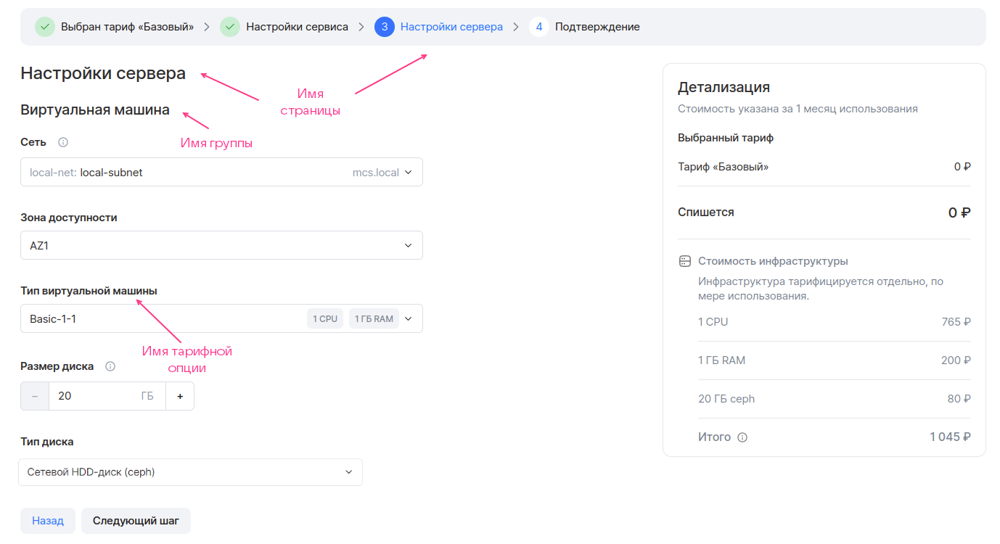
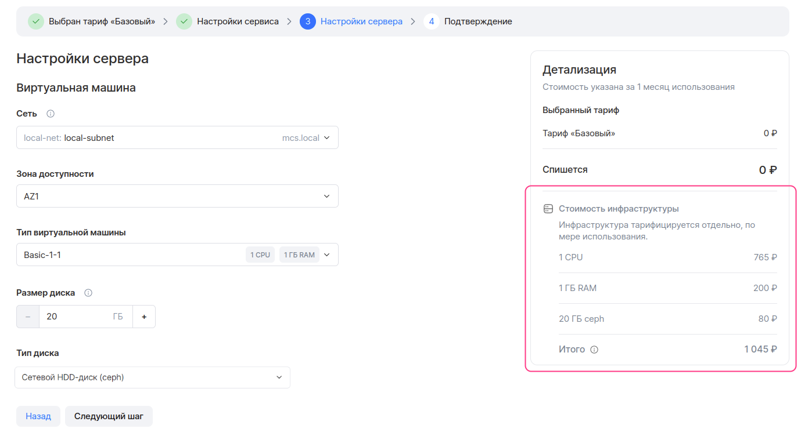

# {appendix-heading(Файл display.yaml)[id=xaas_vendor_ib_display; position=prefix]}

Чтобы описать {linkto(../../../../xaas_instructions/xaas_vendor_index#xaas_wizard)[text=%text]}, в файле `plans/<PLAN_NAME>/display.yaml` задайте параметры, приведённые в {linkto(#tab_plans)[text=таблице %number]}.

{caption(Таблица {counter(table)[id=numb_tab_plans]} — Параметры файла plans/<PLAN_NAME>/plan.yaml)[align=right;position=above;id=tab_plans;number={const(numb_tab_plans)}]}
[cols="2,5,2,2", options="header"]
|===
|Имя
|Описание
|Формат
|Обязательный

|pages
|Описывает все страницы мастера конфигурации тарифного плана, кроме первой и последней.

Если параметр не указан, мастер конфигурации будет состоять только из автоматически формируемых страниц
|Массив (подробнее — в подразделе {linkto(#IBdisplay_pages)[text=%text]})
| 

|entities
|Описывает элементы инфраструктуры {var(sys2)}, чтобы в мастере конфигурации тарифного плана отображался расчёт их стоимости:

* ВМ.
* Балансировщики нагрузки.
* Внешние IP-адреса.

Стоимость рассчитывается автоматически в соответствии с тарифами {var(sys2)}
|Массив (подробнее — в подразделе {linkto(#IBdisplay_entities)[text=%text]})
|Да, если для инфраструктуры сервиса используются тарифные опции типа `datasource` для типа ВМ или диска
|===
{/caption}

## {appendix-heading(Массив pages)[id=IBdisplay_pages; position=prefix]}

Чтобы описать страницы мастера конфигурации тарифного плана ({linkto(#pic_xaas_wizard_ib_page)[text=рисунок %number]}):

1. В файле `plans/<PLAN_NAME>/display.yaml` укажите массив `pages`.
1. В `pages` задайте:

   * Параметр `name` — имя страницы. Не должно превышать 32 символа.
   * Массив `groups`.

1. В `groups` опишите группы тарифных опций для конкретной страницы мастера конфигурации тарифного плана. Для каждой группы задайте:

   * Параметр `name` — имя группы тарифных опций. Не должно превышать 255 символов.
   * Массив `parameters` — тарифные опции, входящие в группу.

1. В `parameters` для каждой тарифной опции задайте параметр `name` — имя её YAML-файла.

   В интерфейсе Marketplace тарифные опции будут отображаться с именами, заданными в секции `schema` в их YAML-файлах.

1. Опишите последующие страницы мастера конфигурации тарифного плана таким же образом. Максимальное количество страниц — 5.

{caption(Рисунок {counter(pic)[id=numb_pic_xaas_wizard_ib_page]} — Мастер конфигурации тарифного плана)[align=center;position=under;id=pic_xaas_wizard_ib_page;number={const(numb_pic_xaas_wizard_ib_page)}]}

{/caption}

{caption(Пример описания страницы **Настройки сервиса** мастера конфигурации тарифного плана)[align=left;position=above]}
```yaml
pages:
- groups:
  - name: Сервер # Имя группы тарифных опций
    parameters:
    - name: network # Имя YAML-файла тарифной опции
    - name: vm
    - name: az

  - name: Системный диск
    parameters:
    - name: volume_size
    - name: volume_type
  name: Настройки сервиса # Имя страницы
```
{/caption}

<warn>

Все тарифные опции плана должны быть указаны в файле `plans/<PLAN_NAME>/display.yaml`.

</warn>

## {appendix-heading(Массив entities)[id=IBdisplay_entities; position=prefix]}

Чтобы в мастере конфигурации тарифного плана рассчитывалась стоимость ВМ ({linkto(#pic_xaas_wizard_ib_price)[text=рисунок %number]}):

1. В файле `plans/<PLAN_NAME>/display.yaml` укажите массив `entities`.
1. В `entities` задайте параметры:

   * `entity` — тип элемента инфраструктуры. Укажите `vm`.
   * `description` — описание ВМ (опционально).
   * `count.const` или `count.param` — количество ВМ.

      Чтобы задать константу, укажите параметр `count.const` и его значение.

      Чтобы количество ВМ определялось значением тарифной опции, укажите параметр `count.param` и имя соответствующего YAML-файла.
   
   * `flavor.const` или `flavor.param` — тип ВМ.

      Чтобы задать константу, укажите параметр `flavor.const` и ID типа ВМ.

      Чтобы тип ВМ определялся значением тарифной опции, укажите параметр `flavor.param` и имя YAML-файла, описывающего тип ВМ (`datasource.type` = `flavor`).

1. Опишите диски ВМ с помощью массива `disks` (опционально, если в конфигурации инфраструктуры нет тарифной опции типа `datasource.type` = `volume_type`).

   1. Для каждого диска задайте параметры:

      * `type.const` или `type.param` — тип диска.

         Чтобы тип диска определялся значением тарифной опции, укажите параметр `type.param` и имя YAML-файла тарифной опции, описывающего тип диска (`datasource.type` = `volume_type`).

         Чтобы задать константу, задайте параметр `type.const` и одно из значений:

         * `ceph` — диск типа HDD.
         * `high-iops` — диск типа High-IOPS SSD (SSD с повышенной производительностью).

            Доступные типы дисков зависят от конкретной инсталляции {var(sys2)}.

      * `size.const` или `size.param` — размер диска.

         Чтобы задать константу, задайте параметр `size.const` и его значение.

         Чтобы размер диска определялся значением тарифной опции, укажите параметр `size.param` и имя соответствующего YAML-файла тарифной опции.

{caption(Рисунок {counter(pic)[id=numb_pic_xaas_wizard_ib_price]} — Мастер конфигурации тарифного плана. Информация о стоимости инфраструктуры)[align=center;position=under;id=pic_xaas_wizard_ib_price;number={const(numb_pic_xaas_wizard_ib_price)}]}

{/caption}

{caption(Пример описания ВМ для мастера конфигурации тарифного плана)[align=left;position=above]}
```yaml
entities:
  - entity: vm
    description: Виртуальная машина
    count:
      const: 1
    flavor:
      param: ds-flavor # Имя YAML-файла тарифной опции
    disks:
      - type:
          param: root_type
        size:
          param: root_size
      - type:
          param: data_type
        size:
          param: data_size
```
{/caption}

<warn>

Если в конфигурации инфраструктуры сервиса используется тарифная опция типа `datasource`, описывающая тип диска, при описании ВМ массив `disks` обязательно должен быть заполнен.

</warn>

Чтобы в мастере конфигурации тарифного плана рассчитывалась стоимость балансировщика нагрузки:

1. В файле `plans/<PLAN_NAME>/display.yaml` укажите массив `entities`.
1. В `entities` задайте параметры:

   * `entity` — тип элемента инфраструктуры. Укажите `load_balancing`.
   * `count.const` или `count.param` — количество балансировщиков нагрузки.

      Чтобы задать константу, задайте параметр `count.const` и его значение.

      Чтобы количество балансировщиков нагрузки определялось значением тарифной опции, укажите параметр `count.param` и имя соответствующего YAML-файла.

{caption(Пример описания балансировщика нагрузки для мастера конфигурации тарифного плана)[align=left;position=above]}
```yaml
entities:
  - entity: load_balancing
    count:
      param: number_balancing # Имя YAML-файла тарифной опции
```
{/caption}

Чтобы в мастере конфигурации тарифного плана рассчитывалась стоимость внешнего IP-адреса:

1. В файле `plans/<PLAN_NAME>/display.yaml` укажите массив `entities`.
1. В `entities` задайте параметры:

   * `entity` — тип элемента инфраструктуры. Укажите `floating_ip`.
   * `count.const` или `count.param` — количество внешних IP-адресов.

      Чтобы задать константу, задайте параметр `count.const` и его значение.

      Чтобы количество внешних IP-адресов определялось значением тарифной опции, укажите параметр `count.param` и имя соответствующего YAML-файла.

{caption(Пример описания внешнего IP-адреса для мастера конфигурации тарифного плана)[align=left;position=above]}
```yaml
entities:
  - entity: floating_ip
    count:
      const: 1
```
{/caption}