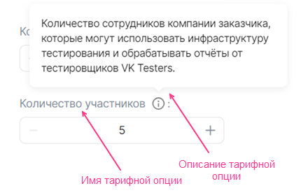
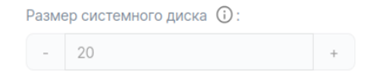
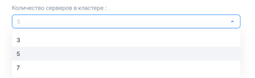
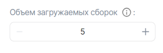
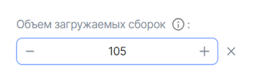
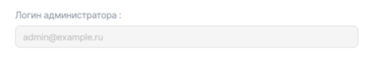
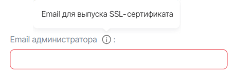
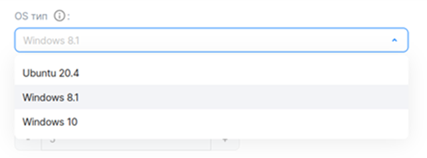
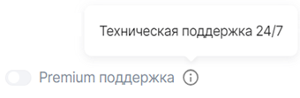

# {appendix-heading(YAML-файл тарифной опции)[id=xaas_vendor_iboption; position=prefix]}

## {appendix-heading(Структура)[id=xaas_vendor_iboption_structure; position=prefix]}

Тарифная опция описывается параметрами и секциями, приведенными в {linkto(#tab_top_level_options)[text=таблице %number]}.

{caption(Таблица {counter(table)[id=numb_tab_top_level_options]} — Параметры и секции для описания тарифной опции)[align=right;position=above;id=tab_top_level_options;number={const(numb_tab_top_level_options)}]}
[cols="2,5,2", options="header"]
|===
|Имя
|Описание
|Обязательный

|actions
|Параметр, определяющий действия, при которых тарифная опция будет активна. Возможные значения параметра:

* `create` — опция активна при подключении сервиса.
* `update` — опция активна при обновлении тарифного плана сервиса.

Если действие указано, тарифная опция будет отображаться пользователю в активном виде.

Если действие не указано — в неактивном виде. В неактивном виде пользователь не сможет изменить значение тарифной опции
| 

|schema
|Секция определяет:

* Тип тарифной опции.
* Имя и описание тарифной опции ({linkto(#pic_xaas_option_shema)[text=рисунок %number]}).
* Настройки значения тарифной опции.

Параметры секции приведены в подразделе {linkto(#xaas_vendor_iboption_schema)[text=%text]}
| 

|billing
|Секция определяет:

* Стоимость тарифной опции.
* Пользовательский шаг изменения для тарифной опции типа `integer`.

Параметры секции приведены в подразделе {linkto(#xaas_vendor_iboption_billing)[text=%text]}
| 
|===
{/caption}

{caption(Рисунок {counter(pic)[id=numb_pic_xaas_option_shema]} — Тарифная опция)[align=center;position=under;id=pic_xaas_option_shema;number={const(numb_pic_xaas_option_shema)}]}
{params[width=50%;printWidth=50%]}
{/caption}

Примеры описания разных типов тарифных опций приведены в подразделе {linkto(../../../../xaas_instructions/xaas_vendor_ibservice_add/xaas_vendor_ibservice_configure/xaas_vendor_iboption_fill_in#xaas_vendor_iboption_fill_in)[text=%text]}.

## {appendix-heading(Секция schema)[id=xaas_vendor_iboption_schema; position=prefix]}

### {appendix-heading(Секция schema для тарифной опции типа integer)[id=IBoption_schema_integer; position=prefix]}

Подтипы тарифной опции `integer`:

* Константа ({linkto(#pic_xaas_option_int_const)[text=рисунок %number]}).

  {caption(Рисунок {counter(pic)[id=numb_pic_xaas_option_int_const]} — Тарифная опция-константа типа integer)[align=center;position=under;id=pic_xaas_option_int_const;number={const(numb_pic_xaas_option_int_const)}]}
  {params[width=50%;printWidth=50%]}
  {/caption}

* С выбором значения из списка ({linkto(#pic_xaas_option_int_enum)[text=рисунок %number]}).

  {caption(Рисунок {counter(pic)[id=numb_pic_xaas_option_int_enum]} — Тарифная опция типа integer c выбором значения из списка)[align=center;position=under;id=pic_xaas_option_int_enum;number={const(numb_pic_xaas_option_int_enum)}]}
  {params[width=50%;printWidth=60%]}
  {/caption}

* С шагом изменения ({linkto(#pic_xaas_option_int_with_step)[text=рисунок %number]} и {linkto(#pic_xaas_option_int_with_step1)[text=рисунок %number]}).

  По умолчанию шаг изменения опции равен `1`. Изменить размер шага, сделать его платным можно в секции {linkto(#xaas_vendor_iboption_billing)[text=billing]}.

  {caption(Рисунок {counter(pic)[id=numb_pic_xaas_option_int_with_step]} — Тарифная опция типа integer с шагом изменения)[align=center;position=under;id=pic_xaas_option_int_with_step;number={const(numb_pic_xaas_option_int_with_step)}]}
  {params[width=50%;printWidth=40%]}
  {/caption}

  {caption(Рисунок {counter(pic)[id=numb_pic_xaas_option_int_with_step1]} — Тарифная опция типа integer с шагом изменения, значение увеличено на шаг изменения)[align=center;position=under;id=pic_xaas_option_int_with_step1;number={const(numb_pic_xaas_option_int_with_step1)}]}
  {params[width=50%;printWidth=50%]}
  {/caption}

Параметры для тарифной опции типа `integer` приведены в {linkto(#tab_schema_integer)[text=таблице %number]}.

{caption(Таблица {counter(table)[id=numb_tab_schema_integer]} — Секция schema для тарифной опции типа integer)[align=right;position=above;id=tab_schema_integer;number={const(numb_tab_schema_integer)}]}
[cols="2,5,2,2", options="header"]
|===
|Имя
|Описание
|Формат
|Обязательный

4+|**Основные параметры тарифной опции, одинаковые для всех подтипов**

|description
|Имя тарифной опции
|string, до 255 символов
| 

|hint
|Подсказка с описанием тарифной опции
|string, до 255 символов
| 

|type
|Определяет тип тарифной опции. Укажите значение `integer`
| 
| 

4+|**Параметры, чтобы настроить подтип тарифной опции**

4+|**Параметр для опции-константы**

|const
|Определяет значение тарифной опции-константы
|integer
| 

4+|**Параметры для опции с выбором значения**

|enum
|Определяет список значений, среди которых пользователь сможет выбрать одно
|Список, внутри списка — integer
| 

|default
|Определяет значение тарифной опции по умолчанию
|integer
| 

4+|**Параметры для опции c шагом изменения 1**

|default
|Определяет значение тарифной опции по умолчанию.

Если параметр не задан, значение по умолчанию равно `0`

|integer, >= `0` или `minimum`, <= `maximum`
| 

|minimum
|Определяет минимальное значение тарифной опции
|integer, >= `0` и <= `maximum`
| 

|maximum
|Определяет максимальное значение тарифной опции
|integer, > `0` и >= `minimum`
| 

|tag
|Тег. Позволяет связать несколько опций между собой.

Используется, чтобы описать диск (подробнее — в подразделе {linkto(../../../../xaas_instructions/xaas_vendor_ibservice_add/xaas_vendor_ibservice_configure/xaas_vendor_iboption_fill_in#xaas_iboption_fill_in_volume)[text=%text]})

|string
| 

4+|**Параметры для опции c пользовательским шагом изменения. Шаг изменения настраивается в секции {linkto(#xaas_vendor_iboption_billing)[text=billing]}**

|default
|Определяет значение тарифной опции по умолчанию, рассчитанное относительно стандартного значения (стандартное значение задается в параметре `billing.base`):

* Если задано значение `0`, значение по умолчанию тарифной опции равно стандартному значению (задано в параметре `billing.base`).
* Если задано значение `n` > `0`, значение по умолчанию тарифной опции складывается из стандартного значения и шага изменения, кратного `n`:
  
   `billing.base` + `n` x `billing.unit.size`
  
|integer, >= `0` или `minimum`, <= `maximum`
| 

|minimum
|Определяет минимальное значение тарифной опции, рассчитанное относительно стандартного значения (стандартное значение задается в параметре `billing.base`) :

* Если задано значение `0`, минимальное значение тарифной опции равно стандартному значению.
* Если задано значение `n` > `0`, минимальное значение тарифной опции складывается из стандартного значения и шага изменения, кратного `n`:

  `billing.base` + `n` x `billing.unit.size`

|integer, >= `0` и <= `maximum`
| 

|maximum
|Определяет максимальное значение тарифной опции, рассчитанное относительно стандартного значения (стандартное значение задается в параметре `billing.base`):

* Если задано значение `0`, максимальное значение тарифной опции равно стандартному значению.
* Если задано значение `n` > `0`, максимальное значение тарифной опции складывается из стандартного значения и шага изменения, кратного `n`:

   `billing.base` + `n` x `billing.unit.size`

|integer, > `0` и >= `minimum`
| 
|===
{/caption}

### {appendix-heading(Секция schema для тарифной опции типа string)[id=IBoption_schema_string; position=prefix]}

Подтипы тарифной опции `string`:

* Константа ({linkto(#pic_xaas_option_string_const)[text=рисунок %number]}).

  {caption(Рисунок {counter(pic)[id=numb_pic_xaas_option_string_const]} — Тарифная опция-константа типа string)[align=center;position=under;id=pic_xaas_option_string_const;number={const(numb_pic_xaas_option_string_const)}]}
  {params[width=50%;printWidth=60%]}
  {/caption}

* С вводом значения ({linkto(#pic_xaas_option_string_input)[text=рисунок %number]}).

  {caption(Рисунок {counter(pic)[id=numb_pic_xaas_option_string_input]} — Тарифная опция типа string c вводом значения)[align=center;position=under;id=pic_xaas_option_string_input;number={const(numb_pic_xaas_option_string_input)}]}
  {params[width=50%;printWidth=50%]}
  {/caption}

* С выбором значения из списка ({linkto(#pic_xaas_option_string_enum)[text=рисунок %number]}).

  {caption(Рисунок {counter(pic)[id=numb_pic_xaas_option_string_enum]} — Тарифная опция типа string c выбором значения из списка)[align=center;position=under;id=pic_xaas_option_string_enum;number={const(numb_pic_xaas_option_string_enum)}]}
  {params[width=50%;printWidth=60%]}
  {/caption}

Параметры для тарифной опции типа `string` приведены в {linkto(#tab_schema_string)[text=таблице %number]}.

{caption(Таблица {counter(table)[id=numb_tab_schema_string]} — Секция schema для тарифной опции типа string)[align=right;position=above;id=tab_schema_string;number={const(numb_tab_schema_string)}]}
[cols="2,5,2,2", options="header"]
|===
|Имя
|Описание
|Формат
|Обязательный

4+|**Основные параметры тарифной опции, одинаковые для всех подтипов**

|description
|Имя тарифной опции
|string, до 255 символов
| 

|hint
|Подсказка с описанием тарифной опции
|string, до 255 символов
| 

|type
|Определяет тип тарифной опции. Укажите значение `string`
| 
| 

4+|**Параметры, чтобы настроить подтип тарифной опции**

4+|**Параметр для опции-константы**

|const
|Определяет значение тарифной опции-константы
|string
| 

4+|**Параметры для опции c вводом значения**

|default
|Определяет значение по умолчанию
|string
| 

|pattern
|Определяет шаблон, которому должно соответствовать значение тарифной опции
|regex
| 

|minLength
|Определяет минимальное количество символов для значения тарифной опции
|integer, > `0` и <= `maxLength`
| 

|maxLength
|Определяет максимальное количество символов для значения тарифной опции
|integer, > `0` и >= `minLength`
| 

4+|**Параметры для опции с выбором значения из списка**

|enum
|Определяет список значений, среди которых пользователь сможет выбрать одно
|Список, внутри списка — string
| 

|default
|Определяет значение по умолчанию
|string
| 
|===
{/caption}

### {appendix-heading(Секция schema для тарифной опции типа boolean)[id=IBoption_schema_boolean; position=prefix]}

Подтип тарифной опции `boolean`:

* Константа ({linkto(#pic_xaas_option_bool_const)[text=рисунок %number]}).

  {caption(Рисунок {counter(pic)[id=numb_pic_xaas_option_bool_const]} — Тарифная опция-константа типа boolean)[align=center;position=under;id=pic_xaas_option_bool_const;number={const(numb_pic_xaas_option_bool_const)}]}
  {params[width=50%;printWidth=40%]}
  {/caption}

* Переключатель ({linkto(#pic_xaas_option_bool)[text=рисунок %number]}).

  {caption(Рисунок {counter(pic)[id=numb_pic_xaas_option_bool]} — Переключатель boolean)[align=center;position=under;id=pic_xaas_option_bool;number={const(numb_pic_xaas_option_bool)}]}
  {params[width=50%;printWidth=60%]}
  {/caption}

Параметры для тарифной опции типа `boolean` приведены в {linkto(#tab_schema_boolean)[text=таблице %number]}.

{caption(Таблица {counter(table)[id=numb_tab_schema_boolean]} — Секция schema для тарифной опции типа boolean)[align=right;position=above;id=tab_schema_boolean;number={const(numb_tab_schema_boolean)}]}
[cols="2,5,2,2", options="header"]
|===
|Имя
|Описание
|Формат
|Обязательный

4+|**Основные параметры тарифной опции, одинаковые для всех подтипов**

|description
|Имя тарифной опции
|string, до 255 символов
| 

|hint
|Подсказка с описанием тарифной опции
|string, до 255 символов
| 

|type
|Определяет тип тарифной опции. Укажите значение `boolean`
| 
| 

4+|**Параметры, чтобы настроить подтип тарифной опции**

4+|**Параметр для опции-константы**

|const
|Определяет значение тарифной опции-константы
|boolean
| 

4+|**Параметр для опции-переключателя**

|default
|Определяет значение тарифной опции по умолчанию.

<warn>

Если для переключателя `boolean` не задан параметр `default`, значение по умолчанию будет равно `false`.

</warn>
|boolean
| 
|===
{/caption}

### {appendix-heading(Секция schema для тарифной опции типа datasource)[id=IBoption_schema_datasorce; position=prefix]}

Параметры для тарифной опции типа `datasource` приведены в {linkto(#tab_schema_datasource)[text=таблице %number]}.

{caption(Таблица {counter(table)[id=numb_tab_schema_datasource]} — Секция schema для тарифной опции типа datasource)[align=right;position=above;id=tab_schema_datasource;number={const(numb_tab_schema_datasource)}]}
[cols="2,5,2,2", options="header"]
|===
|Имя
|Описание
|Формат
|Обязательный

|description
|Имя тарифной опции
|string, до 255 символов
| 

|hint
|Подсказка с описанием тарифной опции
|string, до 255 символов
| 

|type
|Совместно с секцией `datasource` определяет тарифную опцию как опцию, связанную с сущностями {var(sys2)}.

Укажите значение `string`
| 
| 

|default
|Определяет значение по умолчанию.

Может быть задан только для типа `datasource` — `volume_type`.

Возможные значения для `volume_type`:

* `ceph` — диск типа HDD.
* `high-iops` — диск типа High-IOPS SSD (SSD с повышенной производительностью).

  Доступные типы дисков зависят от конкретной инсталляции {var(sys2)}

| 
| 

|tag
|Тег. Позволяет связать несколько опций между собой.

Используется, чтобы описать диск (подробнее — в подразделе {linkto(../../../../xaas_instructions/xaas_vendor_ibservice_add/xaas_vendor_ibservice_configure/xaas_vendor_iboption_fill_in#xaas_iboption_fill_in_volume)[text=%text]})
|string
| 

|datasource
|Секция, которая совместно с параметром `type` определяет тарифную опцию как опцию, связанную с сущностями {var(sys2)}.

Секция описывает конкретный тип сущности {var(sys2)}
| 
| 

4+|**Параметры секции `datasource`**

|datasource.type
|Параметр, определяющий тип сущности {var(sys2)}.

Возможные значения:

* `flavor` — типы ВМ, доступные в проекте пользователя {var(sys2)}.
* `az` — зоны доступности {var(sys2)}.
* `subnet` — виртуальные сети, доступные в проекте {var(sys2)}.
* `volume_type` — тип диска.

Пользователю будет отображаться список значений, соответствующий указанному типу с учетом фильтров (фильтры задаются в секции `datasource.filter`). Среди этих значений пользователю нужно будет выбрать одно
| 
| 

|datasource.filter
|Секция может быть задана только для типов `datasource`:

* `flavor`.
* `volume_type`.

Определяет фильтры для типа ВМ или диска
| 
| 

4+|**Фильтры для типа ВМ `datasource.filter`**

|datasource.filter.vcpus
|Определяет фильтры для CPU ВМ
|Приведен в {linkto(#tab_CPU_RAM)[text=таблице %number]}
| 

|datasource.filter.ram
|Определяет фильтры для RAM ВМ
|Приведен в {linkto(#tab_CPU_RAM)[text=таблице %number]}
| 

4+|**Фильтры для типа диска `datasource.filter`**

|datasource.filter.name.enum
|Определяет фильтры по имени диска.

Возможные значения:

* `ceph` — диск типа HDD.
* `high-iops` — диск типа High-IOPS SSD (SSD с повышенной производительностью)

Доступные типы дисков зависят от конкретной инсталляции {var(sys2)}. При необходимости уточните имена дисков у администратора {var(sys2)}
|Список
| 
|===
{/caption}

Ограничения по CPU и RAM для ВМ задаются с помощью параметров, приведенных в {linkto(#tab_CPU_RAM)[text=таблице %number]}.

{caption(Таблица {counter(table)[id=numb_tab_CPU_RAM]} — Ограничения по CPU и RAM для ВМ)[align=right;position=above;id=tab_CPU_RAM;number={const(numb_tab_CPU_RAM)}]}
[cols="2,5,2,2", options="header"]
|===
|Имя
|Описание
|Формат
|Обязательный

|minimum
|Определяет минимальное значение для CPU или RAM — в зависимости от того, в какой секции этот параметр задан.

Для RAM значение указывается в МБ
|integer, > `0` и <=  `maximum`
| 

|maximum
|Определяет максимальное значение для CPU или RAM — в зависимости от того, в какой секции этот параметр задан
|integer, > `0` и >= `minimum`
| 
|===
{/caption}

## {appendix-heading(Секция billing)[id=xaas_vendor_iboption_billing; position=prefix]}

Платными тарифными опциями могут быть опции следующих типов:

* Числовой (`integer` с шагом изменения).
* Логический (`boolean`).

<warn>

Для платных тарифных опций поддерживается только предоплатный способ списания денежных средств (подробнее — в подразделе {linkto(../../../../xaas_instructions/xaas_vendor_index#xaas_billing)[text=%text]}).

</warn>

В зависимости от типа тарифной опции в секции `billing` задайте параметры и дочерние секции, приведенные в {linkto(#tab_billing_integer)[text=таблице %number]}, {linkto(#tab_billing_boolean)[text=таблице %number]}.

{caption(Таблица {counter(table)[id=numb_tab_billing_integer]} — Параметры секции billing для опции типа integer с шагом изменения)[align=right;position=above;id=tab_billing_integer;number={const(numb_tab_billing_integer)}]}
[cols="2,5,2,2", options="header"]
|===
|Имя
|Описание
|Формат
|Обязательный

|base
|Определяет стандартное значение тарифной опции, входящее в стоимость тарифного плана.

Стандартное значение — это минимальное значение, которое может задать пользователь.

Если параметр не задан, стандартное значение тарифной опции автоматически будет равно `0`

|integer
| 

|cost
|Определяет стоимость шага, на который можно изменить значение тарифной опции.

Если изменение опции бесплатно, укажите значение `0`. Параметры шага определяются в секции `unit`

|float64, >= `0`
| 

|unit
|Определяет параметры шага изменения опции
| 
| 

4+|**Параметры секции `unit`**

|unit.size
|Определяет размер шага, на который можно изменить значение тарифной опции.

Значение, указанное в этом параметре, тарифицируется в соответствии со стоимостью, заданной в параметре `billig.cost`
|integer, > `0`
| 

|unit.measurement
|Определяет единицы измерения шага, заданного в параметре `unit.size`
|string, до 255 символов
| 
|===
{/caption}

{caption(Таблица {counter(table)[id=numb_tab_billing_boolean]} — Параметры секции billing для опции-переключателя boolean)[align=right;position=above;id=tab_billing_boolean;number={const(numb_tab_billing_boolean)}]}
[cols="2,5,2,2", options="header"]
|===
|Имя
|Описание
|Формат
|Обязательный

|cost
|Определяет стоимость опции
|float64, >= `0`
| 
|===
{/caption}