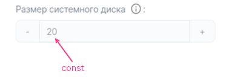
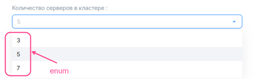
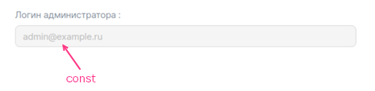
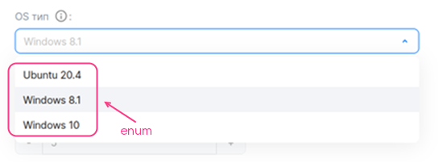
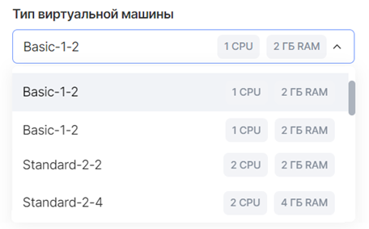
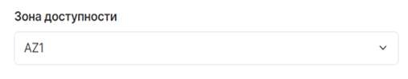
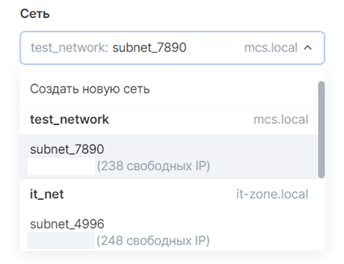
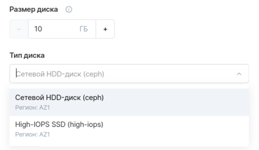

# {appendix-heading(Заполнение YAML-файлов тарифных опций)[id=xaas_vendor_iboption_fill_in; position=prefix]}

В файлах `parameters/<OPTION_NAME>.yaml` опишите все тарифные опции (подробнее — в подразделе {linkto(../../../../xaas_instructions/xaas_vendor_index#xaas_option_types)[text=%text]}), которые будут использоваться хотя бы в одном тарифном плане.

Каждый отдельный YAML-файл соответствует одной тарифной опции. В нем описываются настройки тарифной опции, а для платных опций — стоимость.

Подробное описание параметров, используемых для описания тарифных опций, приведено в подразделе {linkto(../../../../xaas_instructions/xaas_vendor_ibservice_add/xaas_vendor_ibservice_configure/xaas_vendor_iboption#xaas_vendor_iboption)[text=%text]}.

## {appendix-heading(Заполнение файла для тарифной опции-константы типа integer)[id=xaas_vendor_filling_out_file_integer; position=prefix]}

Заполните файл `parameters/<OPTION_NAME>.yaml`:

1. Задайте параметр `actions`.
1. В секции `schema` задайте параметры:

   * `description` — имя тарифной опции.
   * `hint` — описание тарифной опции (опционально).
   * `type` — тип тарифной опции. Укажите `integer`.
   * `const` — значение тарифной опции.

{caption(Пример описания опции-константы типа `integer`, формат `YAML`)[align=left;position=above]}
```yaml
actions:
- create
- update

schema:
  description: Размер системного диска
  hint: В ГБ
  type: integer
  const: 20
```
{/caption}

На {linkto(#pic_xaas_option_int_const_example)[text=рисунке %number]} приведено, как вышеописанная опция будет отображаться в мастере конфигурации тарифного плана.

{caption(Рисунок {counter(pic)[id=numb_pic_xaas_option_int_const_example]} — Тарифная опция-константа типа integer)[align=center;position=under;id=pic_xaas_option_int_const_example;number={const(numb_pic_xaas_option_int_const_example)}]}
{params[width=50%;printWidth=50%]}
{/caption}

## {appendix-heading(Заполнение файла для тарифной опции типа integer с выбором значения из списка)[id=xaas_vendor_filling_out_file_integer_list; position=prefix]}

Заполните файл `parameters/<OPTION_NAME>.yaml`:

1. Задайте параметр `actions`.
1. В секции `schema` задайте параметры:

   * `description` — имя тарифной опции.
   * `hint` — описание тарифной опции (опционально).
   * `type` — тип тарифной опции. Укажите `integer`.
   * `enum` — возможные значения тарифной опции.
   * `default` — значение по умолчанию.

{caption(Пример описания опции типа integer с выбором значения из списка, формат YAML)[align=left;position=above]}
```yaml
actions:
- create
- update

schema:
  description: Количество серверов в кластере
  type: integer
  enum: [3, 5, 7]
  default: 5
```
{/caption}

На {linkto(#pic_xaas_option_int_enum_example)[text=рисунке %number]} приведено, как вышеописанная опция будет отображаться в мастере конфигурации тарифного плана.

{caption(Рисунок {counter(pic)[id=numb_pic_xaas_option_int_enum_example]} — Тарифная опция типа integer c выбором значения из списка)[align=center;position=under;id=pic_xaas_option_int_enum_example;number={const(numb_pic_xaas_option_int_enum_example)}]}
{params[width=50%;printWidth=50%]}
{/caption}

## {appendix-heading(Заполнение файла для тарифной опции типа integer с шагом изменения)[id=xaas_vendor_filling_out_file_integer_step_set; position=prefix]}

### {appendix-heading(Бесплатная тарифная опция с шагом изменения 1)[id=xaas_vendor_filling_out_file_integer_step_set_1; position=prefix]}

Заполните файл `parameters/<OPTION_NAME>.yaml`:

1. Задайте параметр `actions`.
1. В секции `schema` задайте параметры:

   * `description` — имя тарифной опции.
   * `hint` — описание тарифной опции (опционально).
   * `type` — тип тарифной опции. Укажите `integer`.
   * `default` — значение по умолчанию (опционально).

      Если параметр не задан, значение по умолчанию будет равно `0`.
   * `minimum` и `maximum` — максимальное и минимальное значения тарифной опции (опционально).

{caption(Пример описания бесплатной опции типа integer с шагом изменения 1, формат YAML)[align=left;position=above]}
```yaml
actions:
- create
- update

schema:
  description: Количество участников
  hint: Количество сотрудников компании заказчика, которые могут использовать инфраструктуру тестирования и обрабатывать отчеты от тестировщиков VK Testers.
  type: integer
  default: 20
  minimum: 20
```
{/caption}

На {linkto(#pic_xaas_option_int_with_step_standart)[text=рисунке %number]} и {linkto(#pic_xaas_option_int_with_step_standart1)[text=рисунке %number]} приведено, как вышеописанная опция будет отображаться в мастере конфигурации тарифного плана.

{caption(Рисунок {counter(pic)[id=numb_pic_xaas_option_int_with_step_standart]} — Бесплатная тарифная опция типа integer с шагом изменения 1)[align=center;position=under;id=pic_xaas_option_int_with_step_standart;number={const(numb_pic_xaas_option_int_with_step_standart)}]}
{params[printWidth=100%]}
{/caption}

{caption(Рисунок {counter(pic)[id=numb_pic_xaas_option_int_with_step_standart1]} — Бесплатная тарифная опция типа integer с шагом изменения 1, значение увеличено на 1 шаг)[align=center;position=under;id=pic_xaas_option_int_with_step_standart1;number={const(numb_pic_xaas_option_int_with_step_standart1)}]}
{params[printWidth=100%]}
{/caption}

### {appendix-heading(Бесплатная тарифная опция с пользовательским шагом изменения)[id=int_step_free; position=prefix]}

Заполните файл `parameters/<OPTION_NAME>.yaml`:

1. Задайте параметр `actions`.
1. В секции `billing` задайте параметры:

   * `base` — стандартное значение.
   * `cost` — стоимость шага изменения. Укажите `0`.
   * `unit.size` — размер шага изменения.
   * `unit.measurement` — единицы измерения тарифной опции (опционально).

   {caption(Пример заполнения секции billing)[align=left;position=above]}
   ```yaml
   billing:
     base: 25
     cost: 0
     unit:
        size: 100
   ```
   {/caption}
1. В секции `schema` задайте параметры:

   * `description` — имя тарифной опции.
   * `hint` — описание тарифной опции (опционально).
   * `type` — тип тарифной опции. Укажите `integer`.
   * `default` — значение по умолчанию (опционально). Задается относительно стандартного значения опции:

      * Не указывайте параметр `default` или укажите `0`, чтобы значение по умолчанию было равно стандартному значению (рисунок 5).

         {caption(Рисунок {counter(pic)[id=numb_pic_needs_id]} — Бесплатная тарифная опция типа integer с пользовательским шагом изменения (billing.base = 25, schema.default = 0, billing.unit.size = 100))[align=center;position=under;id=pic_needs_id;number={const(numb_pic_needs_id)} ]}
         
         {/caption}
      * Укажите `n`, чтобы значение по умолчанию рассчитывалось по формуле на основе стандартного значения и значения `n` (рисунки 6, 7):

         ```console
         billing.base + n * billing.unit.size
         ```

         {caption(Рисунок {counter(pic)[id=numb_pic_needs_id]} — Бесплатная тарифная опция типа integer с пользовательским шагом изменения (billing.base = 25, schema.default = 1, billing.unit.size = 100))[align=center;position=under;id=pic_needs_id;number={const(numb_pic_needs_id)} ]}
         
         {/caption}

         {caption(Рисунок {counter(pic)[id=numb_pic_needs_id]} — Бесплатная тарифная опция типа integer с пользовательским шагом изменения (billing.base = 25, schema.default = 2, billing.unit.size = 100))[align=center;position=under;id=pic_needs_id;number={const(numb_pic_needs_id)} ]}
         
         {/caption}

   * `minimum` и `maximum` — максимальное и минимальное значения тарифной опции (опционально). Задается так же, как это было сделано для значения по умолчанию.

{caption(Пример описания бесплатной опции типа integer с пользовательским шагом изменения, формат YAML)[align=left;position=above]}
```yaml
actions:
- create
- update

billing:
  base: 25
  cost: 0
  unit:
     size: 100

schema:
  description: Объем загружаемых сборок
  hint: На платформу можно загружать тестовые сборки приложений для раздачи сотрудникам заказчика и тестировщикам VK Testers. Чем больше хранилище, тем больше версий ваших продуктов можно сохранять на платформе тестирования. Поддерживаемые платформы: iOS, Android, Windows, macOS, Linux.
  type: integer
  default: 0
```
{/caption}

<info>

Подробное описание параметров секций `billing` и `schema` приведено в подразделах {linkto(../../../../xaas_instructions/xaas_vendor_ibservice_add/xaas_vendor_ibservice_configure/xaas_vendor_iboption#xaas_vendor_iboption_billing)[text=%text]} и {linkto(../../../../xaas_instructions/xaas_vendor_ibservice_add/xaas_vendor_ibservice_configure/xaas_vendor_iboption/xaas_vendor_iboption_schema#xaas_vendor_iboption_schema)[text=%text]} соответственно.

</info>

### {appendix-heading(Платная тарифная опция)[id=xaas_vendor_paid_tariff_option; position=prefix]}

Заполните файл `parameters/<OPTION_NAME>.yaml`:

1. Задайте параметр `actions`.
1. В секции `billing` задайте параметры ({linkto(#pic_xaas_option_int_with_user_step_prepayed)[text=рисунок %number]}, {linkto(#pic_xaas_option_int_with_user_step_prepayed1)[text=рисунок %number]} и {linkto(#pic_xaas_option_int_with_user_step_prepayed2)[text=рисунок %number]}):

   * `base` — стандартное значение. Стандартное значение входит в стоимость тарифного плана.
   * `cost` — стоимость шага изменения.
   * `unit.size` — размер шага изменения.
   * `unit.measurement` — единицы измерения тарифной опции (опционально).

      {caption(Пример заполнения секции billing)[align=left;position=above]}
      ```yaml
      billing:
        base: 25
        cost: 150
        unit:
           size: 100
      ```
      {/caption}

      В примере выше каждые 100 единиц опции, дополнительные к стандартному значению, стоят 150 денежных единиц.

   {caption(Рисунок {counter(pic)[id=numb_pic_xaas_option_int_with_user_step_prepayed]} — Платная тарифная опция типа integer c шагом изменения (billing.base = 25, billing.cost = 150, billing.unit.size = 100))[align=center;position=under;id=pic_xaas_option_int_with_user_step_prepayed;number={const(numb_pic_xaas_option_int_with_user_step_prepayed)}]}
   {params[printWidth=90%]}
   {/caption}

   {caption(Рисунок {counter(pic)[id=numb_pic_xaas_option_int_with_user_step_prepayed1]} — Платная тарифная опция типа integer c шагом изменения, значение увеличено на 1 шаг (billing.base = 25, billing.cost = 150, billing.unit.size = 100))[align=center;position=under;id=pic_xaas_option_int_with_user_step_prepayed1;number={const(numb_pic_xaas_option_int_with_user_step_prepayed1)}]}
   {params[printWidth=90%]}
   {/caption}

   {caption(Рисунок {counter(pic)[id=numb_pic_xaas_option_int_with_user_step_prepayed2]} — Платная тарифная опция типа integer c шагом изменения, значение увеличено на 2 шага (billing.base = 25, billing.cost = 150, billing.unit.size = 100))[align=center;position=under;id=pic_xaas_option_int_with_user_step_prepayed2;number={const(numb_pic_xaas_option_int_with_user_step_prepayed2)}]}
   {params[printWidth=90%]}
   {/caption}

1. Заполните секцию `schema` таким же образом, как для бесплатной тарифной опции с пользовательским шагом изменения (подробнее — в подразделе {linkto(#int_step_free)[text=%text]}).

   Если для тарифной опции значение по умолчанию не равно стандартному значению (`schema.default ≠ 0`), то, когда пользователь переходит в мастер конфигурации тарифного плана, для такой тарифной опции будет отображаться ее стоимость ({linkto(#pic_xaas_option_int_with_user_step_prepayed3)[text=рисунок %number]}). Пользователь может уменьшить значение опции до стандартного, которое входит в стоимость тарифного плана.

   {caption(Рисунок {counter(pic)[id=numb_pic_xaas_option_int_with_user_step_prepayed3]} — Платная тарифная опция типа integer c шагом изменения (billing.base = 25, billing.cost = 150, billing.unit.size = 100, schema.default = 1))[align=center;position=under;id=pic_xaas_option_int_with_user_step_prepayed3;number={const(numb_pic_xaas_option_int_with_user_step_prepayed3)}]}
   {params[printWidth=90%]}
   {/caption}

<info>

Подробное описание параметров секций `billing` и `schema` приведено в подразделах {linkto(../../../../xaas_instructions/xaas_vendor_ibservice_add/xaas_vendor_ibservice_configure/xaas_vendor_iboption#xaas_vendor_iboption_billing)[text=%text]} и {linkto(../../../../xaas_instructions/xaas_vendor_ibservice_add/xaas_vendor_ibservice_configure/xaas_vendor_iboption#xaas_vendor_iboption_schema)[text=%text]} соответственно.

</info>

## {appendix-heading(Заполнение файла для тарифной опции-константы типа string)[id=xaas_vendor_file_tariff_option_string; position=prefix]}

Заполните файл `parameters/<OPTION_NAME>.yaml`:

1. Задайте параметр `actions`.
1. В секции `schema` задайте параметры:

   * `description` — имя тарифной опции.
   * `hint` — описание тарифной опции (опционально).
   * `type` — тип тарифной опции. Укажите `string`.
   * `const` — значение тарифной опции.

{caption(Пример описания опции-константы типа string, формат YAML)[align=left;position=above]}
```yaml
actions:
- create
- update

schema:
  description: Логин администратора
  type: string
  const: admin@example.ru
```
{/caption}

На {linkto(#pic_xaas_option_string_const_example)[text=рисунке %number]} приведено, как вышеописанная опция будет отображаться в мастере конфигурации тарифного плана.

{caption(Рисунок {counter(pic)[id=numb_pic_xaas_option_string_const_example]} — Тарифная опция-константа типа string)[align=center;position=under;id=pic_xaas_option_string_const_example;number={const(numb_pic_xaas_option_string_const_example)}]}
{params[width=50%;printWidth=60%]}
{/caption}

## {appendix-heading(Заполнение файла для тарифной опции типа string с вводом значения)[id=xaas_vendor_file_tariff_option_string_input; position=prefix]}

Заполните файл `parameters/<OPTION_NAME>.yaml`:

1. Задайте параметр `actions`.
1. В секции `schema` задайте параметры:

   * `description` — имя тарифной опции.
   * `hint` — описание тарифной опции (опционально).
   * `type` — тип тарифной опции. Укажите `string`.
   * `default` — значение по умолчанию.
   * Дополнительные параметры, приведенные в подразделе {linkto(../../../../xaas_instructions/xaas_vendor_ibservice_add/xaas_vendor_ibservice_configure/xaas_vendor_iboption/xaas_vendor_iboption_schema#IBoption_schema_string)[text=%text]} (опционально).

{caption(Пример описания опции типа string с вводом значения, формат YAML)[align=left;position=above]}
```yaml
actions:
- create
- update

schema:
  description: Email администратора
  hint: Email для выпуска SSL-сертификата
  type: string
```
{/caption}

На {linkto(#pic_xaas_option_string_input)[text=рисунке %number]} приведено, как вышеописанная опция будет отображаться в мастере конфигурации тарифного плана.

{caption(Рисунок {counter(pic)[id=numb_pic_xaas_option_string_input]} — Тарифная опция типа string с вводом значения)[align=center;position=under;id=pic_xaas_option_string_input;number={const(numb_pic_xaas_option_string_input)}]}
{params[width=50%;printWidth=60%]}
{/caption}

## {appendix-heading(Заполнение файла для тарифной опции типа string с выбором значения из списка)[id=xaas_vendor_file_tariff_option_string_choice; position=prefix]}

Заполните файл `parameters/<OPTION_NAME>.yaml`:

1. Задайте параметр `actions`.
1. В секции `schema` задайте параметры:

   * `description` — имя тарифной опции.
   * `hint` — описание тарифной опции (опционально).
   * `type` — тип тарифной опции. Укажите `string`.
   * `enum` — возможные значения тарифной опции.
   * `default` — значение по умолчанию.

{caption(Пример описания опции типа string с выбором значения из списка, формат YAML)[align=left;position=above]}
```yaml
actions:
- create
- update

schema:
  description: OS тип
  hint: Операционная система
  type: string
  enum: ["Ubuntu 20.4", "Windows 8.1", "Windows 10"]
  default: Windows 8.1
```
{/caption}

На {linkto(#pic_xaas_option_string_enum_example)[text=рисунке %number]} приведено, как вышеописанная опция будет отображаться в мастере конфигурации тарифного плана.

{caption(Рисунок {counter(pic)[id=numb_pic_xaas_option_string_enum_example]} — Тарифная опция типа string c выбором значения из списка)[align=center;position=under;id=pic_xaas_option_string_enum_example;number={const(numb_pic_xaas_option_string_enum_example)}]}
{params[width=50%;printWidth=50%]}
{/caption}

## {appendix-heading(Заполнение файла для тарифной опции-константы типа boolean)[id=xaas_vendor_file_tariff_option_const_boolean; position=prefix]}

Заполните файл `parameters/<OPTION_NAME>.yaml`:

1. Задайте параметр `actions`.
1. В секции `schema` задайте параметры:

   * `description` — имя тарифной опции.
   * `hint` — описание тарифной опции (опционально).
   * `type` — тип тарифной опции. Укажите `boolean`.
   * `const` — значение тарифной опции.

{caption(Пример описания опции-константы типа boolean, формат YAML)[align=left;position=above]}
```yaml
actions:
- create
- update

schema:
  description: Premium поддержка
  hint: Техническая поддержка 24/7
  type: boolean
  const: false
```
{/caption}

На {linkto(#pic_xaas_option_bool_const)[text=рисунке %number]} приведено, как вышеописанная опция будет отображаться в мастере конфигурации тарифного плана.

{caption(Рисунок {counter(pic)[id=numb_pic_xaas_option_bool_const]} — Тарифная опция-константа типа boolean (const = false))[align=center;position=under;id=pic_xaas_option_bool_const;number={const(numb_pic_xaas_option_bool_const)}]}
{params[width=50%;printWidth=40%]}
{/caption}

## {appendix-heading(Заполнение файла для тарифной опции-переключателя boolean)[id=xaas_vendor_file_tariff_option_switch_boolean; position=prefix]}

### {appendix-heading(Бесплатная)[id=xaas_vendor_file_tariff_option_switch_boolean_free; position=prefix]}

Заполните файл `parameters/<OPTION_NAME>.yaml`:

1. Задайте параметр `actions`.
1. В секции `schema` задайте параметры:

   * `description` — имя тарифной опции.
   * `hint` — описание тарифной опции (опционально).
   * `type` — тип тарифной опции. Укажите `boolean`.
   * `default` — значение по умолчанию (опционально).

      Если параметр `default` не задан, значение по умолчанию будет равно `false`.

{caption(Пример описания бесплатной опции-переключателя boolean, формат YAML)[align=left;position=above]}
```yaml
actions:
- create
- update

schema:
  description: Уведомления об обновлениях
  hint: Получать ли на почту уведомления о новых версиях сервиса.
  type: boolean
  default: true
```
{/caption}

На {linkto(#pic_xaas_option_bool)[text=рисунке %number]} приведено, как вышеописанная опция будет отображаться в мастере конфигурации тарифного плана.

{caption(Рисунок {counter(pic)[id=numb_pic_xaas_option_bool]} — Тарифная опция-переключатель boolean)[align=center;position=under;id=pic_xaas_option_bool;number={const(numb_pic_xaas_option_bool)}]}
{params[width=50%;printWidth=60%]}
{/caption}

### {appendix-heading(Платная)[id=xaas_vendor_file_tariff_option_switch_boolean_paid; position=prefix]}

Заполните файл `parameters/<OPTION_NAME>.yaml`:

1. Задайте параметр `actions`.
1. В секции `schema` задайте параметры:

   * `description` — имя тарифной опции.
   * `hint` — описание тарифной опции (опционально).
   * `type` — тип тарифной опции. Укажите `boolean`.
   * `default` — значение по умолчанию (опционально).

      Если параметр `default` не задан, значение по умолчанию будет равно `false`.

1. В секции `billing` задайте параметр `cost` — стоимость опции, когда переключатель находится в активном положении.

{caption(Пример описания платной опции-переключателя boolean, формат YAML)[align=left;position=above]}
```yaml
actions:
- create
- update

schema:
  description: Уведомления о новых отчетах
  hint: Получать ли на почту уведомления о новых отчетах
  type: boolean
  default: true

billing:
  cost: 50
```
{/caption}

На {linkto(#pic_xaas_option_bool_paid)[text=рисунке %number]} приведено, как вышеописанная опция будет отображаться в мастере конфигурации тарифного плана.

{caption(Рисунок {counter(pic)[id=numb_pic_xaas_option_bool_paid]} — Платная тарифная опция-переключатель boolean)[align=center;position=under;id=pic_xaas_option_bool_paid;number={const(numb_pic_xaas_option_bool_paid)}]}
{params[printWidth=100%]}
{/caption}

## {appendix-heading(Заполнение файла для тарифной опции типа datasource (тип ВМ))[id=xaas_vendor_file_tariff_option_datasource_vm; position=prefix]}

Заполните файл `parameters/<OPTION_NAME>.yaml`:

1. Задайте параметр `actions`.
1. В секции `schema` задайте параметры:

   * `description` — имя тарифной опции.
   * `hint` — описание тарифной опции (опционально).
   * `type` — тип тарифной опции. Укажите `string`.
   * `datasource.type` — тип сущности {var(sys2)}. Укажите `flavor`.
   * `datasource.filter` — фильтры (опционально). Возможные фильтры приведены в подразделе {linkto(../../../../xaas_instructions/xaas_vendor_ibservice_add/xaas_vendor_ibservice_configure/xaas_vendor_iboption/xaas_vendor_iboption_schema#IBoption_schema_datasorce)[text=%text]}.

{caption(Пример описания опции datasource для типа ВМ, формат YAML)[align=left;position=above]}
```yaml
actions:
- create
- update

schema:
  description: Тип виртуальной машины
  type: string
  datasource:
    type: flavor
```
{/caption}

На {linkto(#pic_xaas_option_datasource_flavor)[text=рисунке %number]} приведено, как вышеописанная опция будет отображаться в мастере конфигурации тарифного плана.

{caption(Рисунок {counter(pic)[id=numb_pic_xaas_option_datasource_flavor]} — Тарифная опция datasource (тип ВМ))[align=center;position=under;id=pic_xaas_option_datasource_flavor;number={const(numb_pic_xaas_option_datasource_flavor)}]}
{params[width=50%;printWidth=50%]}
{/caption}

## {appendix-heading(Заполнение файла для тарифной опции типа datasource (зона доступности))[id=xaas_vendor_file_tariff_option_datasource_zone; position=prefix]}

Заполните файл `parameters/<OPTION_NAME>.yaml`:

1. Задайте параметр `actions`.
1. В секции `schema` задайте параметры:

   * `description` — имя тарифной опции.
   * `hint` — описание тарифной опции (опционально).
   * `type` — тип тарифной опции. Укажите `string`.
   * `datasource.type` — тип сущности {var(sys2)}. Укажите `az`.

{caption(Пример описания опции datasource для зоны доступности, формат YAML)[align=left;position=above]}
```yaml
actions:
- create
- update

schema:
  description: Зона доступности
  type: string
  datasource:
    type: az
```
{/caption}

На {linkto(#pic_xaas_option_datasource_az)[text=рисунке %number]} приведено, как вышеописанная опция будет отображаться в мастере конфигурации тарифного плана.

{caption(Рисунок {counter(pic)[id=numb_pic_xaas_option_datasource_az]} — Тарифная опция datasource (зона доступности))[align=center;position=under;id=pic_xaas_option_datasource_az;number={const(numb_pic_xaas_option_datasource_az)}]}
{params[width=50%;printWidth=60%]}
{/caption}

## {appendix-heading(Заполнение файла для тарифной опции типа datasource (виртуальная сеть))[id=xaas_vendor_file_tariff_option_datasource_network; position=prefix]}

Заполните файл `parameters/<OPTION_NAME>.yaml`:

1. Задайте параметр `actions`.
1. В секции `schema` задайте параметры:

   * `description` — имя тарифной опции.
   * `hint` — описание тарифной опции (опционально).
   * `type` — тип тарифной опции. Укажите `string`.
   * `datasource.type` — тип сущности {var(sys2)}. Укажите `subnet`.

{caption(Пример описания опции datasource для виртуальной сети, формат YAML)[align=left;position=above]}
```yaml
actions:
- create
- update

schema:
  description: Сеть
  type: string
  datasource:
    type: subnet
```
{/caption}

На {linkto(#pic_xaas_option_datasource_subnet)[text=рисунке %number]} приведено, как вышеописанная опция будет отображаться в мастере конфигурации тарифного плана.

{caption(Рисунок {counter(pic)[id=numb_pic_xaas_option_datasource_subnet]} — Тарифная опция datasource (виртуальная сеть))[align=center;position=under;id=pic_xaas_option_datasource_subnet;number={const(numb_pic_xaas_option_datasource_subnet)}]}
{params[width=50%;printWidth=50%]}
{/caption}

## {appendix-heading(Описание диска с помощью файлов тарифных опций)[id=xaas_iboption_fill_in_volume; position=prefix]}

Диск описывается двумя тарифными опциями (двумя отдельными YAML-файлами):

* Тип диска — с помощью тарифной опции типа `datasource`.
* Размер диска — с помощью тарифной опции типа `integer` с шагом изменения `1`.

Чтобы описать диск:

1. Опишите тарифную опцию типа `datasource`, получающую данные {var(sys2)} о типах дисков, в файле `parameters/<OPTION_NAME>.yaml`:

   1. Задайте параметр `actions`.
   1. В секции `schema` задайте параметры:

      * `description` — имя тарифной опции.
      * `hint` — описание тарифной опции (опционально).
      * `type` — тип тарифной опции. Укажите `string`.
      * `default` — значение по умолчанию (опционально). Возможные значения приведены в подразделе {linkto(../../../../xaas_instructions/xaas_vendor_ibservice_add/xaas_vendor_ibservice_configure/xaas_vendor_iboption/xaas_vendor_iboption_schema#IBoption_schema_datasorce)[text=%text]}.
      * `tag` — тег. Тег связывает опцию, описывающую тип диска, с опцией, описывающей размер диска.
      * `datasource.type` — тип сущности {var(sys2)}. Укажите `volume_type`.
      * `datasource.filter` — фильтры (опционально). Возможные фильтры приведены в подразделе {linkto(../../../../xaas_instructions/xaas_vendor_ibservice_add/xaas_vendor_ibservice_configure/xaas_vendor_iboption/xaas_vendor_iboption_schema#IBoption_schema_datasorce)[text=%text]}.

         Если фильтры не указаны, будут отображаться все типы дисков, поддерживаемые {var(sys5)}.

   {caption(Пример описания опции datasource для типа диска, формат YAML)[align=left;position=above]}
   ```yaml
   actions:
   - create
   - update

   schema:
     description: Тип диска
     type: string
     default: ceph
     tag: disk1
     datasource:
       type: volume_type
       filter:
         name:
           enum: ["ceph", "high-iops"]
   ```
   {/caption}
1. В отдельном файле `parameters/<OPTION_NAME>.yaml` опишите размер диска с помощью тарифной опции типа `integer` с шагом изменения `1`:

   1. Задайте параметр `actions`.
   1. В секции `schema` задайте параметры:

      * `description` — имя тарифной опции.
      * `hint` — описание тарифной опции (опционально).
      * `type` — тип тарифной опции. Укажите `integer`.
      * `default` — значение по умолчанию (опционально).
      * `maximum` и `minimum` — максимальное и минимальное значения (опционально).
      * `tag` — тег. Значение должно быть такое же, как в файле, описывающем тип диска.

      <info>

      Размер диска измеряется в ГБ.

      </info>

   {caption(Пример описания размера диска через тарифную опцию типа integer с шагом изменения 1, формат YAML)[align=left;position=above]}
   ```yaml
   actions:
   - create
   - update

   schema:
     description: Размер диска
     type: integer
     default: 10
     minimum: 10
     tag: disk1
   ```
   {/caption}

<warn>

Стоимость диска определяется тарифами {var(sys2)}, поэтому ее нельзя задать в описании тарифной опции.

</warn>

На {linkto(#pic_xaas_option_datasource_volume)[text=рисунке %number]}рисунке 21 приведено, как вышеописанные опции (тип и размер диска) будут отображаться в мастере конфигурации тарифного плана.

{caption(Рисунок {counter(pic)[id=numb_pic_xaas_option_datasource_volume]} — Тарифные опции типа integer и datasource, позволяющие настроить размер и тип диска)[align=center;position=under;id=pic_xaas_option_datasource_volume;number={const(numb_pic_xaas_option_datasource_volume)}]}
{params[width=50%;printWidth=60%]}
{/caption}