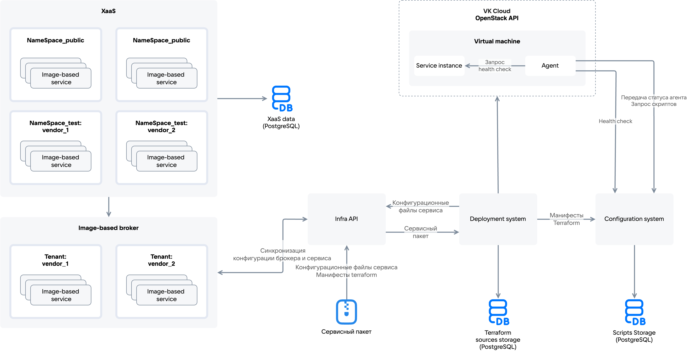

# {appendix-heading(Загрузка сервисного пакета в Marketplace)[id=xaas_vendor_ibservice_upload_package; position=prefix]}

Загрузка сервисного пакета в Marketplace осуществляется с помощью системы развертывания через сервис Infra API. Схема загрузки приведена на {linkto(#pic_xaas_ib_upload)[text=рисунке %number]}.

{caption(Рисунок {counter(pic)[id=numb_pic_xaas_ib_upload]} — Схема загрузки сервисного пакета)[align=center;position=under;id=pic_xaas_ib_upload;number={const(numb_pic_xaas_ib_upload)}]}
{params[width=100%;noBorder=true]}
{/caption}

Описание основных элементов схемы приведено в {linkto(#tab_description_main_circuit_elements)[text=таблице %number]}.

{caption(Таблица {counter(table)[id=numb_tab_description_main_circuit_elements]} — Описание основных элементов схемы)[align=right;position=above;id=tab_description_main_circuit_elements;number={const(numb_tab_description_main_circuit_elements)}]}
[cols="2,5", options="header"]
|===
|Имя
|Описание

|Infra API
|Является точкой интеграции Marketplace и {var(sys2)} для разворачивания image-based приложений. Infra API проверяет данные пользователя, загружающего сервисный пакет или разворачивающего инстанс сервиса. После успешной проверки Infra API получает доступ к межсервисному взаимодействию для создания ресурсов, описанных в манифесте Terraform. Infra API взаимодействует с системой развертывания и сервисом управления конфигурациями

|Система развертывания (Deployment system)
|Обеспечивает разворачивание image-based приложения на ВМ в {var(sys6)}. Управляет инфраструктурой и ПО сервиса

|Image-based брокер
|Управляет жизненным циклом инстанса сервиса, включает в себя тенанты. Тенанты объединяют image-based приложения одного поставщика (`vendor`)

|Сервис управления конфигурациями (Configuration system)
|Сервер, на котором хранится:

* Конфигурация, описанная в манифестах Terraform.
* Результаты выполнения скриптов.
* Текущая конфигурация инстанса сервиса.

Предоставляет доступ к актуальной версии агента, устанавливаемой на ВМ

|Агент (Agent)
|Программное обеспечение, устанавливаемое на ВМ в процессе разворачивания сервиса (подробнее — в подразделе {linkto(../../../../xaas_instructions/xaas_vendor_ibservice_add/xaas_vendor_ibimage_create/xaas_vendor_ibimage_agent#xaas_vendor_ibimage_agent)[text=%text]})

|Сервисный пакет
|Структурированный набор YAML-файлов и манифестов Terraform
|===
{/caption}

Тестовые (`NameSpace_test`) и открытые (`NameSpace_public`) пространства имен Marketplace для каждого сервиса заданы в сервисном ключе.

Чтобы загрузить сервисный пакет в Marketplace:

1. Выполните {linkto(../../../../xaas_instructions/xaas_vendor_ibservice_add/xaas_vendor_ibservice_upload/xaas_vendor_ibservice_upload_prepare#xaas_vendor_ibservice_upload_prepare)[text=подготовительные операции]}.
1. Протестируйте манифесты Terraform локально (подробнее — в подразделе {linkto(../../../../xaas_instructions/xaas_vendor_ibservice_add/xaas_vendor_ibservice_upload/xaas_vendor_ibservice_upload_localtest#xaas_vendor_ibservice_upload_localtest)[text=%text]}).
1. Протестируйте манифесты Terraform с системой развертывания (подробнее — в подразделе {linkto(../../../../xaas_instructions/xaas_vendor_ibservice_add/xaas_vendor_ibservice_upload/xaas_vendor_ibservice_upload_deploysystemtest#xaas_vendor_ibservice_upload_deploysystemtest)[text=%text]}).
1. Убедитесь, что файлы сервисного пакета заполнены и их структура соответствует используемой версии генератора JSON-файла (подробнее — в подразделе {linkto(../../../../xaas_instructions/xaas_vendor_ibservice_add/xaas_vendor_ib_structure#xaas_vendor_ib_structure)[text=%text]}).
1. Убедитесь, что сочетания ID и ревизии каждого тарифного плана уникальны в рамках сервисного пакета.
1. Запакуйте сервисный пакет (директория `<SERVICE_NAME>` с конфигурационными файлами сервиса и манифестами Terraform) в zip-архив. Размер архива должен быть не более 30 МБ.
1. Чтобы загрузить архив в Marketplace, выполните запрос к сервису Infra API со следующими параметрами:

   * Метод запроса: `POST`.
   * Путь запроса: `https://<CLOUD_HOST>/marketplace/api/infra-api/api/v1-public/product`

      Здесь `<CLOUD_HOST>` — доменное имя {var(sys2)}.
   * Тело запроса: zip-архив.
   * `x-service-token`: `<SERVICE_TOKEN>` — сервисный ключ.

      {caption(Пример запроса на загрузку сервисного пакета в Marketplace)[align=left;position=above]}
      ```console
      $ curl -v -X POST https://<CLOUD_HOST>/marketplace/api/infra-api/api/v1-public/product \
      -H 'x-service-token: <SERVICE_TOKEN>' \
      -F "upload=@/home/VKservice.zip"
      ```
      {/caption}

      HTTP-коды ответа:
   
      * 204 — сервисный пакет загружен.
      * 400, 404, 500 — ошибка выполнения запроса.
      * 401 — ошибка авторизации.

      Конфигурационные файлы, описывающие тарифные планы и опции сервиса, передаются image-based брокеру, манифесты Terraform — системе развертывания.

   Сервисный пакет, загружаемый в Marketplace, сначала попадает в тестовое пространство имен, после публикации — в открытое.

1. После окончания загрузки сервиса зайдите в Портал самообслуживания и убедитесь, что сервис отображается в Marketplace. Загруженный сервис будет доступен только пользователям тестовых пространств имен Marketplace, указанных в сервисном ключе.

   <info>

   Если после загрузки сервис не отображается в Marketplace, выйдите из Портала самообслуживания и войдите заново.

   </info>

Чтобы проверить, как сервис будет функционировать в {var(sys3)}, после загрузки сервисного пакета протестируйте сервис в тестовом пространстве имен Marketplace:

1. Зайдите в Портал самообслуживания.
1. Убедитесь, что мастер конфигурации каждого тарифного плана отображается корректно.
1. Подключите сервис. Убедитесь, что разворачивание инстанса сервиса выполнено успешно.

   Если при разворачивании инстанса сервиса не удалось создать ресурс, описанный в манифесте, система развертывания запустит процесс разворачивания сервиса повторно. Процесс разворачивания инстанса сервиса может занимать до 1,5 ч.

   <warn>

   При каждой новой попытке системы развертывания установить сервис все существующие ресурсы удаляются и создаются заново.

   </warn>
   
1. Обновите инстанс сервиса:

   1. Поменяйте значения тарифных опций текущего тарифного плана.
   1. Перейдите на новый тарифный план.

      Изменение параметров ресурсов, описанных в манифесте, запускает процесс переустановки инстанса сервиса, при котором обновляются только измененные ресурсы. Если система развертывания не смогла обновить ресурсы, она будет пробовать обновить их повторно. Процесс обновления конфигурации инстанса сервиса с учетом повторных попыток может занимать до 1,5 ч.

      <warn>

      При обновлении конфигурации инстанса сервиса система развертывания обновляет только измененные ресурсы.

      </warn>

1. Проверьте основные пользовательские сценарии сервиса.
1. Удалите инстанс сервиса.
1. При необходимости внесите изменения в конфигурацию сервиса (подробнее — в разделе {linkto(../../../../xaas_instructions/xaas_vendor_ibservice_update#xaas_vendor_ibservice_update)[text=%text]}).

<info>

Для тестирования сервиса выдаются бонусы. Чтобы получить бонусы, обратитесь к администратору {var(sys2)}. Бонусные средства будут зачислены на бонусный счет проекта {var(sys2)}.

</info>