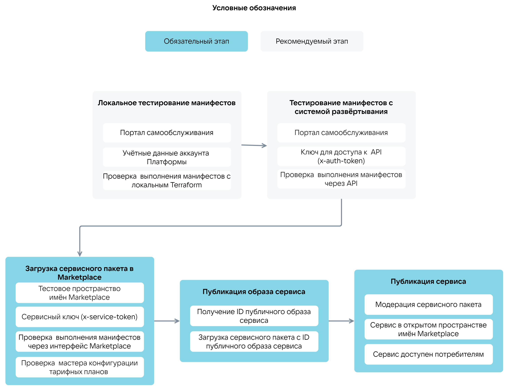

# {appendix-heading(Этапы загрузки сервиса)[id=xaas_vendor_ibservice_upload_phases; position=prefix]}

Этапы загрузки image-based приложения ({linkto(#pic_xaas_ib_upload_phases)[text=рисунок %number]}):

1. {linkto(../../../../xaas_instructions/xaas_vendor_ibservice_add/xaas_vendor_ibservice_upload/xaas_vendor_ibservice_upload_localtest#xaas_vendor_ibservice_upload_localtest)[text=%text]}.
1. {linkto(../../../../xaas_instructions/xaas_vendor_ibservice_add/xaas_vendor_ibservice_upload/xaas_vendor_ibservice_upload_deploysystemtest#xaas_vendor_ibservice_upload_deploysystemtest)[text=%text]}.
1. {linkto(../../../../xaas_instructions/xaas_vendor_ibservice_add/xaas_vendor_ibservice_upload/xaas_vendor_ibservice_upload_package#xaas_vendor_ibservice_upload_package)[text=%text]}.
1. {linkto(../../../../xaas_instructions/xaas_vendor_ibservice_add/xaas_vendor_ibservice_upload/xaas_vendor_ibservice_upload_publish_image#xaas_vendor_ibservice_upload_publish_image)[text=%text]}.
1. {linkto(../../../../xaas_instructions/xaas_vendor_ibservice_add/xaas_vendor_ibservice_upload/xaas_vendor_ibservice_upload_publish#xaas_vendor_ibservice_upload_publish)[text=%text]}.

{caption(Рисунок {counter(pic)[id=numb_pic_xaas_ib_upload_phases]} — Этапы загрузки image-based приложения в Marketplace)[align=center;position=under;id=pic_xaas_ib_upload_phases;number={const(numb_pic_xaas_ib_upload_phases)}]}
{params[width=100%]}
{/caption}

Перед тестированием манифестов Terraform проверьте, что параметры уже существующих ресурсов {var(sys2)} (например, тип ВМ, образ сервиса) указаны в манифестах верно. Используйте [источники данных провайдера VK CS](https://github.com/vk-cs/terraform-provider-vkcs/tree/master/docs/data-sources). Установка и настройка Terraform приведена в подразделе {linkto(../../../../xaas_instructions/xaas_vendor_ibservice_add/xaas_vendor_ibservice_upload/xaas_vendor_ibservice_upload_localtest#xaas_vendor_ibservice_upload_localtest)[text=%text]}.

{caption(Пример проверки того, что указанный тип ВМ существует в {var(sys6)})[align=left;position=above]}
```console
data "vkcs_compute_flavor" "compute" {
flavor_id = "4e115a9b-0ac2-440d-a120-95cf130d63c7"
}
```
{/caption}

<info>

Проверка параметров существующих ресурсов {var(sys2)} сократит время тестирования манифестов и исключит попытки создания ресурсов с некорректной конфигурацией.

</info>