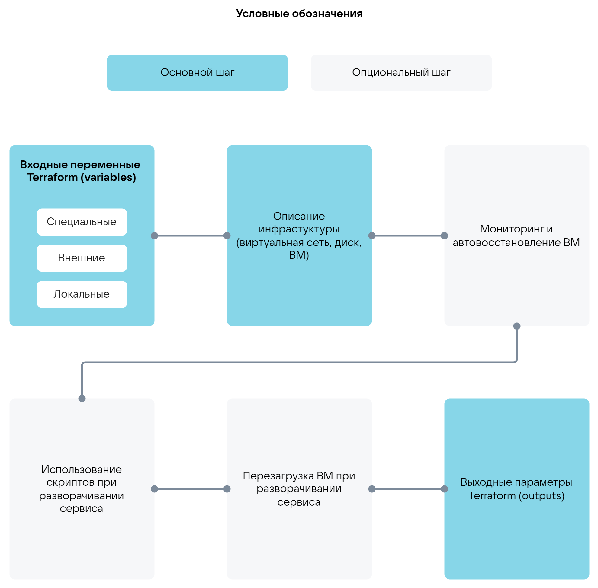

# {appendix-heading(Манифест Terraform)[id=xaas_vendor_tf_manifest_steps; position=prefix]}

Конфигурация инфраструктуры image-based приложения описывается с помощью манифеста Terraform `plans/<PLAN_NAME>/deployment/deploy.tf` на языке `HashiCorp Configuration Language (HCL)` (синтаксис — на [официальном сайте](https://developer.hashicorp.com/terraform/language/syntax/configuration)).

В манифесте `plans/<PLAN_NAME>/deployment/deploy.tf` описывается инфраструктура для разворачивания инстанса сервиса. Для этого используются ресурсы и источники данных провайдеров из {linkto(#tab_terraform_providers)[text=таблицы %number]}.

{caption(Таблица {counter(table)[id=numb_tab_terraform_providers]} — Провайдеры Terraform)[align=right;position=above;id=tab_terraform_providers;number={const(numb_tab_terraform_providers)}]}
[cols="2,5,2", options="header"]
|===
|Имя
|Описание
|Обозначение в манифесте

|VK CS
|Содержит ресурсы и источники данных для описания инфраструктуры сервиса.

Ресурсы и источники данных приведены в [официальной документации провайдера](https://github.com/vk-cs/terraform-provider-vkcs/tree/master/docs)

|`vkcs`

|VK CS Infra (iVK CS)
|Содержит ресурсы и источники данных, расширяющие возможности провайдера VK CS. Например, позволяющие отслеживать состояние инстанса сервиса, запускать скрипты и использовать их результаты в процессе разворачивания. Для скриптов поддерживаются языки Bash и Python.

Ресурсы и источники данных приведены в разделах {linkto(../../../../xaas_instructions/xaas_vendor_ivkcs/xaas_vendor_ivkcs_resources/xaas_vendor_ivkcs_resources_list#xaas_vendor_ivkcs_resources_list)[text=%text]}, {linkto(../../../../xaas_instructions/xaas_vendor_ivkcs/xaas_vendor_ivkcs_datasources#xaas_vendor_ivkcs_datasources)[text=%text]}

|`ivkcs`

|null
|Ресурсы провайдера используются для настройки получения статуса агента на ВМ
|`null`

|random
|Ресурсы провайдера (подробнее — в [официальной документации провайдера](https://github.com/hashicorp/terraform-provider-random/tree/main/docs)) используются, чтобы генерировать пароли для доступа к инстансу сервиса
|`random`
|===
{/caption}

В манифесте используются основные элементы Terraform:

* Входные переменные `variables` для конфигурации ресурсов.
* Ресурсы `resources`, позволяющие управлять объектами инфраструктуры. Например, создать ВМ. При описании ресурсов можно указывать зависимости с помощью блока `depends on`. Ресурс не будет создан, если не выполняется хотя бы одна зависимость.
* Источники данных `data-sources`, позволяющие получить определенную информацию от провайдера. Например, получить доступные типы ВМ или получить результаты выполнения скриптов.
* Выходные параметры `outputs` — результаты выполнения манифеста.

Основные и опциональные шаги, описываемые в манифесте Terraform, приведены на {linkto(#pic_xaas_steps_tf)[text=рисунке %number]}.

{caption(Рисунок {counter(pic)[id=numb_pic_xaas_steps_tf]} — Шаги для манифеста Terraform)[align=center;position=under;id=pic_xaas_steps_tf;number={const(numb_pic_xaas_steps_tf)}]}
{params[width=80%]}
{/caption}

<err>

Конкретные шаги для описания разворачивания сервиса зависят от требующейся инфраструктуры и её настроек для конкретного сервиса.

</err>

Основные шаги для разворачивания сервиса на ВМ в {var(sys6)}:

1. {linkto(../../../../xaas_instructions/xaas_vendor_ibservice_add/xaas_vendor_tf_manifest/xaas_vendor_tf_manifest_variable#xaas_vendor_tf_manifest_variable)[text=Описание входных переменных для конфигурации ресурсов]}.
1. {linkto(../../../../xaas_instructions/xaas_vendor_ibservice_add/xaas_vendor_tf_manifest/xaas_vendor_tf_manifest_image#xaas_vendor_tf_manifest_image)[text=%text]}.
1. {linkto(../../../../xaas_instructions/xaas_vendor_ibservice_add/xaas_vendor_tf_manifest/xaas_vendor_tf_manifest_output#xaas_vendor_tf_manifest_output)[text=Описание выходных параметров]}.

Дополнительные возможности:

* {linkto(../../../../xaas_instructions/xaas_vendor_ibservice_add/xaas_vendor_tf_manifest/xaas_vendor_tf_manifest_monitoring_remediation#xaas_vendor_tf_manifest_monitoring_remediation)[text=%text]} (отслеживание состояния ВМ и повторное разворачивание ВМ, если она вышла из строя).
* Выполнение скриптов в процессе разворачивания или переустановки сервиса (подробнее — в подразделе {linkto(../../../../xaas_instructions/xaas_vendor_ibservice_add/xaas_vendor_tf_manifest/xaas_vendor_tf_manifest_script#xaas_vendor_tf_manifest_script)[text=%text]}).
* Использование результатов выполнения скриптов другими ресурсами манифеста (подробнее — в подразделе {linkto(../../../../xaas_instructions/xaas_vendor_ibservice_add/xaas_vendor_tf_manifest/xaas_vendor_tf_manifest_script#xaas_vendor_tf_manifest_script)[text=%text]}).
* Получение результатов выполнения скриптов (подробнее — в подразделе {linkto(../../../../xaas_instructions/xaas_vendor_ibservice_add/xaas_vendor_tf_manifest/xaas_vendor_tf_manifest_script#xaas_vendor_tf_manifest_script)[text=%text]}).
* Перезагрузка ВМ в процессе разворачивания сервиса (подробнее — в разделе {linkto(../../../../xaas_instructions/xaas_vendor_ivkcs/xaas_vendor_ivkcs_resources/xaas_vendor_ivkcs_compute_instance_reboot#xaas_vendor_ivkcs_compute_instance_reboot)[text=%text]}).

Дополнительные возможности обеспечиваются ресурсами провайдера iVK CS.

<info>

Идентификатор разворачивания сервиса для ресурсов провайдера iVK CS можно получить с помощью специальной переменной `instance_uuid` (подробнее — в подразделе {linkto(../../../../xaas_instructions/xaas_vendor_ibservice_add/xaas_vendor_tf_manifest/xaas_vendor_tf_manifest_variable#xaas_vendor_tf_manifest_variable)[text=%text]}).

</info>

Мониторинг, автовосстановление ВМ и использование скриптов обеспечиваются специальными сервисами (подробнее — в подразделе {linkto(../../../../xaas_instructions/xaas_vendor_ibservice_add/xaas_vendor_ibservice_upload/xaas_vendor_ibservice_upload_package#xaas_vendor_ibservice_upload_package)[text=%text]}), с которыми взаимодействует провайдер iVK CS:

* Сервис управления конфигурациями.
* Агент.

Подготовленный манифест загружается в систему развёртывания (`deployment system`) в составе сервисного пакета. Загрузка сервисного пакета описана в разделе {linkto(../../../../xaas_instructions/xaas_vendor_ibservice_add/xaas_vendor_ibservice_upload/xaas_vendor_ibservice_upload_package#xaas_vendor_ibservice_upload_package)[text=%text]}.

Пример манифеста для разворачивания сервиса Redis приведён в разделе {linkto(../../../../xaas_instructions/xaas_vendor_tf_manifest_example#xaas_vendor_tf_manifest_example)[text=%text]}.