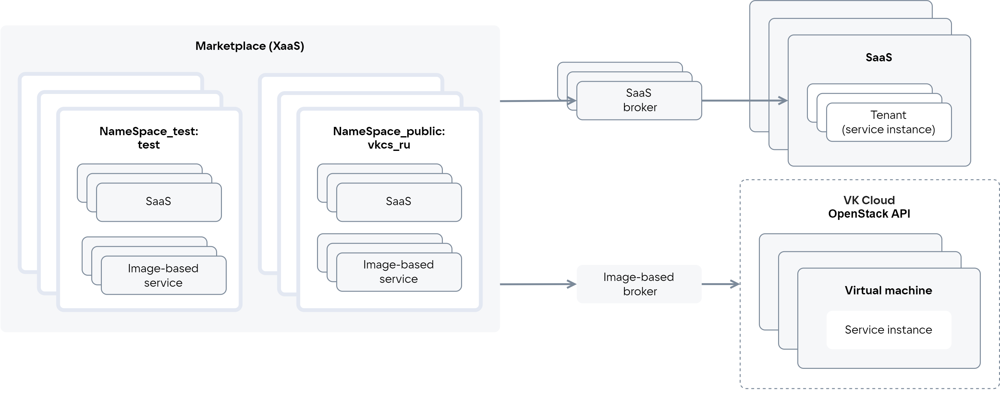
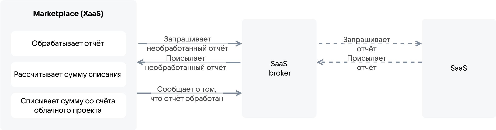
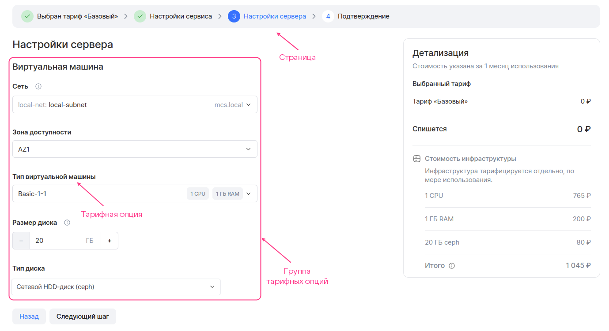

# {appendix-heading(Общая информация)[id=xaas_vendor_index; position=prefix]}

Магазин приложений Marketplace (XaaS) интегрирован с {var(sys5)}. Marketplace обеспечивает доступ пользователей {var(sys2)} к сервисам, размещенным в нем.

<info>

Сервисы, добавленные в Marketplace, отображаются в разделе **Магазин приложений** в Портале самообслуживания.

</info>

Роли пользователей, взаимодействующих с Marketplace:

* Поставщик — добавляет сервис в Marketplace. Доступны тестовые и открытые пространства имен Marketplace.
* Потребитель — использует сервис, размещенный в Marketplace. Доступны только открытые пространства имен Marketplace.
* Администратор — регистрирует брокера, управляет пространствами имен, публикует сервисы в Marketplace.

## {appendix-heading(Типы сервисов)[id=xaas_vendor_index_type_services; position=prefix]}

Marketplace позволяет размещать следующие типы сервисов:

* SaaS-приложение — централизованно установленный мультитенантный продукт. Инфраструктура для работы сервиса предоставляется поставщиком. Поставщик разворачивает сервис либо на сторонней инфраструктуре, либо на инфраструктуре {var(sys2)} в своем проекте. Пользователю предоставляется доступ к инстансу сервиса через отдельный тенант/аккаунт.
* Image-based приложение — продукт, который разворачивается на основе образов ВМ в облачном проекте пользователя. Для работы сервиса может использоваться дополнительная инфраструктура {var(sys2)}: виртуальные сети, балансировщики нагрузки, кластеры DBaaS, S3, резервное копирование. Инфраструктура для работы сервиса предоставляется {var(sys5)}. Инстансы сервиса разворачиваются в проекте пользователя.

   Marketplace позволяет размещать image-based приложения, которые разворачиваются как на одной ВМ, так и в кластере.

Услуги, предоставляемые сервисом, описываются с помощью тарифных планов и опций. Тарифная опция — это конкретный параметр плана.

Взаимодействие Marketplace с сервисами осуществляется по протоколу VK OSB с помощью брокеров ({linkto(#pic_xaas)[text=рисунок %number]}). Брокер обеспечивает доставку конфигурации сервиса в Marketplace: Marketplace периодически опрашивает брокера о текущей конфигурации сервиса.

{caption(Рисунок {counter(pic)[id=numb_pic_xaas]} — Взаимодействие Marketplace с сервисами)[align=center;position=under;id=pic_xaas;number={const(numb_pic_xaas)}]}
{params[noBorder=true]}
{/caption}

SaaS-брокер обеспечивает взаимодействие конкретного SaaS-приложения с Marketplace. Image-based брокер обеспечивает взаимодействие image-based приложений с Marketplace. Image-based брокер внутри себя имеет тенанты, объединяющие image-based приложения одного поставщика.

<warn>

Поставщик SaaS-приложения разрабатывает SaaS-брокер.

Поставщик image-based приложения разрабатывает сервисный пакет для image-based брокера.

Брокер для image-based приложений разработан VK.

</warn>

Marketplace включает в себя:

* Тестовые пространства имен (`NameSpace_test`), в которых проверяется конфигурация сервиса перед публикацией. Доступны все ревизии сервиса.
* Открытые пространства имен (`NameSpace_public`), в которых сервис публикуется. Доступна только последняя опубликованная ревизия сервиса.

Доступ к тестовым и открытым пространствам имен выдается администратором {var(sys2)}. Доступ к тестовым пространствам имен выдается только поставщикам. Если у пользователя есть доступ к нескольким пространствам имен, в каталоге Marketplace он будет видеть все сервисы и их ревизии, размещенные хотя бы в одном пространстве имен, к которому у пользователя есть доступ.

Тестовые и открытые пространства имен для image-based приложения задаются в сервисном ключе и image-based брокере, для SaaS-приложения — в SaaS-брокере при регистрации брокера в Marketplace. Сервисный ключ для image-based приложения создается администратором {var(sys2)}.

Сущности, связанные с сервисом и используемые при интеграции с Marketplace, приведены в {linkto(#tab_entities)[text=таблице %number]}.

{caption(Таблица {counter(table)[id=numb_tab_entities]} — Сущности, связанные с сервисом)[align=right;position=above;id=tab_entities;number={const(numb_tab_entities)}]}
[cols="2,5", options="header"]
|===
|Имя
|Описание

|Инстанс сервиса (Service instance)
|Экземпляр сервиса, развернутый у пользователя

|Сервисная привязка (Service binding)
|Сущность, которая создается после разворачивания инстанса сервиса на основании запроса от {var(sys2)} к брокеру и связывается с инстансом сервиса.

Наиболее часто сервисная привязка используется, чтобы передать пользователю чувствительную информацию для доступа к сервису. Если сервис умеет отправлять данные для доступа без участия Marketplace, для этой задачи использовать сервисную привязку не требуется. Задачи, для которых используются сервисные привязки, зависят от конкретного сервиса
|===
{/caption}

<info>

Инстанс сервиса SaaS-приложения — это тенант/аккаунт SaaS-приложения. Например, инстанс SaaS-приложения VK Testers соответствует одной компании в VK Testers.

</info>

## {appendix-heading(Типы тарифных опций)[id=xaas_option_types; position=prefix]}

Поддерживаются типы тарифных опций, приведенные в {linkto(#tab_tariff_options_types)[text=таблице %number]}.

{caption(Таблица {counter(table)[id=numb_tab_tariff_options_types]} — Типы тарифных опций)[align=right;position=above;id=tab_tariff_options_types;number={const(numb_tab_tariff_options_types)}]}
[cols="4,2,2", options="header"]
|===
|Тип тарифной опции
|SaaS-приложение
|Image-based приложение

|Числовой
|integer, number
|integer

|Строковый (string)
| 
| 

|Логический (boolean)
| 
| 

|Datasource
| 
| 
|===
{/caption}

Тип опции `datasource` используется для описания опций, связанных с сущностями {var(sys2)}. Такой тип позволяет использовать данные {var(sys2)} в режиме реального времени. На основании этих данных формируются возможные значения опции во время подключения сервиса или обновления тарифного плана.

Поддерживаемые типы `datasource`:

* Типы ВМ, доступные в проекте пользователя {var(sys2)}.
* Зоны доступности {var(sys2)}.
* Виртуальные сети, доступные в проекте {var(sys2)}.
* Тип диска.

## {appendix-heading(Тарификация)[id=xaas_billing; position=prefix]}

Тарифные планы могут быть платными или бесплатными.

Тарифные планы могут иметь платные тарифные опции. Поддерживаются платные опции следующих типов:

* Числовой.
* Логический.

Стоимость тарифных планов и опций описывается в конфигурации сервиса.

Описание типов тарификации (способов оплаты) приведено в {linkto(#tab_tariff_types)[text=таблице %number]}.

{caption(Таблица {counter(table)[id=numb_tab_tariff_types]} — Типы тарификации)[align=right;position=above;id=tab_tariff_types;number={const(numb_tab_tariff_types)}]}
[cols="2,5", options="header"]
|===
|Имя
|Описание

|Предоплатный
|Стоимость тарифного плана и опций списывается раз в отчетный период в дату подключения тарифного плана.

Стоимость тарифных опций фиксирована

|Постоплатный ({linkto(#pic_xaas_saas_broker_resource_usage)[text=рисунок %number]})
|Стоимость тарифных опций рассчитывается исходя из фактически использованного количества ресурсов сервиса за месяц (например, используемого объема хранилища).

Оплата использованных ресурсов сервиса (тарифных опций) осуществляется на основании отчета, полученного от сервиса.

Периодичность списания равна периодичности, с которой сервис формирует отчет. Например, если сервис формирует отчет раз в месяц, стоимость будет списываться раз в месяц.

<warn>

Постоплатный способ списания применяется только для тарифных опций в бесплатном тарифном плане.

</warn>

|BYOL (Bring Your Own License)
|Использование сторонних лицензий для сервисов. Инстанс сервиса разворачивается без лицензии
|===
{/caption}

<err>

Текущая версия Marketplace не поддерживает постоплатный способ списания денежных средств для image-based приложений.

</err>

{caption(Рисунок {counter(pic)[id=numb_pic_xaas_saas_broker_resource_usage]} — Передача отчета между Marketplace и брокером)[align=center;position=under;id=pic_xaas_saas_broker_resource_usage;number={const(numb_pic_xaas_saas_broker_resource_usage)}]}
{params[width=100%;noBorder=true]}
{/caption}

Marketplace периодически опрашивает брокера на наличие необработанных отчетов о фактически использованных ресурсах сервиса (постоплатные тарифные опции):

1. Если в брокере есть необработанные отчеты, брокер передает их Marketplace.
1. Если в брокере нет необработанных отчетов, выполняются следующие действия:

   1. Брокер запрашивает отчет у сервиса.
   1. По запросу брокера сервис передает ему отчет по всем существующим инстансам сервиса.
   1. Брокер присваивает отчету идентификатор `batch_id`.
   1. Брокер в ответ на запрос Marketplace передает ему необработанный отчет.

1. Marketplace рассчитывает стоимость использованных ресурсов на основании полученного отчета.
1. После обработки отчета (списание денежных средств по этому отчету произошло или запланировано) Marketplace сообщает брокеру `batch_id` этого отчета. В дальнейшем обработанные отчеты брокер не будет передавать Marketplace.

## {appendix-heading(Матрица тарифных планов)[id=xaas_tariff_matrix; position=prefix]}

Матрица тарифных планов отображается при просмотре информации о сервисе. На основании матрицы пользователь может сравнить тарифные планы сервиса между собой: какие опции в какой тарифный план входят.

Матрица тарифных планов описывается в конфигурации сервиса. В ней указываются тарифные опции сервиса, на основании которых пользователь будет выбирать тарифный план.

## {appendix-heading(Мастер конфигурации тарифного плана)[id=xaas_wizard; position=prefix]}

При подключении сервиса и при обновлении тарифного плана пользователю отображается мастер конфигурации тарифного плана.

Мастер конфигурации тарифного плана позволяет пользователю настроить тарифные опции для конкретного тарифного плана.

В интерфейсе Marketplace мастер конфигурации тарифного плана разбит на отдельные страницы ({linkto(#pic_xaas_wizard)[text=рисунок %number]}). Каждая страница описывает конкретный этап настройки тарифного плана. На странице отображаются тарифные опции, настраиваемые на этом этапе. Опции объединены в группы.

{caption(Рисунок {counter(pic)[id=numb_pic_xaas_wizard]} — Мастер конфигурации тарифного плана)[align=center;position=under;id=pic_xaas_wizard;number={const(numb_pic_xaas_wizard)}]}

{/caption}

Первая и последняя страницы мастера конфигурации тарифного плана добавляются автоматически. Остальные страницы описываются в конфигурации сервиса.

В мастере конфигурации тарифного плана отображается стоимость тарифного плана и платных тарифных опций. Для image-based приложений дополнительно отображается стоимость инфраструктуры {var(sys2)}, которая рассчитывается автоматически в соответствии с тарифами {var(sys2)}. Параметры для расчета описываются в конфигурации image-based приложения.