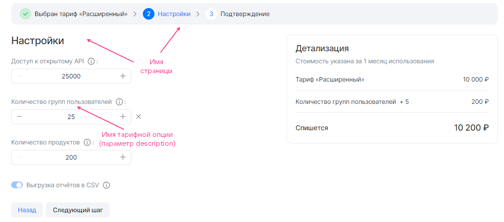
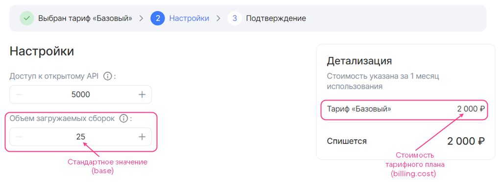
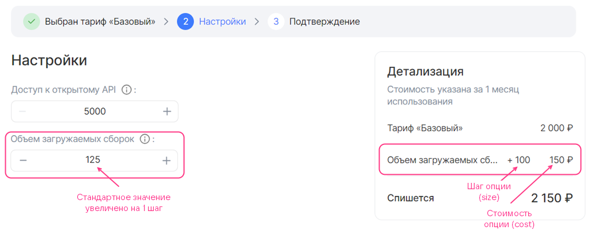
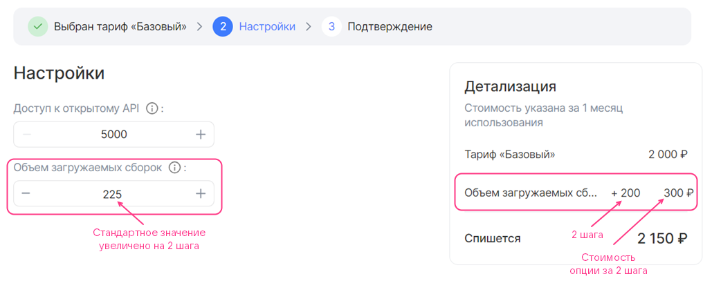
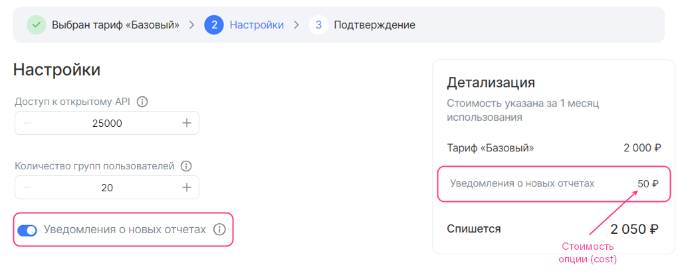
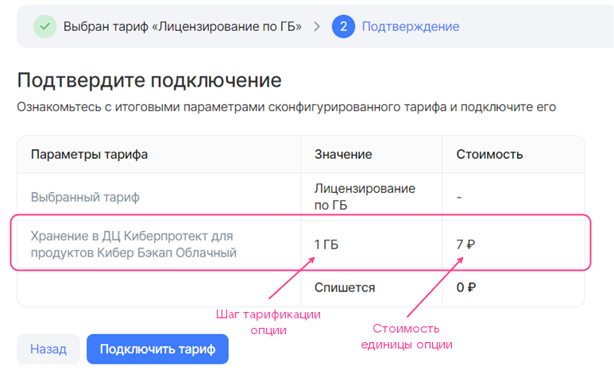
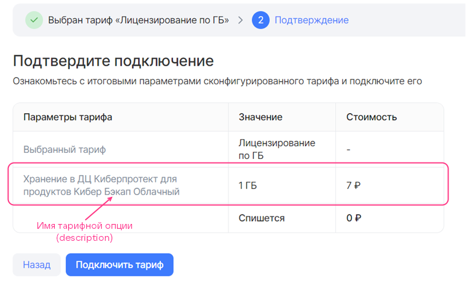

## {appendix-heading(Секция plans)[id=xaas_vendor_saas_plan; position=prefix]}

## {appendix-heading(Структура)[id=xaas_vendor_saas_plan_structure; position=prefix]}

В секции `plans` опишите тарифные планы сервиса по следующей структуре:

```json
      "plans": [
        {
          <PLAN_PARAMETERS>,
          "display": {
          },
          "billing": {
          },
          "schemas": {
          }
        },
        ...
      ]
```

Здесь:

* `<PLAN_PARAMETERS>` — параметры плана (подробнее — в подразделе {linkto(#xaas_vendor_saas_plan_param)[text=%text]}).
* Секция `display` — описывает мастер конфигурации конкретного тарифного плана (подробнее — в подразделе {linkto(#xaas_vendor_saas_plan_display)[text=%text]}).
* Секция `billing` — описывает стоимость плана и его опций (подробнее — в подразделе {linkto(#xaas_vendor_saas_plan_billing)[text=%text]}).
* Секция `schemas` — описывает тарифные опции плана (подробнее — в подразделе {linkto(#xaas_vendor_saas_plan_schema)[text=%text]}).

## {appendix-heading(Параметры тарифного плана)[id=xaas_vendor_saas_plan_param; position=prefix]}

Для тарифного плана задайте параметры, приведённые в {linkto(#tab_tariff_plan_parameters)[text=таблице %number]}.

{caption(Таблица {counter(table)[id=numb_tab_tariff_plan_parameters]} — Параметры тарифного плана)[align=right;position=above;id=tab_tariff_plan_parameters;number={const(numb_tab_tariff_plan_parameters)}]}
[cols="2,5,2,2", options="header"]
|===
|Имя
|Описание
|Формат
|Обязательный

|id
|Идентификатор тарифного плана UUID4 (ID), сформированный с помощью генератора UUID4
|string (UUID4)
| 

|revision
|Ревизия тарифного плана. Сочетание ревизии и ID тарифного плана определяет его уникальность в сервисе. Остальные параметры описывают характеристики конкретной ревизии тарифного плана
|string, до 255 символов
| 

|name
|Техническое название тарифного плана, которое не отображается в интерфейсе Marketplace. Должно быть указано латинскими буквами с использованием знака нижнего подчеркивания вместо пробелов
|string, до 255 символов
| 

|description
|Название тарифного плана, которое отображается в интерфейсе Marketplace
|string, до 255 символов
| 

|free
|Определяет, бесплатный тарифный план или нет
|boolean
| 

|plan_updateable
|Определяет, может ли пользователь переходить с одного тарифного плана на другой без удаления сервиса.

Переопределяет значение, заданное в одноимённом параметре сервиса
|boolean
| 

|metadata
|Определяет тестовые и открытые пространства имён Marketplace, в которых тарифный план будет доступен.

Тестовые пространства имён задаются в ключе `test_ns`.

Открытые пространства имён задаются в ключе `prod_ns`.

Чтобы получить имена пространств имён, обратитесь к администратору {var(sys2)}.

Если пространства имён не заданы, будут использованы значения по умолчанию:

* Тестовое — `test`.
* Открытое — `vkcs_ru`

|map, ключи — string
| 
|===
{/caption}

<err>

Сочетание ID и ревизии тарифного плана должно быть уникальным в рамках сервиса. Если план с такими же идентификатором и ревизией существует в этом сервисе, тарифный план не будет обновлен.

</err>

## {appendix-heading(Секция display)[id=xaas_vendor_saas_plan_display; position=prefix]}

В секции `display` опишите мастер конфигурации тарифного плана (подробнее — в подразделе {linkto(../../../../xaas_instructions/xaas_vendor_index#xaas_wizard)[text=%text]}) по следующей структуре:

```json
"display": {
  "pages": [
    {
      <PAGE_PARAMETERS>,
      "groups": [
        {
          <GROUP_PARAMETERS>,
          "parameters": [
            {
              <OPTION_PARAMETERS>
            },
            ...
          ]
        }
        ...
      ]
    },
  ...
  ]
}
```

Здесь:

* Секция `pages` — описывает страницы мастера конфигурации тарифного плана. Может быть пустой.
* `<PAGE_PARAMETERS>` — параметры одной страницы.
* Секция `groups` — описывает группы тарифных опций в рамках одной страницы.
* `<GROUP_PARAMETERS>` — параметры группы тарифных опций.
* Секция `parameters` — определяет тарифные опции в рамках одной группы.
* `<OPTION_PARAMETERS>` — параметры тарифных опций.

В секции `display` описываются все страницы мастера конфигурации тарифного плана, кроме первой и последней. Максимальное количество страниц — 5.

Параметры страниц, групп и тарифных опций в группах одинаковые и приведены в {linkto(#tab_saas_plan_display)[text=таблице %number]}.

{caption(Таблица {counter(table)[id=numb_tab_saas_plan_display]} — Параметры страниц, групп и тарифных опций для мастера конфигурации тарифного плана)[align=right;position=above;id=tab_saas_plan_display;number={const(numb_tab_saas_plan_display)}]}
[cols="2,5,4,2", options="header"]
|===
|Имя
|Описание
|Формат
|Обязательный

|name
|Имя страницы, группы или тарифной опции в JSON-файле.

<warn>

В интерфейсе Marketplace тарифные опции будут отображаться с именами, заданными в параметре `description` этих опций (секция `plans.schemas`).

</warn>
|string.

Имя страницы — до 32 символов.

Имя группы — до 255 символов
| 

|index
|Порядковый номер страницы, группы на странице или тарифной опции в группе
|integer
| 
|===
{/caption}

Мастер конфигурации тарифного плана, приведённый на {linkto(#pic_xaas_wizard_saas)[text=рисунке %number]}, соответствует следующему содержимому секции `display`:

```json
"display": {
  "pages": [
    {
      "name": "Настройки", // Имя страницы
      "index": 0,
      "groups": [
        {
          "name": "", // Имя группы
          "index": 0,
          "parameters": [
            {
              "name": "api_requests_daily_limit", // Имя тарифной опции в JSON-файле
              "index": 0,
            },
            {
              "name": "groups",
              "index": 1,
            },
            {
              "name": "products",
              "index": 2,
            },
            {
              "name": "reports",
              "index": 3
            }
          ]
        }
      ]
    }
  ]
}
```

{caption(Рисунок {counter(pic)[id=numb_pic_xaas_wizard_saas]} — Мастер конфигурации тарифного плана)[align=center;position=under;id=pic_xaas_wizard_saas;number={const(numb_pic_xaas_wizard_saas)}]}

{/caption}

## {appendix-heading(Секция billing)[id=xaas_vendor_saas_plan_billing; position=prefix]}

Секция `billing` описывает:

* Стоимость конкретного тарифного плана.
* Пользовательский шаг изменения для тарифных опций типа `integer`.
* Стоимость тарифных опций плана. Платными тарифными опциями могут быть опции следующих типов:

    * Числовой (`integer`, `number`).
    * Логический (`boolean`).

Поддерживаются следующие способы списания денежных средств (подробнее — в подразделе {linkto(../../../../xaas_instructions/xaas_vendor_index#xaas_billing)[text=%text]}):

* Для стоимости тарифного плана — предоплатный.
* Для стоимости тарифных опций — постоплатный и предоплатный.

  Предоплатными тарифными опциями могут быть опции числового и логического типа.

  Постоплатными тарифными опциями могут быть опции только числового типа.

<warn>

В рамках одного тарифного плана могут быть опции только с одним способом списания денежных средств.

</warn>

Применяемый способ оплаты определяется местом описания тарифных опций в секции `plans.schemas` (подробнее — в подразделе {linkto(#xaas_vendor_saas_plan_schema)[text=%text]}):

* Если опции описаны в секциях `service_instance.create` и `service_instance.update`, применяется предоплатный способ списания.
* Если опции описаны в секции `service_instance.resource_usages`, применяется постоплатный способ списания.

Опишите секцию `billing` по следующей структуре:

```json
"billing": {
            "cost": <MONTH_COST>,
            "options": {
              "<OPTION>": {
                <OPTION_BILLING>
                },
              ...
              }
            }
```

Здесь:

* Параметр `cost` — определяет стоимость плана за месяц `<MONTH_COST>` без учёта платных тарифных опций. Задаётся в валюте страны, где развёрнут Marketplace. Если план бесплатный, укажите значение `0`.
* Секция `options` (опциональная) — описывает стоимость платных тарифных опций.
* `<OPTION>` — имя тарифной опции в JSON-файле.
* `<OPTION_BILLING>` — стоимость тарифной опции и параметры шага изменения для опции типа `integer`. Сама тарифная опция (тип, настройки значения) описывается в секции {linkto(#xaas_vendor_saas_plan_schema)[text=schemas]}.

### {appendix-heading(Секция billing с бесплатной тарифной опцией типа integer с пользовательским шагом изменения)[id=xaas_vendor_saas_plan_billing_integer_free; position=prefix]}

Шаг изменения тарифной опции типа `integer` в `<OPTION_BILLING>` описывается такими же параметрами, как и для image-based приложения (подробнее — в подразделе {linkto(../../../../xaas_instructions/xaas_vendor_ibservice_add/xaas_vendor_ibservice_configure/xaas_vendor_iboption#xaas_vendor_iboption_billing)[text=%text]}).

Чтобы опция была бесплатной, укажите `0` в параметре `billing.options.<OPTION>.cost`.

{caption(Пример описания секции billing для плана с бесплатной тарифной опцией типа integer с шагом изменения)[align=left;position=above]}
```json
"billing": {
  "cost": 2000,  // Стоимость тарифного плана
  "options": {
    "quantity": { // Имя опции в JSON-файле
      "base": 25, // Стандартное значение опции
      "cost": 0,  // Стоимость шага изменения опции
      "unit": {
        "size": 100  // Шаг изменения опции
      }
    }
  }
}
```
{/caption}

На {linkto(#pic_xaas_option_int_with_user_step_prepayed4)[text=рисунке %number]}, {linkto(#pic_xaas_option_int_with_user_step_free_saas)[text=рисунке %number]} и {linkto(#pic_xaas_option_int_with_user_step_free_saas1)[text=рисунке %number]} приведено, как будет отображаться в мастере конфигурации тарифного плана стоимость тарифного плана и опция, описанные выше.

{caption(Рисунок {counter(pic)[id=numb_pic_xaas_option_int_with_user_step_prepayed4]} — Тарифный план с бесплатной опцией типа integer с шагом изменения (base = 25, size = 100))[align=center;position=under;id=pic_xaas_option_int_with_user_step_prepayed4;number={const(numb_pic_xaas_option_int_with_user_step_prepayed4)}]}

{/caption}

{caption(Рисунок {counter(pic)[id=numb_pic_xaas_option_int_with_user_step_free_saas]} — Тарифный план с бесплатной опцией типа integer с шагом изменения, значение опции увеличено на 1 шаг (base = 25, size = 100))[align=center;position=under;id=pic_xaas_option_int_with_user_step_free_saas;number={const(numb_pic_xaas_option_int_with_user_step_free_saas)}]}

{/caption}

{caption(Рисунок {counter(pic)[id=numb_pic_xaas_option_int_with_user_step_free_saas1]} — Тарифный план с бесплатной опцией типа integer с шагом изменения, значение опции увеличено на 2 шага (base = 25, size = 100))[align=center;position=under;id=pic_xaas_option_int_with_user_step_free_saas1;number={const(numb_pic_xaas_option_int_with_user_step_free_saas1)}]}

{/caption}

### {appendix-heading(Секция billing с предоплатной тарифной опцией типа integer с шагом изменения)[id=xaas_vendor_saas_plan_billing_integer_prepaid; position=prefix]}

Стоимость и шаг изменения предоплатной тарифной опции типа `integer` в `<OPTION_BILLING>` описывается такими же параметрами, как и для image-based приложения (подробнее — в подразделе {linkto(../../../../xaas_instructions/xaas_vendor_ibservice_add/xaas_vendor_ibservice_configure/xaas_vendor_iboption#xaas_vendor_iboption_billing)[text=%text]}).

Чтобы опция была предоплатной, укажите стоимость за 1 шаг изменения в параметре `billing.options.<OPTION>.cost`.

{caption(Пример описания секции billing для плана с предоплатной тарифной опцией типа integer с шагом изменения)[align=left;position=above]}
```json
"billing": {
  "cost": 2000,  // Стоимость тарифного плана
  "options": {
    "quantity": {  // Имя опции в JSON-файле
      "base": 25, // Стандартное значение опции
      "cost": 150, // Стоимость шага изменения опции
      "unit": {
        "size": 100 // Шаг изменения опции
      }
    }
  }
}
```
{/caption}

На {linkto(#pic_xaas_option_int_with_user_step_prepayed4)[text=рисунке %number]}, {linkto(#pic_xaas_option_int_with_user_step_prepayed1)[text=рисунке %number]} и {linkto(#pic_xaas_option_int_with_user_step_prepayed2)[text=рисунке %number]} приведено, как будет отображаться в мастере конфигурации тарифного плана стоимость тарифного плана и опция, описанные выше.

{caption(Рисунок {counter(pic)[id=numb_pic_xaas_option_int_with_user_step_prepayed4]} — Тарифный план с предоплатной опцией типа integer с шагом изменения (base = 25, size = 100))[align=center;position=under;id=pic_xaas_option_int_with_user_step_prepayed4;number={const(numb_pic_xaas_option_int_with_user_step_prepayed4)}]}

{/caption}

{caption(Рисунок {counter(pic)[id=numb_pic_xaas_option_int_with_user_step_prepayed1]} — Тарифный план с предоплатной опцией типа integer с шагом изменения, значение опции увеличено на 1 шаг (base = 25, size = 100))[align=center;position=under;id=pic_xaas_option_int_with_user_step_prepayed1;number={const(numb_pic_xaas_option_int_with_user_step_prepayed1)}]}

{/caption}

{caption(Рисунок {counter(pic)[id=numb_pic_xaas_option_int_with_user_step_prepayed2]} — Тарифный план с предоплатной опцией типа integer с шагом изменения, значение опции увеличено на 2 шага (base = 25, size = 100))[align=center;position=under;id=pic_xaas_option_int_with_user_step_prepayed2;number={const(numb_pic_xaas_option_int_with_user_step_prepayed2)}]}

{/caption}

### {appendix-heading(Секция billing с предоплатной тарифной опцией-переключателем boolean)[id=xaas_vendor_saas_plan_billing_boolean_prepaid; position=prefix]}

Чтобы опция-переключатель `boolean` была предоплатной, укажите стоимость в параметре `billing.options.<OPTION>.cost`.

{caption(Пример описания секции billing для плана с предоплатной тарифной опцией-переключателем boolean)[align=left;position=above]}
```json
"billing": {
  "cost": 2000, // Стоимость тарифного плана
  "options": {
    "notifications": { // Имя опции в JSON-файле
      "cost": 50 // Стоимость опции
    }
  }
}
```
{/caption}

На {linkto(#pic_xaas_option_bool_paid)[text=рисунке %number]} приведено, как будет отображаться в мастере конфигурации тарифного плана стоимость тарифного плана и опция, описанные выше.

{caption(Рисунок {counter(pic)[id=numb_pic_xaas_option_bool_paid]} — Тарифный план с предоплатной опцией-переключателем boolean)[align=center;position=under;id=pic_xaas_option_bool_paid;number={const(numb_pic_xaas_option_bool_paid)}]}

{/caption}

### {appendix-heading(Секция billing с постоплатной числовой тарифной опцией)[id=saas_plan_billing_postpaid; position=prefix]}

Стоимость постоплатной опции типа `integer` или `number` в `<OPTION_BILLING>` описывается параметрами, приведёнными в {linkto(#tab_saas_plan_billing_prepaid)[text=таблице %number]}.

{caption(Таблица {counter(table)[id=numb_tab_saas_plan_billing_prepaid]} — Параметры числовой постоплатной тарифной опции)[align=right;position=above;id=tab_saas_plan_billing_prepaid;number={const(numb_tab_saas_plan_billing_prepaid)}]}
[cols="2,5,2,2", options="header"]
|===
|Имя
|Описание
|Формат
|Обязательный

|cost
|Определяет стоимость единицы опции.

<warn>

Стоимость должна соответствовать значению `price`, указанному в методе брокера для получения отчёта по фактически использованным ресурсам SaaS-приложения (подробнее — в подразделе {linkto(../../../../xaas_instructions/xaas_vendor_saas_add/xaas_vendor_saas_broker#xaas_vendor_saas_broker)[text=%text]}).

</warn>

|float64, >= 0
| 

|unit
|Определяет единицы измерения опции
| 
| 

|unit.size
|Шаг тарификации опции. Значение должно быть `1`
|integer, > 0
| 

|unit.measurement
|Определяет единицы измерения опции
|string, до 255 символов
| 
|===
{/caption}

<warn>

Постоплатные тарифные опции могут быть только в бесплатном тарифном плане.

</warn>

{caption(Пример описания секции billing для плана с постоплатной тарифной опцией storage)[align=left;position=above]}
```json
"billing": {
  "cost": 0, // Стоимость тарифного плана
  "options": {
    "storage": { // Имя опции в JSON-файле
      "cost": 7,
      "unit": {
      "size": 1,
      "measurement": "ГБ"
      }
    }
  }
}
```
{/caption}

В примере выше тарифный план бесплатный, единица тарифной опции `storage` стоит 7 денежных единиц ({linkto(#pic_xaas_option_postpayed_billing)[text=рисунок %number]}).

{caption(Рисунок {counter(pic)[id=numb_pic_xaas_option_postpayed_billing]} — Тарифный план с постоплатной опцией (billing.cost = 7, billing.unit.size = 1))[align=center;position=under;id=pic_xaas_option_postpayed_billing;number={const(numb_pic_xaas_option_postpayed_billing)}]}

{/caption}

## {appendix-heading(Секция schemas)[id=xaas_vendor_saas_plan_schema; position=prefix]}

В секции `schemas` опишите тарифные опции конкретного плана (подробнее — в подразделе {linkto(../../../../xaas_instructions/xaas_vendor_index#xaas_option_types)[text=%text]}) по следующей структуре:

```json
"schemas": {
            "service_instance": {
              "create": {
                "parameters": {
                  "$schema": "http://json-schema.org/draft-04/schema#",
                  "type": "object",
                  "properties": {
                  }
                }
              },
              "update": {
                "parameters": {
                  "$schema": "http://json-schema.org/draft-04/schema#",
                  "type": "object",
                  "properties": {
                  }
                }
              },
              "resource_usages": {
                "parameters": {
                  "$schema": "http://json-schema.org/draft-04/schema#",
                  "type": "object",
                  "properties": {
                  }
                }
              }
            },
            "service_binding": {
              "create": {
                "parameters": {
                  "type": "object",
                  "properties": {
                  }
                }
              }
            }
          }
```

Здесь:

* Секция `service_instance` — описывает тарифные опции плана и определяет способ списания денежных средств для платных опций.

    * Секция `service_instance.create` — описывает бесплатные и предоплатные тарифные опции, которые будут активными в мастере конфигурации тарифного плана при подключении сервиса.
    * Секция `service_instance.update` — описывает бесплатные и предоплатные тарифные опции, которые будут активными в мастере конфигурации тарифного плана при обновлении тарифного плана сервиса.
    * Секция `service_instance.resource_usages` — описывает постоплатные тарифные опции.

   <warn>

  Все опции с постоплатным способом списания денежных средств должны быть описаны в брокере (подробнее — в подразделе {linkto(../../../xaas_vendor_saas_add/xaas_vendor_saas_broker#xaas_vendor_saas_broker)[text=%text]}).

   </warn>

* Секция `service_binding` — описывает создание сервисных привязок.

<warn>

В рамках одного тарифного плана могут быть опции только с одним способом списания денежных средств. Могут быть описаны:

* Только секции `service_instance.create` и `service_instance.update` (обе или только одна).
* Или только секция `service_instance.resource_usages`.

</warn>

Все секции внутри `schemas` являются обязательными для объявления в JSON-файле. Секции могут быть пустыми.

Параметры тарифных опций описываются JSON-схемами. Стоимость платных опций и шаг изменения для опции типа `integer` описывается в секции `plans.billing.options` (подробнее — в подразделе {linkto(#xaas_vendor_saas_plan_billing)[text=%text]}).

### {appendix-heading(Бесплатные и предоплатные тарифные опции)[id=xaas_vendor_saas_plan_schema_free_prepaid; position=prefix]}

Бесплатные и предоплатные тарифные опции описываются в секциях `properties` такими же параметрами, как для image-based приложения (подробнее — в подразделе {linkto(../../../../xaas_instructions/xaas_vendor_ibservice_add/xaas_vendor_ibservice_configure/xaas_vendor_iboption#xaas_vendor_iboption_schema)[text=%text]}). Стоимость опции описывается в секции {linkto(#xaas_vendor_saas_plan_billing)[text=billing]}.

Для SaaS-приложения поддерживаются следующие типы тарифных опций:

* `integer`.
* `string`.
* `boolean`.

Заполнение секции `schema` с примерами отображения разных типов опций в интерфейсе Marketplace описано в подразделе {linkto(../../../../xaas_instructions/xaas_vendor_ibservice_add/xaas_vendor_ibservice_configure/xaas_vendor_iboption_fill_in#xaas_vendor_iboption_fill_in)[text=%text]}.

Пример описания разных типов опций в формате `JSON` приведён ниже.

{caption(Пример описания секции schemas для разных типов тарифных опций)[align=left;position=above]}
```json
"schemas": {
            "service_instance": {
              "create": {
                "parameters": {
                  "$schema": "http://json-schema.org/draft-04/schema#",
                  "type": "object",
                  "properties": {
                    "int_const": {  // Тарифная опция-константа типа integer
                      "type": "integer",
                      "description": "Размер системного диска",
                      "hint": "В ГБ",
                      "const": 20
                    },
                    "int_enum": {  // Тарифная опция типа integer с выбором значения из списка
                      "type": "integer",
                      "description": "Количество серверов в кластере",
                      "enum": [3, 5, 7],
                      "default": 5
                    },
                    "int_step_1": {  // Тарифная опция типа integer с шагом изменения 1
                      "type": "integer",
                      "description": "Количество участников",
                      "hint": "Количество сотрудников компании заказчика, которые могут использовать инфраструктуру тестирования и обрабатывать отчёты от тестировщиков VK Testers.",
                      "default": 20,
                      "minimum": 20
                    },
                    "int_step_user": {  // Тарифная опция типа integer с пользовательским шагом изменения. Параметры шага описываются в секции billing
                      "type": "integer",
                      "description": "Объем загружаемых сборок",
                      "hint": "На платформу можно загружать тестовые сборки приложений для раздачи сотрудникам заказчика и тестировщикам VK Testers. Чем больше хранилище, тем больше версий ваших продуктов можно сохранять на платформе тестирования. Поддерживаемые платформы: iOS, Android, Windows, macOS, Linux.",
                      "default": 0
                    },
                    "string_const": {  // Тарифная опция-константа типа string
                      "type": "string",
                      "description": "Логин администратора",
                      "const": "admin@example.ru"
                    },
                    "string_input": {  // Тарифная опция типа string с вводом значения
                      "type": "string",
                      "description": "Email администратора",
                      "hint": "Email для выпуска SSL-сертификата"
                    },
                    "string_enum": {  // Тарифная опция типа string с выбором значения из списка
                      "type": "string",
                      "description": "OS тип",
                      "hint": "Операционная система",
                      "enum": ["Ubuntu 20.4", "Windows 8.1", "Windows 10"],
                      "default": "Windows 8.1"
                    },
                    "boolean_const": {  // Тарифная опция-константа типа boolean
                      "type": "boolean",
                      "description": "Premium поддержка",
                      "hint": "Техническая поддержка 24/7",
                      "const": false
                    },
                    "boolean": {  // Тарифная опция-переключатель типа boolean
                      "type": "boolean",
                      "description": "Уведомления об обновлениях",
                      "hint": "Получать ли на почту уведомления о новых версиях сервиса.",
                      "default": true
                    }
                  }
                }
              },
              "update": {
                "parameters": {
                  "$schema": "http://json-schema.org/draft-04/schema#",
                  "type": "object",
                  "properties": {
                  }
                }
              },
              "resource_usages": {
                "parameters": {
                  "$schema": "http://json-schema.org/draft-04/schema#",
                  "type": "object",
                  "properties": {
                  }
                }
              }
            },
            "service_binding": {
              "create": {
                "parameters": {
                  "type": "object",
                  "properties": {
                  }
                }
              }
            }
}
```
{/caption}

<info>

Чтобы тарифную опцию сделать предоплатной, опишите её стоимость в секции  `plans.billing.options` (подробнее — в подразделе {linkto(#xaas_vendor_saas_plan_billing)[text=%text]}).

</info>

### {appendix-heading(Постоплатные тарифные опции)[id=xaas_vendor_saas_plan_schema_prepaid; position=prefix]}

Постоплатные тарифные опции описываются в секции `properties` параметрами, приведёнными в {linkto(#tab_saas_plan_schema_prepaid)[text=таблице %number]}. Стоимость опции описывается в секции {linkto(#xaas_vendor_saas_plan_billing)[text=billing]}.

{caption(Таблица {counter(table)[id=numb_tab_saas_plan_schema_prepaid]} — Параметры для постоплатных опций)[align=right;position=above;id=tab_saas_plan_schema_prepaid;number={const(numb_tab_saas_plan_schema_prepaid)}]}
[cols="2,5,2,2", options="header"]
|===
|Имя
|Описание
|Формат
|Обязательный

|description
|Имя тарифной опции
|string, до 255 символов
| 

|hint
|Подсказка с описанием тарифной опции
|string, до 255 символов
| 

|type
|Определяет тип тарифной опции. Укажите значение `integer` или `number`
| 
| 
|===
{/caption}

<warn>

Имя опции в JSON-файле должно соответствовать значению `kind`, указанному в методе брокера, реализующем передачу отчёта в Marketplace (подробнее — в подразделе {linkto(../../../../xaas_instructions/xaas_vendor_saas_add/xaas_vendor_saas_broker#xaas_vendor_saas_broker)[text=%text]}).

</warn>

В примере ниже в секции `schemas` описан тарифный план с опцией типа `number` ({linkto(#pic_xaas_option_postpayed)[text=рисунок %number]}). Для опции задан постоплатный способ списания денежных средств.

{caption(Пример описания секции schemas для тарифного плана с постоплатной опцией)[align=left;position=above]}
```json
"schemas": {
            "service_instance": {
              "create": {
                "parameters": {
                  "$schema": "http://json-schema.org/draft-04/schema#",
                  "type": "object",
                  "properties": {
                  }
                }
              },
              "update": {
                "parameters": {
                  "$schema": "http://json-schema.org/draft-04/schema#",
                  "type": "object",
                  "properties": {
                  }
                }
              },
              "resource_usages": {
                "parameters": {
                  "$schema": "http://json-schema.org/draft-04/schema#",
                  "type": "object",
                  "properties": {
                    "storage": {
                      "description": "Хранение в ДЦ Киберпротект для продуктов Бэкап Облачный",
                      "type": "number"
                    }
                  }
                }
              }
            },
            "service_binding": {
              "create": {
                "parameters": {
                  "type": "object",
                  "properties": {
                  }
                }
              }
            }
          }
```
{/caption}

{caption(Рисунок {counter(pic)[id=numb_pic_xaas_option_postpayed]} — Постоплатная тарифная опция)[align=center;position=under;id=pic_xaas_option_postpayed;number={const(numb_pic_xaas_option_postpayed)}]}

{/caption}

<info>

Стоимость постоплатной тарифной опции опишите в секции `plans.billing.options` (подробнее — в подразделе {linkto(../../../../xaas_instructions/xaas_vendor_saas_add/xaas_vendor_saas_configure/xaas_vendor_saas_plan/xaas_vendor_saas_plan_billing#saas_plan_billing_postpaid)[text=%text]}).

</info>