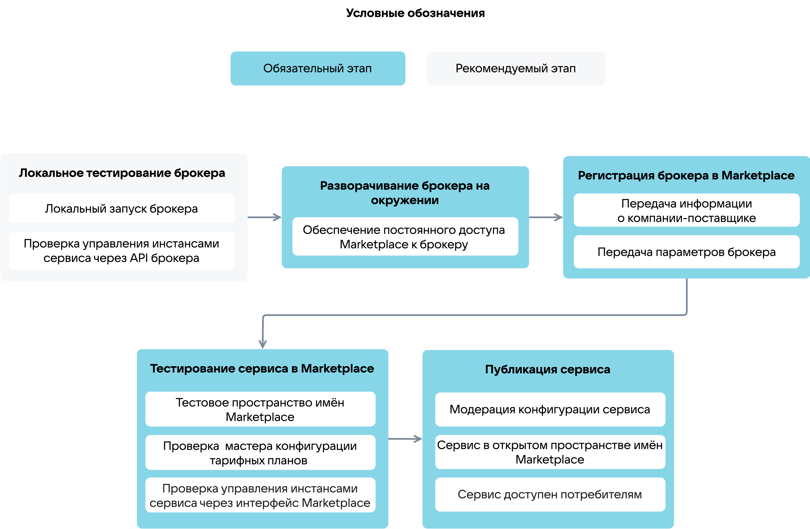

# {appendix-heading(Этапы загрузки сервиса)[id=xaas_vendor_saas_upload_phases; position=prefix]}

У пользователя, загружающего сервис в Marketplace, должна быть учетная запись (личный кабинет) в {var(sys6)}. Инструкция по регистрации приведена в **Руководстве пользователя {var(system)}** в разделе **Подготовка к работе**.

Этапы загрузки SaaS-приложения в Marketplace ({linkto(#pic_xaas_saas_upload)[text=рисунок %number]}):

1. {linkto(../../../../xaas_instructions/xaas_vendor_saas_add/xaas_vendor_saas_upload/xaas_vendor_saas_upload_localtest#xaas_vendor_saas_upload_localtest)[text=%text]}.
1. {linkto(../../../../xaas_instructions/xaas_vendor_saas_add/xaas_vendor_saas_upload/xaas_vendor_saas_upload_env#xaas_vendor_saas_upload_env)[text=%text]}.
1. {linkto(../../../../xaas_instructions/xaas_vendor_saas_add/xaas_vendor_saas_upload/xaas_vendor_saas_upload_registration#xaas_vendor_saas_upload_registration)[text=%text]}.
1. {linkto(../../../../xaas_instructions/xaas_vendor_saas_add/xaas_vendor_saas_upload/xaas_vendor_saas_upload_testmarketplace#xaas_vendor_saas_upload_testmarketplace)[text=%text]}.
1. {linkto(../../../../xaas_instructions/xaas_vendor_saas_add/xaas_vendor_saas_upload/xaas_vendor_saas_upload_publish#xaas_vendor_saas_upload_publish)[text=%text]}.

{caption(Рисунок {counter(pic)[id=numb_pic_xaas_saas_upload]} — Загрузка SaaS-приложения)[align=center;position=under;id=pic_xaas_saas_upload;number={const(numb_pic_xaas_saas_upload)}]}
{params[width=100%;noBorder=true]}
{/caption}